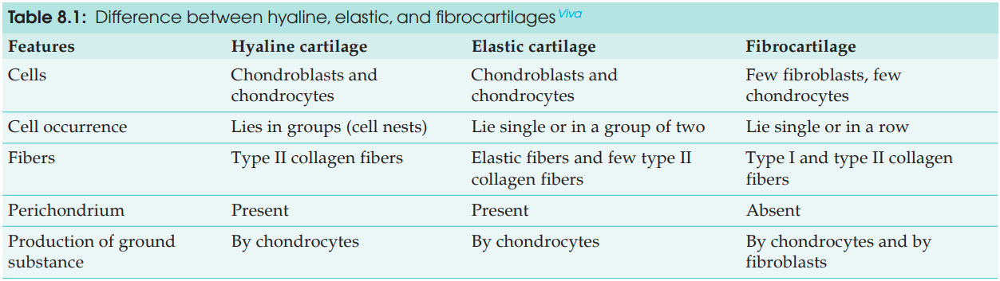
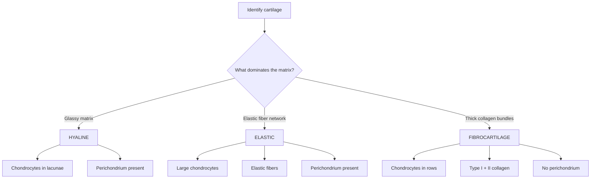

# Difference Between Hyaline, Elastic & Fibrocartilage

> 

| **Feature**             | **Hyaline cartilage**                                                                                     | **Elastic cartilage**                                                                                                 | **Fibrocartilage**                                                                                                      |
| ----------------------- | --------------------------------------------------------------------------------------------------------- | --------------------------------------------------------------------------------------------------------------------- | ----------------------------------------------------------------------------------------------------------------------- |
| **Main feature** ⭐      | **Glassy, translucent matrix**                                                                            | **Elastic, yellowish cartilage**                                                                                      | **White, tough cartilage**                                                                                              |
| **Main fibers** ⭐       | Mainly **Type II collagen**                                                                               | **Elastic fibers + Type II collagen**                                                                                 | **Type I + Type II collagen**                                                                                           |
| **Fiber appearance**    | Fibers not clearly visible in H&E                                                                         | Dense network of **branching & anastomosing elastic fibers**                                                          | Thick **parallel collagen bundles**                                                                                     |
| **Special stain**       | —                                                                                                         | **Orcein / resorcin-fuchsin** demonstrates elastic fibers                                                             | —                                                                                                                       |
| **Chondrocytes**        | Numerous, in lacunae                                                                                      | **Larger** than hyaline; singly or groups of 2                                                                        | **Few**, arranged in rows between collagen bundles                                                                      |
| **Isogenous groups**    | Common                                                                                                    | May occur                                                                                                             | Present, but chondrocytes are few                                                                                       |
| **Matrix**              | Abundant, glassy                                                                                          | Similar to hyaline; proteoglycans + glycoproteins                                                                     | Less prominent; between thick collagen bundles                                                                          |
| **Perichondrium** ⭐     | **Present** except articular cartilage & cartilage-bone interface                                         | **Present**                                                                                                           | **Absent** ⭐                                                                                                            |
| **Mechanical property** | Firm support + smooth surface                                                                             | **Resilience, pliability & elasticity**                                                                               | **Toughness + resistance to compression/tension**                                                                       |
| **Color**               | Glassy/translucent                                                                                        | **Yellowish**                                                                                                         | **White**                                                                                                               |
| **Important locations** | Articular cartilage, costal cartilage, nose, trachea & bronchi, fetal skeleton, thyroid/cricoid/arytenoid | **Pinna, external acoustic meatus, auditory tube, epiglottis**, tips of arytenoid, corniculate & cuneiform cartilages | **Intervertebral discs, pubic symphysis, menisci, TMJ & sternoclavicular articular discs, glenoidal/acetabular labrum** |

---

## 🔬 Histological Identification — Lock This In

### 🧠 Viva Identification Formula

$$
\boxed{\text{Hyaline → Glassy}}
$$

$$
\boxed{\text{Elastic → Elastic fibres}}
$$

$$
\boxed{\text{Fibrocartilage → Thick collagen bundles + rows of chondrocytes}}
$$

### ⭐ Highest-yield differences

**1. Fibers**

* Hyaline → **Type II collagen**
* Elastic → **Elastic + Type II collagen**
* Fibrocartilage → **Type I + II collagen**

**2. Perichondrium**

* Hyaline → **Present***
* Elastic → **Present**
* Fibrocartilage → **Absent**

**3. Arrangement of chondrocytes**

* Hyaline → **Groups/isogenous groups**
* Elastic → **Singly or groups of 2**
* Fibrocartilage → **Rows between collagen bundles**

*Hyaline cartilage lacks perichondrium at **articular surfaces** and **cartilage–bone interface**.
