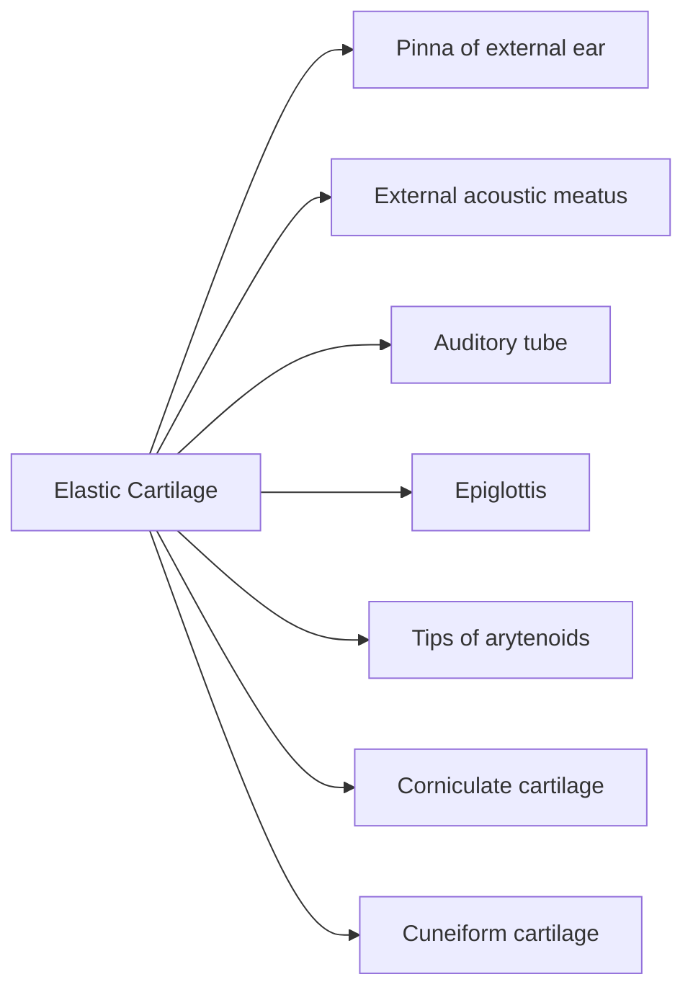
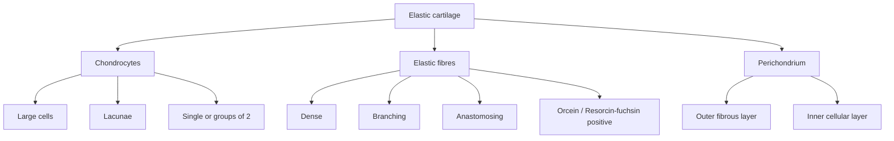

# Elastic Cartilage

> 

## 1. Definition / Identification

* Elastic cartilage provides **resilience, pliability and elasticity** to organs.
* Fresh elastic cartilage is **yellowish** → hence called **yellow elastic cartilage**.
* Histologically, it contains:

  * **Chondrocytes**
  * **Ground substance**
  * **Elastic fibres**
* **Key identification:** Dense network of **branching and anastomosing elastic fibres**.

---

## 2. Locations ⭐

---

## 3. Fibres ⭐

* Contains a **dense meshwork of fine elastic fibres**.
* Elastic fibres **branch and anastomose** with each other.
* Gives the cartilage its **yellowish colour**.
* Also contains a few **Type II collagen fibres**.
* Elastic fibres are **not clearly demonstrated by H&E**.
* Best demonstrated by:

  * **Orcein stain**
  * **Resorcin-fuchsin stain**

$$
\boxed{\text{Elastic cartilage = Type II collagen + abundant elastic fibres}}
$$

---

## 4. Chondrocytes

* Chondrocytes lie within **lacunae**.
* **Larger than chondrocytes of hyaline cartilage** ⭐
* Occur:

  * **Singly**, or
  * In groups of **2**
* Chondrocytes produce:

  * Elastic fibres
  * Collagen fibres
  * Ground substance
* Empty space around chondrocytes in H&E is a **shrinkage artifact**.

---

## 5. Ground Substance

* Similar to hyaline cartilage.
* Contains:

  * **Proteoglycans**
  * **Glycoproteins**

---

## 6. Perichondrium ⭐

* Elastic cartilage is covered by **perichondrium**.
* Perichondrium has **2 layers**:

| Layer                    | Composition                               |
| ------------------------ | ----------------------------------------- |
| **Outer fibrous layer**  | Dense irregular connective tissue         |
| **Inner cellular layer** | Cells that divide → form new chondrocytes |

---

# 🔥 Histological Identification

### 🧠 **Viva Lock**

> **Elastic cartilage = Large chondrocytes + abundant branching elastic fibres + perichondrium**

**Classic examples:**
**Pinna + epiglottis + auditory tube**.
