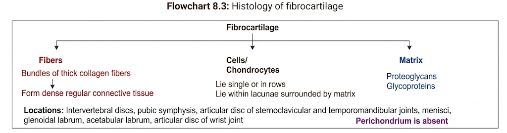
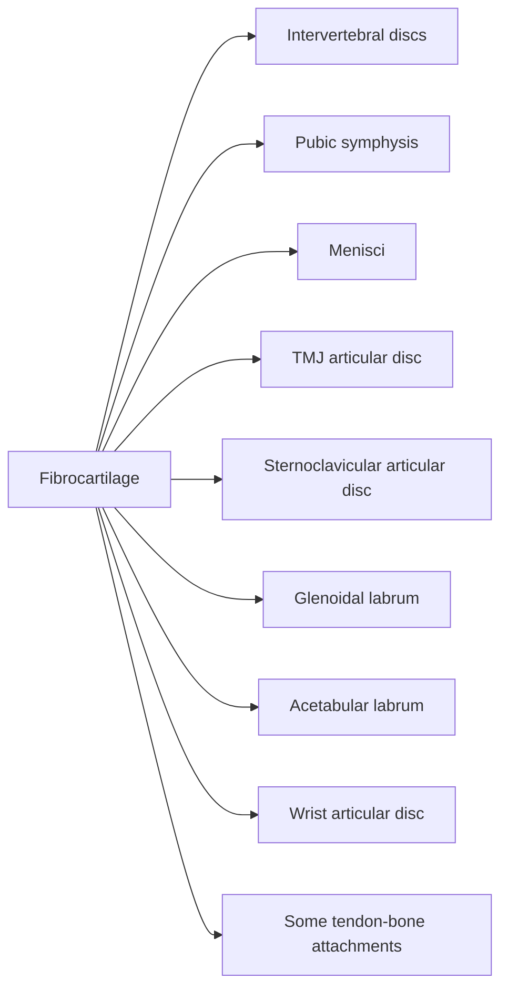
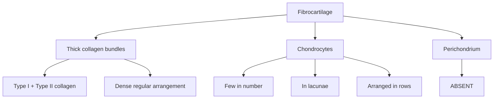

# Fibrocartilage

## 1. Definition / Identification ⭐

* Fibrocartilage is a **combination of dense regular connective tissue and hyaline cartilage**.
* Contains **thick bundles of collagen fibres** → gives it a **white colour**.
* Hence also called **white fibrocartilage**.
* Provides **great strength and resistance to compression and tension**.

$$
\boxed{\text{Fibrocartilage = Thick collagen bundles + Chondrocytes}}
$$

---

## 2. Locations ⭐

---

## 3. Fibres ⭐

* Contains **thick collagen fibre bundles**.
* Mainly arranged like **dense regular connective tissue**.
* Contains:

  * **Type I collagen** → predominant
  * **Type II collagen** → variable amount
* Collagen bundles give fibrocartilage its **white appearance**.
* Some **fibroblasts** are present between collagen bundles.

  * Fibroblast nuclei are **flat and elongated**.

---

## 4. Chondrocytes ⭐

* **Few in number** compared with hyaline cartilage.
* Located in **lacunae**.
* Arranged:

  * **Singly**, or
  * In **isogenous groups**
* Characteristically arranged in **rows between thick collagen bundles**.

$$
\boxed{\text{Rows of chondrocytes between collagen bundles = Fibrocartilage}}
$$

---

## 5. Matrix

* Chondrocytes produce matrix containing:

  * **Proteoglycans**
  * **Glycoproteins**
* Matrix is present **between the collagen bundles**.

---

## 6. Perichondrium ⭐

* **Perichondrium is ABSENT.**

> ⭐ **Most important differentiating feature:** Fibrocartilage **does not have perichondrium**.

---

# 🔬 Histological Identification

### 🧠 Viva Lock

> **Fibrocartilage = White + Thick collagen bundles + Rows of chondrocytes + NO perichondrium**

### 🔥 One-line comparison

$$
\boxed{
  \begin{matrix}
\text{Hyaline → Glassy}\\\\
\qquad
\text{Elastic → Elastic fibres}\\\\
\qquad
\text{Fibrocartilage → Collagen bundles + rows of chondrocytes}
\end{matrix}
}
$$
