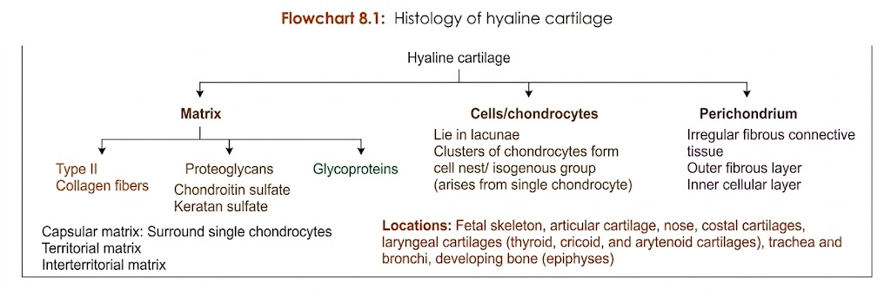
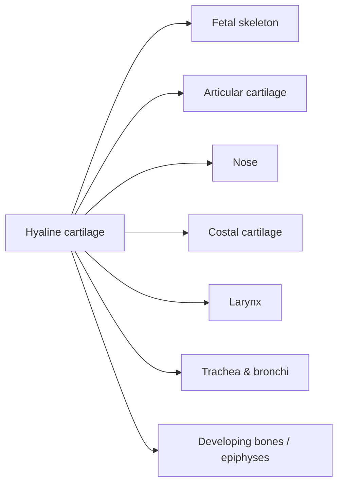
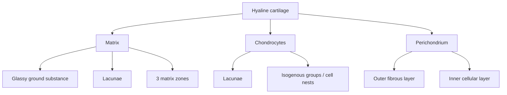
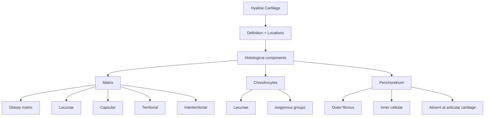

# HYALINE CARTILAGE — 5 Marks

> 

## 1. Definition / Identification

* **Most abundant type of cartilage** in the body.
* Matrix has a **glassy, transparent appearance** → hence *hyaline*.
* *Hyalos* = **glass** (Greek).

---

## 2. Locations ⭐

### Laryngeal cartilages

* Thyroid
* Cricoid
* Arytenoid

---

# 3. Histological Components

$$
\boxed{\text{Hyaline cartilage = Chondrocytes + Matrix + Perichondrium}}
$$

---

# 4. Matrix ⭐

* **Glassy appearance**
* Contains **lacunae** → spaces containing chondrocytes.
* Chondrocytes produce **sulfated proteoglycans**.

### Three zones of matrix

| Matrix                             | Main feature                                                                         | Staining     |
| ---------------------------------- | ------------------------------------------------------------------------------------ | ------------ |
| **Capsular / pericellular matrix** | Immediately surrounds chondrocyte; rich in sulfated proteoglycans + type VI collagen | **Darkest**  |
| **Territorial matrix**             | Surrounds capsular matrix; less proteoglycans                                        | Less dark    |
| **Interterritorial matrix**        | Surrounds territorial matrix; least proteoglycans                                    | **Lightest** |

$$
\boxed{\text{Capsular} > \text{Territorial} > \text{Interterritorial}}
$$

**Intensity of staining for sulfated proteoglycans**

---

# 5. Chondrocytes ⭐

* Cartilage cells are called **chondrocytes**.
* Located within **lacunae**.
* Produce and maintain the extracellular matrix.

### H&E appearance

* Chondrocyte appears separated from the lacunar wall by an **empty space**.
* This is a **processing artifact due to shrinkage** of the cell.
* In living cartilage → chondrocyte occupies the entire lacuna.

---

## Isogenous Groups / Cell Nests ⭐

* Chondrocytes undergo **mitotic division**.
* Daughter cells remain together.
* Group of daughter cells derived from **one mother chondrocyte** → **isogenous group**.
* Surrounded by territorial matrix.

$$
\text{Chondrocyte}
\xrightarrow{\text{mitosis}}
\text{Daughter chondrocytes}
\rightarrow
\boxed{\text{Isogenous group / Cell nest}}
$$

---

# 6. Perichondrium ⭐

* Hyaline cartilage is generally covered by **perichondrium**.
* It is an **irregular fibrovascular connective tissue layer**.

### Two layers

| Layer                    | Composition / function                       |
| ------------------------ | -------------------------------------------- |
| **Outer fibrous layer**  | Dense irregular connective tissue            |
| **Inner cellular layer** | Cells divide → give rise to new chondrocytes |

### Nutrition

* Perichondrial capillaries provide nutrients.
* Nutrients reach cartilage cells by **diffusion**.

---

## Sites where Perichondrium is ABSENT ⭐

1. **Articular cartilage**
2. Site of **direct contact between cartilage and bone**

---

# 🧠 Exam Flow

### 🔥 Viva identification points

* **Glassy matrix** → hyaline cartilage
* **Chondrocytes in lacunae**
* **Isogenous groups**
* **Capsular → territorial → interterritorial matrix**
* **Perichondrium present**, except **articular cartilage & cartilage-bone interface**
