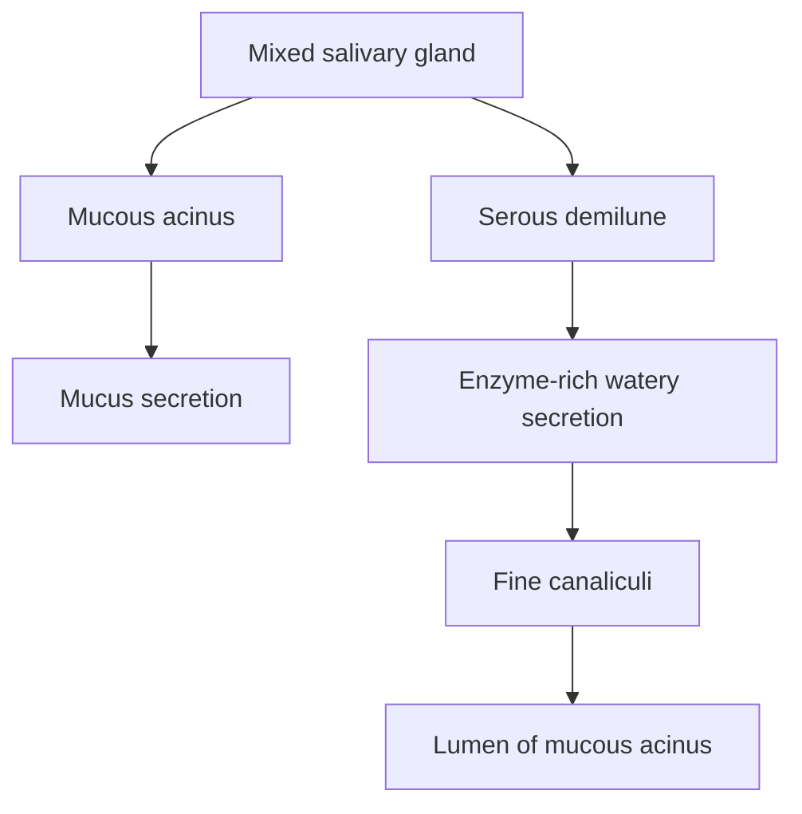

# Mixed Salivary Glands

## Definition

* **Mixed glands** secrete:

  * **Mucus**
  * **Enzyme-rich watery/serous secretion**

---

## Secretory Unit

$$
\boxed{\text{Mucous acinus + Serous demilunes}}
$$

### Mucous Acinus

* Forms the **main secretory unit**.
* Contains **mucous cells**.
* Mucous cells secrete **mucus**.

### Serous Demilunes ⭐

* **Half-moon-shaped cap** of serous cells over the mucous acinus.
* Serous cells secrete **enzyme-rich watery secretion**.
* Their secretion reaches the lumen of the mucous acinus through **fine canaliculi**.

---

## 🔬 Identification Feature

| Feature          | Mixed gland                          |
| ---------------- | ------------------------------------ |
| Main acinus      | **Mucous acinus**                    |
| Serous component | **Serous demilune**                  |
| Appearance       | Serous cells form **half-moon cap**  |
| Secretion        | Mucus + watery enzyme-rich secretion |

---

## ⚠️ Modern Concept: Serous Demilunes

* Serous demilunes are considered a **preparation artifact**.
* During tissue processing:

  * Mucous cells **swell**
  * Swollen mucous cells push serous cells towards the periphery
  * → Produces apparent **serous demilune**
* Rapid-freezing studies show that a normal acinus may contain **both serous and mucous cells** without true demilunes.

$$
\text{Tissue processing}
\rightarrow
\text{Mucous cell swelling}
\rightarrow
\text{Serous cells displaced}
\rightarrow
\boxed{\text{Apparent serous demilune}}
$$

---

## Example

### **Submandibular salivary gland** ⭐

---

### 🧠 Viva Lock

> **Mixed gland = Mucous acinus + Serous demilune → Submandibular gland**

**⭐ Most important identification point:**
**Mucous acinus capped by half-moon-shaped serous cells = mixed gland.**
