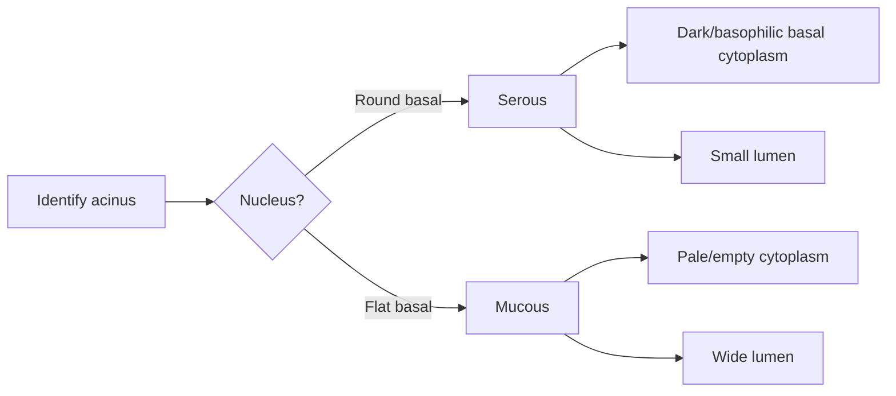
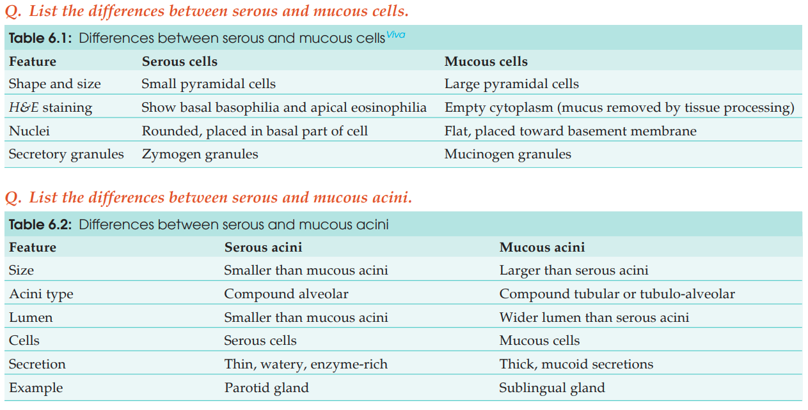

# Difference Between Serous and Mucous Glands

| **Feature**                     | **Serous gland**                                             | **Mucous gland**                                    |
| ------------------------------- | ------------------------------------------------------------ | --------------------------------------------------- |
| **Secretion**                   | Protein-rich, watery                                         | Thick, mucoid                                       |
| **Secretory unit**              | **Serous acinus**                                            | **Mucous acinus**                                   |
| **Cell shape**                  | Pyramidal                                                    | Pyramidal                                           |
| **Nucleus** ⭐                   | **Round**, basal                                             | **Flat**, basally placed                            |
| **Cytoplasm on H&E** ⭐          | **Basophilic basal part** + eosinophilic apical part         | **Pale/empty-looking**                              |
| **RER**                         | Abundant → basal basophilia                                  | Less prominent                                      |
| **Golgi & secretory granules**  | Well-developed Golgi + **zymogen granules** apically         | Mucinogen granules                                  |
| **Reason for empty appearance** | —                                                            | Mucinogen is water-soluble → lost during processing |
| **Lumen** ⭐                     | **Narrow/small**                                             | **Wide**                                            |
| **PAS staining**                | —                                                            | **PAS positive** → magenta                          |
| **Main function**               | Protein/enzyme secretion                                     | Mucus secretion                                     |
| **Examples**                    | **Parotid, exocrine pancreas, lacrimal, von Ebner's glands** | **Sublingual gland**                                |

### 🧠 Histology identification shortcut

### 🔥 Viva lock-in

**Serous = S = Small lumen + Spherical nucleus + Strongly stained**

**Mucous = M = Massive/wide lumen + Marginal/flat nucleus + Mucus → pale cytoplasm**

> 