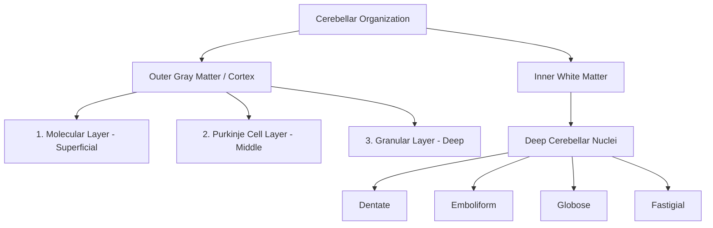
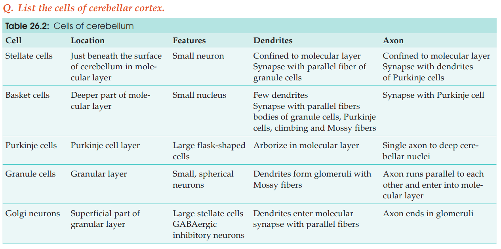
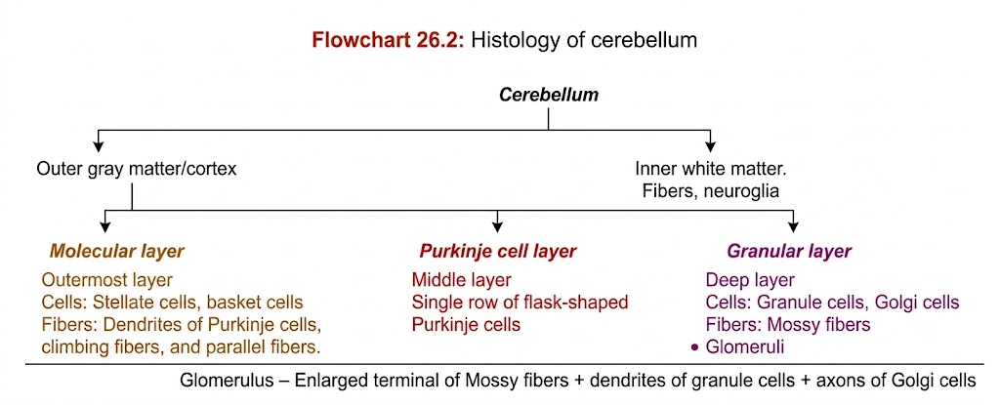

# HISTOLOGY OF CEREBELLUM

---

## 1. GENERAL ARCHITECTURE

* **Nature:** Uniform structure throughout (**homotypical**).
* **Division:**
* **Outer Cortex:** Gray matter organized into $3$ distinct layers.
* **Inner Core:** White matter containing neuroglial cells, nerve fibers, and deep cerebellar nuclei.

* **Deep Cerebellar Nuclei:** Four bilateral gray matter masses embedded inside white matter:
* **Dentatus**
* **Emboliformis**
* **Globosus**
* **Fastigius**

---

## 2. LAYERS OF CEREBELLAR CORTEX

| Layer | Position & Staining | Cellular Components | Fibrous Components & Synapses |
| :--- | :--- | :--- | :--- |
| **Molecular Layer** | • Outermost layer (deep to pia mater) • **Lightly stained** (H&E) | • **Superficial:** Stellate cells • **Deep:** Basket cells | • Dendritic trees of Purkinje cells • Axons of granule cells (parallel fibers) • Climbing fibers |
| **Purkinje Cell Layer** | • Intermediate layer • Single row of prominent cells | • **Purkinje cells:** Large, **flask-shaped** neurons | • **Apex:** Dendrites entering molecular layer • **Base:** Axon exiting to cerebellar nuclei |
| **Granular Layer** | • Innermost layer (adjacent to white matter) • **Darkly / Densely stained** | • **Granule cells:** Small, rounded neurons • **Golgi cells:** Large, stellate neurons | • **Mossy fibers** (pontocerebellar afferents) • **Cerebellar Glomeruli** • Passing climbing fibers & Purkinje axons |
---

## 3. SPECIAL HISTOLOGICAL FEATURES

* **Purkinje Neuron Morphology:**
* Single monolayer arrangement between molecular and granular layers.
* Flask-shaped soma acts as the primary functional output unit of the cortex.

* **Cerebellar Glomeruli *(Islands of Cerebellum)*:**
* Light-staining synaptic complexes in the granular layer.
* **Composition:**

$$\text{Glomerulus} = \text{Mossy fiber expanded terminal} + \text{Granule cell dendrites} + \text{Golgi cell axons}$$

---

## 4. WHITE MATTER

* **Composition:** Myelinated nerve fibers (afferent/efferent tracts) and neuroglial cells.
* **Function:** Transmits incoming pontocerebellar pathways (mossy fibers, climbing fibers) and relays cerebellar cortical output to deep cerebellar nuclei.

