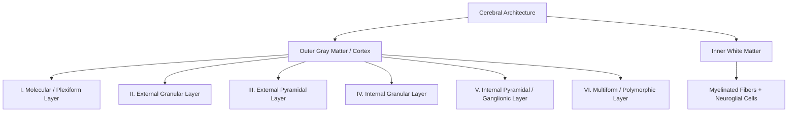
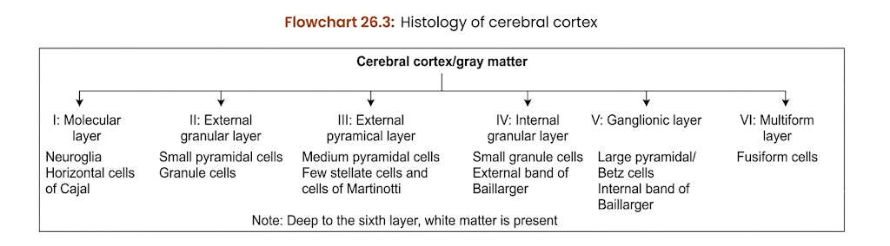

## HISTOLOGY OF CEREBRUM

---

### 1. GENERAL ARCHITECTURE

a. **Gross Division:** Consists of an **outer gray matter** (*cerebral cortex*) and an **inner white matter**.
b. **Composition of Gray Matter:**

* Neuronal cell bodies and processes (axons and dendrites)
* Neuroglia and dense networks of blood capillaries
* Complex synaptic neuropil organized into **6 structural layers**

c. **Composition of White Matter:** Composed of small round nuclei of **neuroglial cells** and dense bundles of **nerve fibers** (*myelinated processes*).

---

### 2. PRINCIPAL NEURONS OF CEREBRAL CORTEX

a. **Pyramidal Cells:**
* Make up approximately **$\frac{2}{3}$ of all cortical neurons** (~$5.5\text{ billion}$).
* **Morphology:** Large, triangular, **multipolar neurons** with apex directed toward the cortical surface.
* **Processes:**
* *Apical dendrite:* Arises from apex $\rightarrow$ extends toward surface.
* *Basal dendrites:* Arise from basal angles.
* *Axon:* Arises from base $\rightarrow$ projects downward into white matter.

b. **Stellate / Granule Cells:** 
  * Small, star-shaped, multipolar interneurons with short processes.

c. **Cells of Martinotti:** 
  * Small polygonal/triangular neurons whose axons uniquely travel **upward toward the cortical surface**.

d. **Fusiform Cells:** 
  * Spindle-shaped neurons oriented perpendicular to the surface; axon arises centrally and dendrites emerge from both poles.

e. **Other Minor Types:** 
  * Horizontal cells of Cajal, basket cells, double bouquet cells, and chandelier cells.

---

### 3. LAYERS OF CEREBRAL CORTEX
<table>
  <thead>
    <tr>
      <th>Layer</th>
      <th>Primary Neuronal Population</th>
      <th>Key Structural &amp; Fiber Features</th>
    </tr>
  </thead>
  <tbody>
    <tr>
      <td><strong>I. Molecular Layer</strong> <em>(Plexiform)</em></td>
      <td>
        <ul>
          <li>Horizontal cells of Cajal</li>
          <li>Neuroglial cells (nuclei visible)</li>
        </ul>
      </td>
      <td>
        <ul>
          <li>Directly beneath pia mater</li>
          <li>Dense neuropil and superficial capillaries</li>
        </ul>
      </td>
    </tr>
    <tr>
      <td><strong>II. External Granular Layer</strong></td>
      <td>
        <ul>
          <li>Small pyramidal cells</li>
          <li>Stellate / granule cells</li>
        </ul>
      </td>
      <td>
        <ul>
          <li>Densely packed cellular layer</li>
        </ul>
      </td>
    </tr>
    <tr>
      <td><strong>III. External Pyramidal Layer</strong></td>
      <td>
        <ul>
          <li>Medium pyramidal cells</li>
          <li>Cells of Martinotti</li>
          <li>Few stellate cells</li>
        </ul>
      </td>
      <td>
        <ul>
          <li>Axons form association and commissural fibers</li>
        </ul>
      </td>
    </tr>
    <tr>
      <td><strong>IV. Internal Granular Layer</strong></td>
      <td>
        <ul>
          <li>Closely packed small granule / stellate cells</li>
        </ul>
      </td>
      <td>
        <ul>
          <li>Prominent <strong>External band of Baillarger</strong></li>
        </ul>
      </td>
    </tr>
    <tr>
      <td><strong>V. Internal Pyramidal Layer</strong> <em>(Ganglionic)</em></td>
      <td>
        <ul>
          <li><strong>Betz cells</strong> (giant motor cortex cells)</li>
          <li>Large pyramidal cells</li>
          <li>Martinotti, fusiform, and granule cells</li>
        </ul>
      </td>
      <td>
        <ul>
          <li>Source of major efferent tracts</li>
          <li>Prominent <strong>Internal band of Baillarger</strong></li>
        </ul>
      </td>
    </tr>
    <tr>
      <td><strong>VI. Multiform Layer</strong> <em>(Polymorphic)</em></td>
      <td>
        <ul>
          <li>Spindle-shaped fusiform cells</li>
          <li>Cells of Martinotti</li>
          <li>Stellate cells</li>
        </ul>
      </td>
      <td>
        <ul>
          <li>Merges directly into subcortical white matter</li>
        </ul>
      </td>
    </tr>
  </tbody>
</table>

---

### 4. BANDS OF BAILLARGER (HIGH-YIELD POINTS)

a. **External Band of Baillarger:** Horizontal fiber stripe located within **Layer IV** (*Internal Granular Layer*).
b. **Internal Band of Baillarger:** Horizontal fiber stripe located within **Layer V** (*Internal Pyramidal Layer*).

