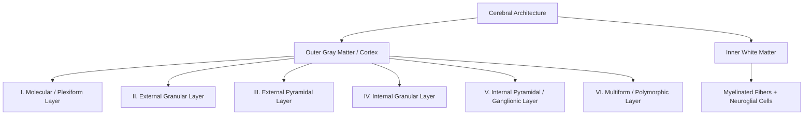

## HISTOLOGY OF CEREBRUM

---

### 1. GENERAL ARCHITECTURE

a. **Gross Division:** Consists of an **outer gray matter** (*cerebral cortex*) and an **inner white matter**.
b. **Composition of Gray Matter:**

* Neuronal cell bodies and processes (axons and dendrites)
* Neuroglia and dense networks of blood capillaries
* Complex synaptic neuropil organized into **6 structural layers**
c. **Composition of White Matter:** Composed of small round nuclei of **neuroglial cells** and dense bundles of **nerve fibers** (*myelinated processes*).

---

### 2. PRINCIPAL NEURONS OF CEREBRAL CORTEX

a. **Pyramidal Cells:**

* Make up approximately **$\frac{2}{3}$ of all cortical neurons** (~$5.5\text{ billion}$).
* **Morphology:** Large, triangular, **multipolar neurons** with apex directed toward the cortical surface.
* **Processes:**
* *Apical dendrite:* Arises from apex $\rightarrow$ extends toward surface.
* *Basal dendrites:* Arise from basal angles.
* *Axon:* Arises from base $\rightarrow$ projects downward into white matter.
b. **Stellate / Granule Cells:** Small, star-shaped, multipolar interneurons with short processes.
c. **Cells of Martinotti:** Small polygonal/triangular neurons whose axons uniquely travel **upward toward the cortical surface**.
d. **Fusiform Cells:** Spindle-shaped neurons oriented perpendicular to the surface; axon arises centrally and dendrites emerge from both poles.
e. **Other Minor Types:** Horizontal cells of Cajal, basket cells, double bouquet cells, and chandelier cells.

---

### 3. LAYERS OF CEREBRAL CORTEX

| Layer | Primary Neuronal Population | Key Structural & Fiber Features |
| --- | --- | --- |
| **I. Molecular Layer** *(Plexiform)* | • Horizontal cells of Cajal 

 • Neuroglial cells (only nuclei visible) | • Lies immediately beneath **pia mater** 

 • Dense neuropil and superficial capillaries |
| **II. External Granular Layer** | • Small pyramidal cells 

 • Stellate / Granule cells | • Densely packed cellular zone |
| **III. External Pyramidal Layer** | • Medium pyramidal cells 

 • Cells of Martinotti 

 • Few stellate cells | • Axons project as **association** and **commissural fibers** |
| **IV. Internal Granular Layer** | • Densely packed small stellate / granule cells | • Prominent horizontal fiber plexus (**External band of Baillarger**) |
| **V. Internal Pyramidal Layer** *(Ganglionic)* | • **Betz cells** (giant pyramidal cells of motor cortex) 

 • Large pyramidal cells 

 • Cells of Martinotti & fusiform cells | • Source of major projection pathways 

 • Horizontal fiber plexus (**Internal band of Baillarger**) |
| **VI. Multiform Layer** *(Polymorphic)* | • Spindle-shaped fusiform cells 

 • Cells of Martinotti 

 • Stellate cells | • Merges directly into the underlying subcortical **white matter** |

---

### 4. BANDS OF BAILLARGER (HIGH-YIELD POINTS)

a. **External Band of Baillarger:** Horizontal fiber stripe located within **Layer IV** (*Internal Granular Layer*).
b. **Internal Band of Baillarger:** Horizontal fiber stripe located within **Layer V** (*Internal Pyramidal Layer*).

