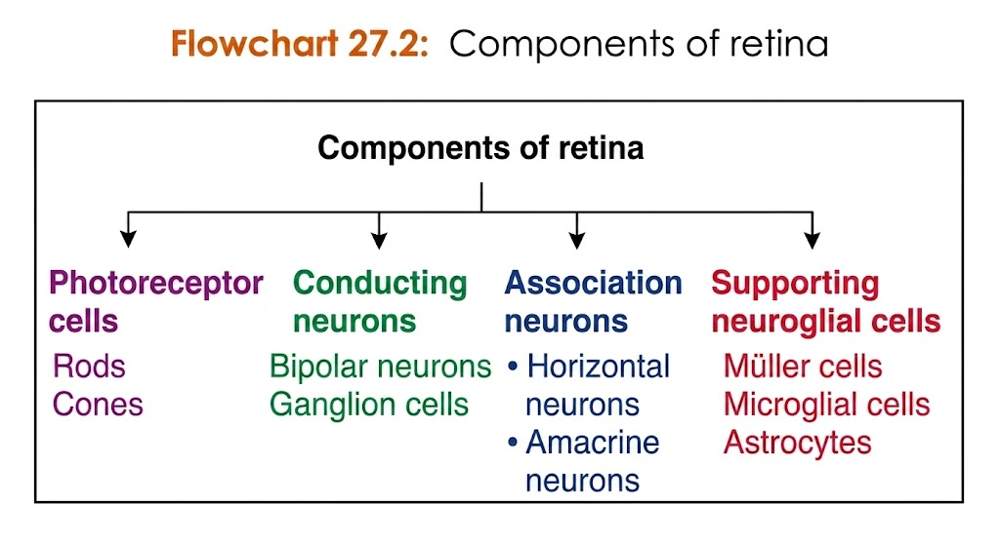

# Histology of Retin

## Retina consists of ten layers as follows
### 1. Retinal pigmented epithelium (REP)
### 2. Layer of rods and cones
### 3. Outer limiting membrane
### 4. Outer nuclear layer
### 5. Outer plexiform layer
### 6. Inner nuclear layer
### 7. Inner plexiform layer
### 8. Ganglion cell layer
### 9. Layer of optic nerve fibers
### 10. Inner limiting membrane

## Components of Retina
> 