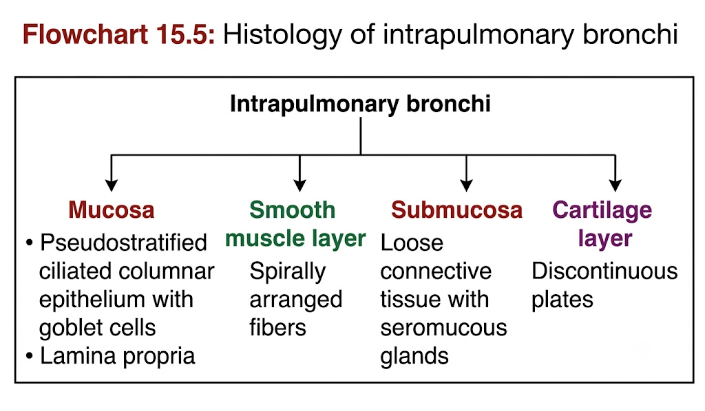
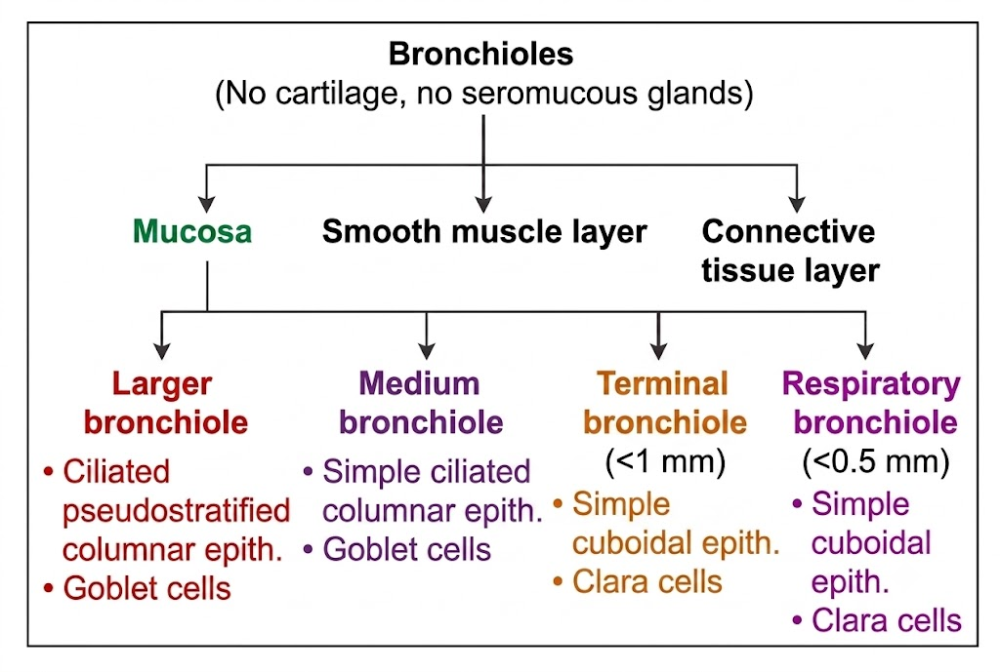
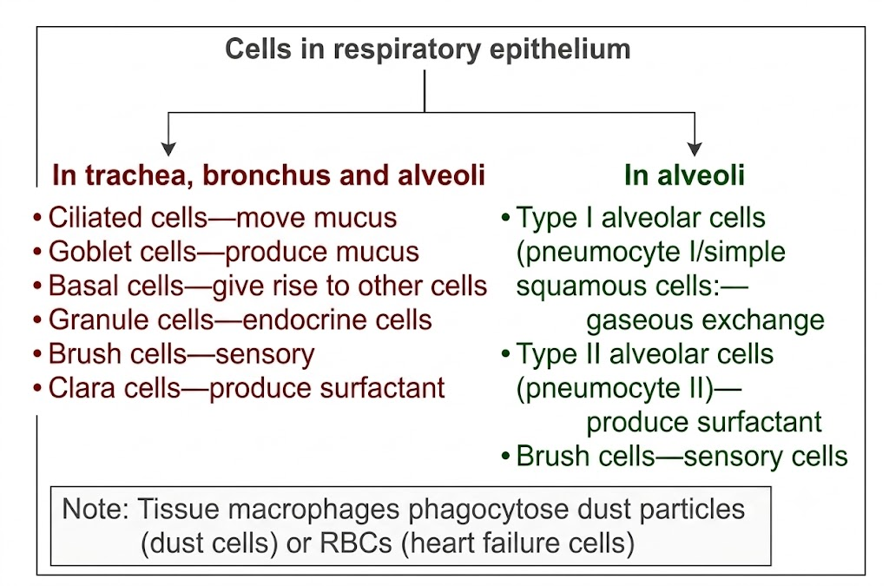
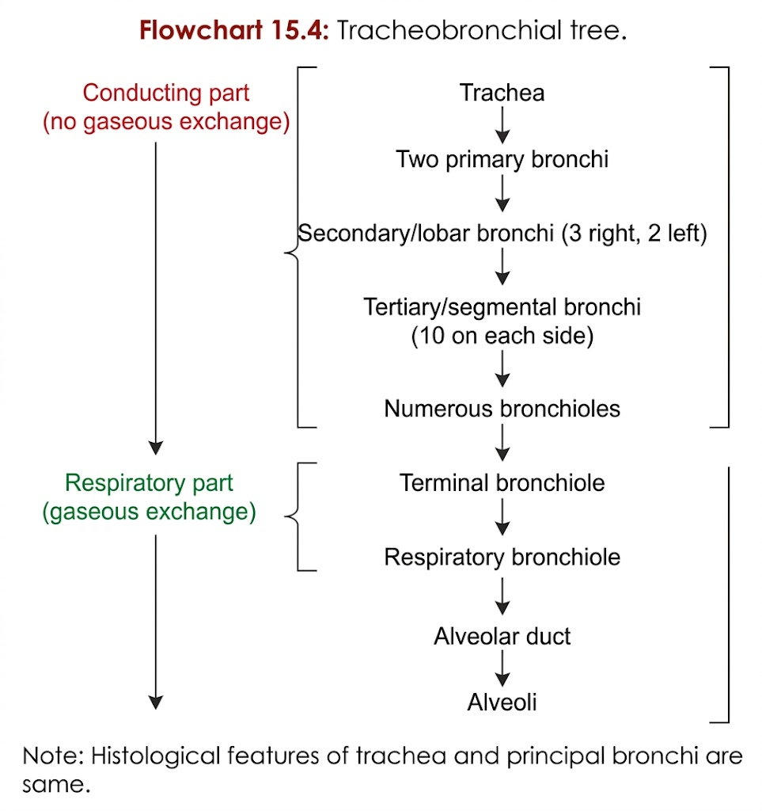

# HISTOLOGY OF LUNG

## 1. Covering & Components

* Lung is covered by:

  * **Visceral pleura (mesothelium)**
  * Underlying **connective tissue**
* Lung consists of:

  1. **Intrapulmonary bronchi**
  2. **Bronchioles**
  3. **Alveoli**

---

## 2. Intrapulmonary Bronchi

**Examples:** Lobar, segmental and terminal bronchi.

| Feature        | Intrapulmonary bronchus                 |
| -------------- | --------------------------------------- |
| Epithelium     | **Pseudostratified ciliated columnar**  |
| Goblet cells   | **Present**                             |
| Lamina propria | Present; contains **seromucous glands** |
| Smooth muscle  | **Complete circumferential layer**      |
| Cartilage      | **Discontinuous cartilaginous plates**  |

> 

---

## 3. Bronchioles ⭐

* **< 1 mm diameter**
* **No cartilage plates**
* Epithelium gradually changes:

$$
\boxed{\text{Pseudostratified ciliated columnar}}
\rightarrow
\boxed{\text{Ciliated columnar}}
\rightarrow
\boxed{\text{Simple cuboidal}}
$$

* **Terminal bronchioles:**

  * **Clara cells** replace goblet cells.
* Have:

  * Smooth muscle layer
  * Surrounding connective tissue
* **Respiratory bronchiole:**

  * Lined by **simple cuboidal epithelium**
  * Surrounded by smooth muscle

> 

---

## 4. Alveoli ⭐

* **Thin-walled polyhedral sacs**
* Lined mainly by **simple squamous epithelium**
* Cells:

| Cell                    | Feature                                             |
| ----------------------- | --------------------------------------------------- |
| **Type I pneumocytes**  | Simple squamous; form major part of alveolar lining |
| **Type II pneumocytes** | Few in number; **produce surfactant**               |

### Interalveolar septum contains:

* Small amount of **connective tissue**
* **Continuous (non-fenestrated) capillaries**

> 

---

# 5. Conducting → Respiratory Pathway
$$
\boxed{
\begin{matrix}
\text{Trachea} 
\\\ \downarrow \\\ 
\text{principal bronchi} 
\\\ \downarrow \\\ 
\text{lobar bronchi} 
\\\ \downarrow \\\ 
\text{segmental bronchi} 
\\\ \downarrow \\\ 
\text{large bronchioles} 
\\\ \downarrow \\\ 
\text{terminal bronchioles} 
\\\ \downarrow \\\
\text{respiratory bronchioles} 
\\\ \downarrow \\\ 
\text{alveolar ducts} 
\\\ \downarrow \\\ 
\text{alveolar sacs} 
\\\ \downarrow \\\ 
\text{alveoli}.
\end{matrix}
}
$$

> 

## 🔥 Histology Identification Points

$$
\boxed{
\begin{matrix}
\text{Bronchus → cartilage + glands}\\\
\text{Bronchiole → NO cartilage + NO glands}\\\
\text{Terminal bronchiole → Clara cells}\\\
\text{Alveoli → Type I + Type II pneumocytes}
\end{matrix}}
$$

**This is the high-yield distinction to lock in for viva.**
