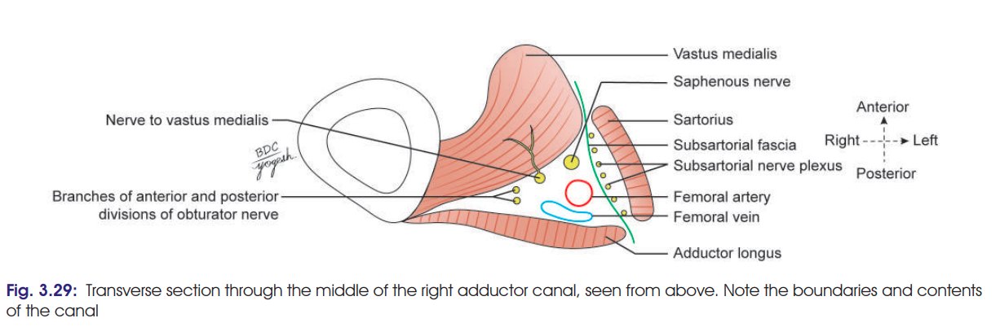
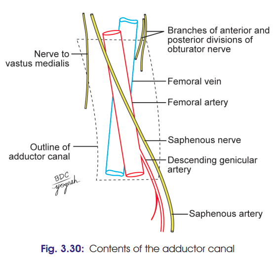

# Adductor Canal

### Hunter's Canal / Subsartorial Canal

### Headings

* Definition / location
* Extent
* Shape
* Boundaries
* Contents
* Clinical anatomy

---

## 1. Definition / Location

* **Adductor canal** is an **intermuscular space** situated on the **medial side of the middle ⅓ of the thigh**.
* Also called:

  * **Hunter's canal**
  * **Subsartorial canal**

---

## 2. Extent

* Extends from:

  * **Apex of femoral triangle** → above
  * **Tendinous opening in adductor magnus** → below

### 🧠 Remember

**Femoral triangle → Adductor canal → Adductor hiatus → Popliteal fossa**

---

## 3. Shape

* **Triangular** on cross-section.

---

## 4. Boundaries ⭐

| Wall                           | Structure                                             |
| ------------------------------ | ----------------------------------------------------- |
| **Anterolateral wall**         | **Vastus medialis**                                   |
| **Posteromedial wall / floor** | **Adductor longus** above + **Adductor magnus** below |
| **Medial wall / roof**         | Strong **fibrous membrane**                           |
| **Roof covered by**            | **Sartorius**                                         |

### 🧠 Super easy

**Vastus → Adductors → Fibrous membrane**

* **Vastus medialis** = anterolateral
* **Adductor longus + magnus** = floor
* **Fibrous membrane** = roof
* **Sartorius** = lies over roof
  

---

# 5. Contents ⭐⭐⭐

### **F V S N N A**

1. **F**emoral artery
2. Femoral **v**ein
3. **S**aphenous nerve
4. **N**erve to vastus medialis
5. **N**erves/branches of anterior & posterior divisions of obturator nerve
6. **A**descending genicular artery

### Easy recall:

> **“Femoral Vein, Saphenous Nerve, Vastus Nerve, Obturator Nerves, Descending Genicular.”**

The **big 3** you absolutely shouldn't forget:

**Femoral artery + Femoral vein + Saphenous nerve**

---

# 6. Clinical Anatomy

### Adductor canal block

* Local anaesthetic is injected into the adductor canal to **block the saphenous nerve**.

### Adductor canal compression syndrome

* Hypertrophy of adjacent muscles may compress the **neurovascular bundle**.
* **Femoral artery compression** → claudication
* **Saphenous nerve compression** → neurological symptoms

### Site of ligation of femoral artery 
* The **femoral artery** may be **ligated** in the **adductor canal** for treatment of a **popliteal aneurysm**.
---
