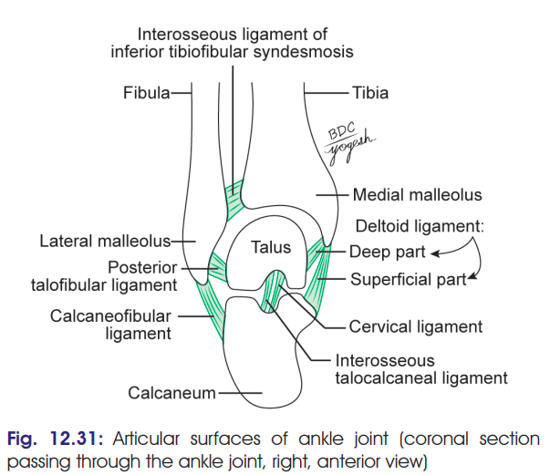

# ANKLE JOINT

### Headings

* Definition / Type
* Articular surfaces
* Stability
* Ligaments

  * Fibrous capsule
  * Deltoid ligament
  * Lateral collateral ligament
* Relations
* Blood supply
* Nerve supply
* Movements
* Applied anatomy

---

## 1. Definition

* **Ankle joint / Talocrural joint**
* Strong **weight-bearing joint** between:

  * Lower ends of **tibia and fibula**
  * **Talus**

### Type

* **Synovial joint**
* **Hinge variety**
* **Uniaxial**

---

## 2. Articular Surfaces

### Proximal surface → Tibiofibular mortise

Formed by:

1. Lower end of **tibia + medial malleolus**
2. **Lateral malleolus of fibula**
3. **Inferior transverse tibiofibular ligament**

→ Together form a deep **tibiofibular socket / mortise**

### Distal surface

* Articular surfaces of **talus**:

  * Superior surface
  * Medial surface
  * Lateral surface

---

## 3. Stability of Ankle Joint

Stability is provided by:

1. **Close interlocking** of articular surfaces
2. **Strong collateral ligaments** on both sides
3. **Tendons crossing the joint**

   * 4 anteriorly
   * 3 posteromedially
   * 2 posterolaterally

---

# 4. Ligaments

The joint is supported by:

1. **Fibrous capsule**
2. **Deltoid / medial collateral ligament**
3. **Lateral collateral ligament**

---

## A. Fibrous Capsule

* Surrounds the joint.
* **Weak anteriorly and posteriorly**.
* Attached around articular margins except:

1. **Posterosuperiorly**

   * Attached to **inferior transverse tibiofibular ligament**

2. **Anteroinferiorly**

   * Attached to **dorsum of neck of talus**
   * At some distance from trochlear surface

* Synovial membrane → **lines the capsule**
* Joint cavity → **ascends between tibia and fibula**

---

# B. Deltoid / Medial Collateral Ligament

* **Very strong**
* **Triangular**
* Situated on **medial side** of ankle
* Divided into:

  * **Superficial part**
  * **Deep part**

### Common attachment

* Apex and margins of **medial malleolus**

### Superficial part → 3 components

| Fibres                               | Attachment                                                 |
| ------------------------------------ | ---------------------------------------------------------- |
| **Anterior / Tibionavicular**        | Tuberosity of navicular + medial margin of spring ligament |
| **Middle / Tibiocalcanean**          | Sustentaculum tali                                         |
| **Posterior / Posterior tibiotalar** | Medial tubercle of posterior process of talus              |

### Deep part

* **Anterior tibiotalar fibres**
* Attached to **anterior part of medial surface of talus**

### Applied

* Deltoid ligament is **very strong**.
* Excessive tensile force → **avulsion fracture** rather than ligament tear.
* Commonly injured in **eversion**.

---

# C. Lateral Collateral Ligament

Consists of **3 bands**:

### 1. Anterior talofibular ligament

* From **anterior margin of lateral malleolus** → neck of talus
* Just in front of fibular facet

### 2. Posterior talofibular ligament

* From **lower part of malleolar fossa of fibula** → lateral tubercle of talus

### 3. Calcaneofibular ligament

* Long, rounded cord
* From **notch on lower border of lateral malleolus** → tubercle on lateral surface of calcaneum

### Easy order

**ATFL → PTFL → CFL**

---

# 5. Relations

## Anterior → Medial to lateral

**T**ibialis anterior
↓
Extensor **H**allucis longus
↓
Anterior tibial **A**rtery
↓
Deep peroneal **N**erve
↓
Extensor **D**igitorum longus
↓
**P**eroneus tertius

### Mnemonic:

**T**all **H**imalayas **A**re **N**ever **D**ry **P**laces

---

## Posterior → Medial to lateral

**T**ibialis posterior
↓
Flexor **D**igitorum longus
↓
Posterior tibial **A**rtery
↓
Tibial **N**erve
↓
Flexor **H**allucis longus

### Mnemonic:

**T**alented **D**octors **A**re **N**ever **H**ungry

---

## Posterolateral

* Tendons of:

  * **Peroneus longus**
  * **Peroneus brevis**

---

# 6. Blood Supply

From malleolar branches of:

* **Anterior tibial artery**
* **Posterior tibial artery**
* **Peroneal artery**

---

# 7. Nerve Supply

* **Deep peroneal nerve**
* **Tibial nerve**

---

# 8. Movements

| **Movement**                                  | **Main Muscles**        | **Accessory Muscles**                                                                |
| --------------------------------------------- | ----------------------- | ------------------------------------------------------------------------------------ |
| **Dorsiflexion** *(forefoot is raised)*       | Tibialis anterior       | Extensor digitorum longus Extensor hallucis longus                                |
| **Plantar flexion** *(forefoot is depressed)* | Gastrocnemius Soleus | Plantaris Tibialis posterior Flexor hallucis longus Flexor digitorum longus |

## ⭐ 30-second recall skeleton

**ANKLE JOINT**

**Type** → Hinge, synovial, uniaxial
↓
**Articular surfaces** → Tibia + fibula → mortise + talus
↓
**Stability** → Interlocking + ligaments + tendons
↓
**Ligaments** → Capsule + Deltoid + Lateral
↓
**Deltoid** → Superficial 3 + Deep 1
↓
**Lateral** → ATFL + PTFL + CFL
↓
**Relations** → Anterior + Posterior + Posterolateral
↓
**Blood** → AT + PT + Peroneal
↓
**Nerve** → Deep peroneal + Tibial
↓
**Movements** → Dorsiflexion + Plantar flexion

## 9. Clinical Anatomy

### 1. Ankle Sprains

* Most ankle sprains are actually **abduction sprains of subtalar joints**.
* Few fibres of **deltoid ligament** may also be torn.
* **True ankle joint sprain**:

  * Caused by **forced plantar flexion**
  * → tearing of **anterior fibres of fibrous capsule**
* Ankle joint is **unstable during plantar flexion**.

### 2. Dislocation of Ankle

* **Rare** because of strong stability provided by the **deep tibiofibular socket**.
* Usually associated with **fracture of one of the malleoli**.
* Occurs mainly in **plantar flexion**, when the joint is unstable.

### 3. Optimal Position

* Ankle is kept in **slight plantar flexion** while applying a plaster cast.
* Helps prevent **ankylosis / joint stiffness**.

### 4. Pott's Fracture

**Pott's fracture = fracture-dislocation of ankle**

Features:

1. **Oblique fracture of lateral malleolus**
2. **Transverse fracture of medial malleolus**
3. **Anterior dislocation of tibia over talus**
4. Sometimes → fracture of **posterior margin of lower end of tibia**

   * Called **third malleolus**

### ⭐ Clinical recall

**Pott's = Lateral + Medial + Tibia + ± Posterior**

→ Oblique **lateral malleolus**
→ Transverse **medial malleolus**
→ **Anterior** tibial dislocation
→ ± **Third malleolus** fracture
