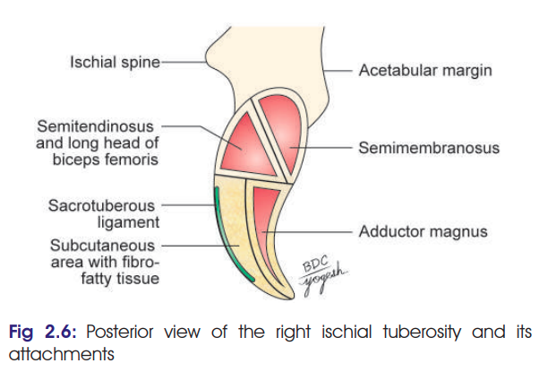

# Hamstring Muscles — Short Note

### Headings

* Definition
* Members
* Common features
* Origin & insertion
* Nerve supply
* Actions
* Special points
* Applied
  
---

## 1. Definition

* **Hamstrings** are the muscles of the back of the thigh that mainly **extend the hip and flex the knee**.

## 2. Members

1. **Semitendinosus**
2. **Semimembranosus**
3. **Biceps femoris — long head**
4. **Ischial (hamstring) part of adductor magnus**

---

## 3. Common Features

| Feature          | Hamstrings                                                    |
| ---------------- | ------------------------------------------------------------- |
| **Origin**       | Mainly from **ischial tuberosity**                            |
| **Insertion**    | Extend to **bones of the leg** *(exception: adductor magnus)* |
| **Nerve supply** | **Tibial part of sciatic nerve**                              |
| **Main actions** | **Hip extension + knee flexion**                              |

### Why are they called hamstrings?

They are grouped together because they **arise mainly from the ischial tuberosity**, are supplied by the **tibial part of sciatic nerve**, and **extend the hip + flex the knee**.

### Why is adductor magnus included?

* Its **ischial/hamstring part** is supplied by the **tibial part of sciatic nerve**.
* It helps in **hip extension and knee flexion**.
* It reaches the **adductor tubercle**, rather than the leg.
* It is included because the **tibial collateral ligament of the knee is morphologically related to its degenerated tendon**.

### Why is biceps femoris included?

* **Long head** arises from the **ischial tuberosity**.
* It is supplied by the **tibial part of sciatic nerve**.
* It **extends hip and flexes knee**.

⚠️ **Important:** The **short head of biceps femoris is NOT a true hamstring** because it does not arise from the ischial tuberosity and is supplied by the **common peroneal part of sciatic nerve**.

---

# 4. Origin & Insertion

| Muscle              | Origin — remember                                                                      | Insertion — remember                                                                  |
| ------------------- | -------------------------------------------------------------------------------------- | ------------------------------------------------------------------------------------- |
| **Semitendinosus**  | Ischial tuberosity                                                                     | **Medial surface of tibia**                                                           |
| **Semimembranosus** | Ischial tuberosity                                                                     | **Medial condyle of tibia**                                                           |
| **Biceps femoris**  | Long head → ischial tuberosity; Short head → linea aspera + lateral supracondylar line | **Head of fibula**                                                                    |
| **Adductor magnus** | Ischial tuberosity + ischiopubic ramus                                                 | **Gluteal tuberosity → linea aspera → medial supracondylar line → adductor tubercle** |

### 🧠 Insertion pattern

Think:

**SemiTENDINOSUS → TIBIA**
**SemiMEMBRANOSUS → MEDIAL TIBIA**
**BICEPS → FIBULA**
**Adductor MAGNUS → BIG stretch along femur → ADDUCTOR TUBERCLE**

---

# 5. Nerve Supply

* **Semitendinosus:** Tibial part of sciatic nerve
* **Semimembranosus:** Tibial part of sciatic nerve
* **Biceps femoris:**

  * Long head → **Tibial part**
  * Short head → **Common peroneal part**
* **Adductor magnus:**

  * Adductor part → **Posterior division of obturator nerve**
  * Hamstring part → **Tibial part of sciatic nerve**

### ⭐ High-yield

**Hamstring part of adductor magnus = tibial sciatic**

**Short head of biceps = common peroneal**

---

# 6. Actions

### Main hamstring action

**Hip → Extension**
**Knee → Flexion**

* Semitendinosus → knee flexion + **medial rotation** of leg
* Semimembranosus → knee flexion + **medial rotation** of leg
* Biceps femoris → knee flexion + **lateral rotation** of leg
* Hamstring part of adductor magnus → **hip extension**

---

# 7. Special Points

* **Semitendinosus** → upper part muscular, **long tendon**
* **Semimembranosus** → **flat tendon of origin**
* **Biceps femoris** → **two heads**

  * Long head
  * Short head
* **Adductor magnus** → **largest muscle of the compartment**
* Adductor magnus is a **hybrid muscle** because of its **dual nerve supply**.

### ⭐ 5-mark exam core

If you're short on time, make sure you can reproduce:

**Definition → Members → Common features → O/I table → Nerve supply → Actions → 2–3 special points.**

## Clinical Anatomy

### 1. Testing of hamstrings

* Patient is placed in **prone position**.
* Ask the patient to **flex the knee against resistance**.
* This tests the **hamstring muscles**.

### 2. Semimembranosus bursitis

* **Inflammation of the semimembranosus bursa** → **semimembranosus bursitis**.
* Bursa becomes **prominent during knee extension**.
* Bursa **disappears during knee flexion**.

### ⭐ Exam line

> **Hamstrings → tested by resisted knee flexion in prone position.**
