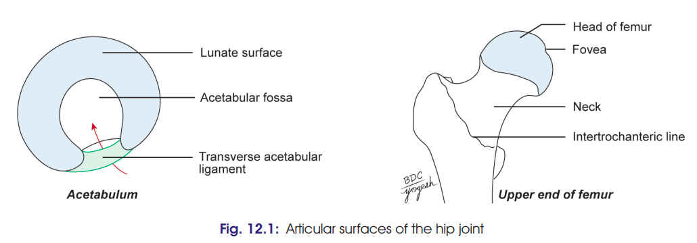
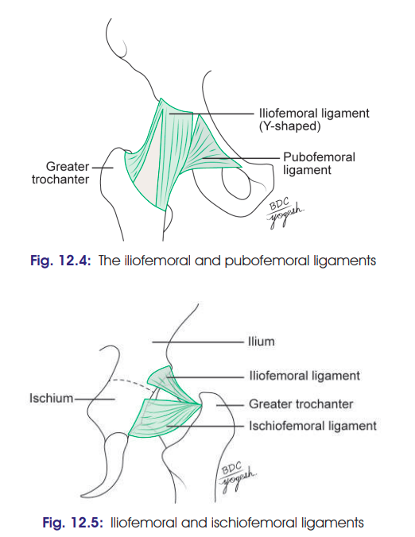
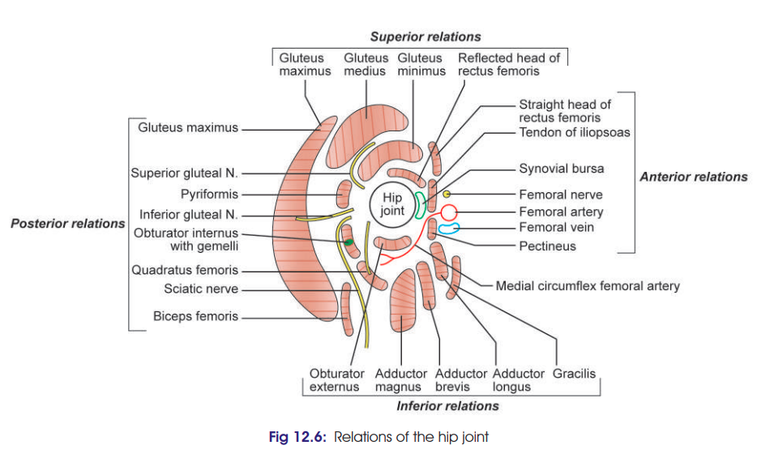

# HIP JOINT — 10 Marks

> **Exam strategy:** For a 10-marker, give good weight to **articular surfaces + ligaments + stability + relations + blood/nerve supply + movements + clinical anatomy**. Don't write every tiny detail from the textbook.

## 1. Definition & Type

* Hip joint is a **synovial joint** between the **head of femur** and **acetabulum** of hip bone.
* It is the **largest ball-and-socket joint**.
* It is **multiaxial**.
* It transmits the weight of the upper body to the lower limb.

---

## 2. Articular Surfaces ⭐

### Head of femur

* More than half of a sphere.
* Covered by **hyaline cartilage**, except at the **fovea capitis**.

### Acetabulum

* Has a **horseshoe-shaped lunate articular surface** covered by cartilage.
* Also has:

  * Acetabular notch
  * Acetabular fossa

> 

---

# 3. Ligaments ⭐⭐⭐

### A. Fibrous/Capsular ligament

* On hip bone → attached to **acetabular labrum**, transverse acetabular ligament and surrounding bone.
* On femur → attached to **intertrochanteric line anteriorly** and about 1 cm medial to intertrochanteric crest posteriorly.
* Synovial membrane lines the inner surface of capsule and intracapsular neck of femur.

### B. Iliofemoral ligament ⭐

* Also called **ligament of Bigelow**.
* Strong, **inverted Y-shaped** ligament on anterior aspect.
* Apex → anterior inferior iliac spine.
* Base → intertrochanteric line.
* **One of the strongest ligaments in the body.**
* Prevents **backward falling of trunk** during standing.

### C. Pubofemoral ligament

* Supports the joint **inferomedially**.
* Extends from iliopubic eminence, obturator crest and membrane to the capsule.

### D. Ischiofemoral ligament

* Comparatively weak.
* Lies **posteriorly**.
* Extends from ischium to acetabulum.
* Some fibres form the **zona orbicularis**.

### E. Ligament of head of femur ⭐

* Flat, triangular ligament.
* Apex → **fovea capitis**.
* Base → margins of acetabular notch and transverse acetabular ligament.
* Carries vessels to head of femur from branches of **obturator and medial circumflex femoral arteries**.

### F. Acetabular labrum

* Fibrocartilaginous rim attached to margin of acetabulum.
* **Deepens the acetabulum** and helps retain the head of femur.

### G. Transverse acetabular ligament

* Bridges the acetabular notch.
* Converts the notch into a **foramen** for passage of acetabular vessels and nerves.

> 

---

# 4. Stability of Hip Joint ⭐⭐⭐

Hip joint combines **great stability with considerable mobility**.

Stability is provided by:

1. **Deep acetabulum**
2. **Acetabular labrum** deepens/narrows the acetabular opening.
3. **Strong ligaments**, especially iliofemoral ligament.
4. **Strong surrounding muscles**
5. **Long and oblique neck of femur**
6. **Atmospheric pressure**

---

# 5. Relations

> 

| Direction     | Important relations                                                                                                     |
| ------------- | ----------------------------------------------------------------------------------------------------------------------- |
| **Anterior**  | Iliopsoas tendon + bursa, femoral vein, femoral artery, femoral nerve                                                   |
| **Posterior** | Gluteus maximus, piriformis, sciatic nerve, nerve to quadratus femoris, obturator internus + gemelli, quadratus femoris |
| **Superior**  | Reflected head of rectus femoris, gluteus minimus, gluteus medius                                                       |
| **Inferior**  | Pectineus, obturator externus, adductors, hamstrings                                                                    |

---

# 6. Bursae Around Hip

* **Trochanteric bursa** — between gluteus maximus and greater trochanter.
* **Ischial bursa** — between gluteus maximus and ischial tuberosity.
* **Gluteofemoral bursa** — between gluteus maximus and vastus lateralis.
* **Subpsoas bursa** — between iliopubic eminence and psoas major tendon.
* Bursae between **gluteus medius/minimus and greater trochanter**.

---

# 7. Blood Supply ⭐

Branches of:

1. **Medial circumflex femoral artery**
2. **Lateral circumflex femoral artery**
3. **Obturator artery**
4. **Superior gluteal artery**
5. **Inferior gluteal artery**

> **Important:** Retinacular branches of the **medial circumflex femoral artery** are especially important for the blood supply of the head and neck of femur.

---

# 8. Nerve Supply

* **Femoral nerve** → through nerve to rectus femoris
* **Anterior division of obturator nerve**
* **Nerve to quadratus femoris**
* **Superior gluteal nerve**

---

# 9. Movements ⭐

| Movement             | Chief muscles                                  | Accessory                                       |
| -------------------- | ---------------------------------------------- | ----------------------------------------------- |
| **Flexion**          | Iliopsoas                                      | Rectus femoris, sartorius, pectineus, adductors |
| **Extension**        | Gluteus maximus, hamstrings                    | —                                               |
| **Adduction**        | Adductor longus, brevis, magnus                | Pectineus, gracilis                             |
| **Abduction**        | Gluteus medius & minimus                       | Tensor fasciae latae, sartorius                 |
| **Medial rotation**  | TFL + anterior fibres of glutei medius/minimus | —                                               |
| **Lateral rotation** | Obturators, gemelli, quadratus femoris         | Piriformis, gluteus maximus, sartorius          |

**Movements:** flexion, extension, abduction, adduction, medial rotation, lateral rotation and **circumduction**.

---

# 10. Clinical Anatomy ⭐⭐⭐⭐⭐

### 1. Congenital dislocation of hip

* More common than congenital dislocation of other joints.
* Head of femur slips **upwards onto gluteal surface of ilium** due to developmental deficiency of upper acetabular margin.
* Causes **lurching gait**.
* **Trendelenburg test is positive.**

### 2. Dislocation

* **Posterior dislocation** — most common.
* Anterior — less common.
* Central — rare.
* **Sciatic nerve may be injured** in posterior dislocation.

### 3. Coxa vara and coxa valga

* Normal neck-shaft angle:

  * Child → about **150°**
  * Adult → about **127°**
* **Coxa vara:** angle decreased.
* **Coxa valga:** angle increased.

### 4. Referred pain

* Disease of hip, e.g. **tuberculosis**, may cause pain in the **knee** because of common nerve supply.

### 5. Fracture neck of femur ⭐⭐⭐

* May be:

  * **Subcapital**
  * Cervical
  * Basal
* Damage to **retinacular arteries** can cause **avascular necrosis of head of femur**.
* Risk is greatest in **subcapital fractures** and least in basal fractures.

### 6. Perthes' disease

* Characterised by **destruction and flattening of head of femur**.
* Also called **pseudocoxalgia**.
* X-ray shows increased joint space.

### 7. Osteoarthritis

* Degenerative disease, commonly in old age.
* Wear of articular cartilage → formation of **osteophytes** → restricted and painful movements.

### 8. Hip aspiration

Two approaches:

* **Anterior:** needle introduced below ASIS and directed upwards, backwards and medially.
* **Lateral:** needle introduced superior and medial to greater trochanter.

### 9. Shenton's line

* Continuous curve formed by:
  **upper border of obturator foramen + lower border of neck of femur**.
* Becomes abnormal in **fracture neck of femur**.

### 10. Hip replacement

* **Hip arthroplasty** replaces a worn-out/damaged hip joint with an artificial prosthesis.
* May be **partial or complete**.
* Used particularly in severe osteoarthritis and other destructive hip conditions.

### 11. Close-packed position

* **Extension + slight abduction + medial rotation**.
* Capsule is maximally taut.

---
