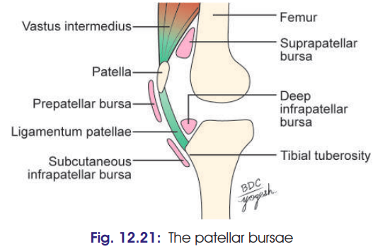

# Bursae Around Knee Joint — 5 Marks

**Introduction:**
**12 bursae** are described around the knee, arranged as **4 anterior, 4 lateral and 4 medial bursae**.

### 1. Anterior bursae

1. **Subcutaneous prepatellar bursa** — between skin and patella/upper ligamentum patellae.
2. **Subcutaneous infrapatellar bursa** — between skin and ligamentum patellae.
3. **Suprapatellar bursa** — between anterior surface of lower femur and deep surface of quadriceps femoris.
4. **Deep infrapatellar bursa** — between ligamentum patellae and tibial tuberosity.

### 2. Lateral bursae

1. **Lateral gastrocnemius bursa** — between lateral head of gastrocnemius and joint capsule.
2. **Fibular bursa** — between fibular collateral ligament and tendon of biceps femoris.
3. **Fibulopopliteal bursa** — between fibular collateral ligament and tendon of popliteus.
4. **Subpopliteal bursa** — between popliteus and lateral condyle of femur.

### 3. Medial bursae

1. **Medial gastrocnemius (Bordie’s) bursa** — between medial head of gastrocnemius and joint capsule.
2. **Anserine bursa** — between tibial collateral ligament and pes anserinus.
3. **Semimembranosus bursa** — between semimembranosus and tibial collateral ligament.
4. **Bursa between semimembranosus and medial condyle of tibia.**

---

## Clinical anatomy ⭐

### 1. Housemaid's / Carpenter's knee

* **Prepatellar bursitis**
* Due to repeated friction/pressure over the prepatellar bursa.
* Presents as **swelling over the patella**, which may be painful and restrict movements.

### 2. Clergyman's knee

* **Subcutaneous infrapatellar bursitis**
* Due to repeated **kneeling/crawling**.
* Presents as swelling **below the patella**, anterior to ligamentum patellae.

### 3. Baker's cyst

* Inflammation/distension of the bursa deep to **semimembranosus**.
* Presents as a **fluid-filled swelling in the medial popliteal region**.
* May restrict knee movements.

### 4. Anserine Bursitis / Goose's foot
* Bursa anserine between insertion of sartorius, gracilis, semitendinosus and tibial collateral ligament may get inflammed.
---

### 🧠 Super-fast recall

**4 Anterior:**
**Prepatellar → Infrapatellar → Suprapatellar → Deep infrapatellar**

**4 Lateral:**
**Gastro → Fibular → Fibulopopliteal → Subpopliteal**

**4 Medial:**
**Gastro → Anserine → Semimembranosus → Semimembranosus–medial condyle**

- **3 clinicals are must-know:**

> **Housemaid → Prepatellar**
> **Clergyman → Subcutaneous infrapatellar**
> **Baker → Semimembranosus-related bursa**

