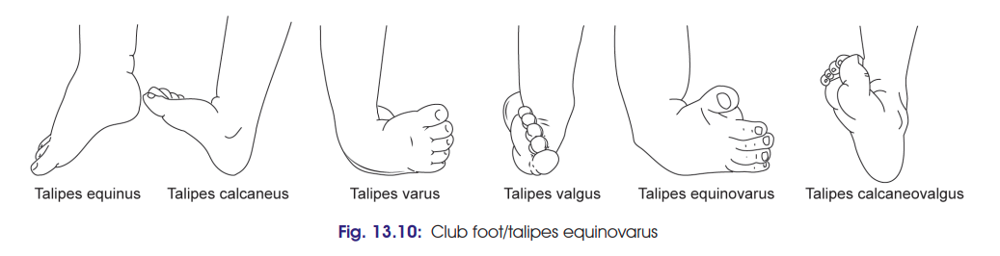

# Clubfoot (Talipes)

**Definition:**
Clubfoot (talipes) is a **congenital or acquired deformity** characterised by abnormal rotation/position of the foot.

### Types

1. **Talipes equinus**

   * Foot is **plantar flexed**.
   * Patient walks on **toes**, with heel raised.

2. **Talipes calcaneus**

   * Foot is **dorsiflexed**.
   * Patient walks on **heel**, with forefoot raised.

3. **Talipes varus**

   * Foot is **inverted and adducted**.
   * Patient walks on the **outer border** of foot.

4. **Talipes valgus**

   * Foot is **everted and abducted**.
   * Patient walks on the **inner border** of foot.

5. ⭐ **Talipes equinovarus**

   * **Commonest deformity** of the foot.
   * Foot is **inverted + adducted + plantar flexed**.
   * May be associated with **spina bifida**.

6. **Talipes calcaneovalgus**

   * Foot is **dorsiflexed at ankle joint**.
   * Foot is **everted at midtarsal joints**.

### 🔑 One-line recall

**Equinus → toes**
**Calcaneus → heel**
**Varus → inverted + adducted**
**Valgus → everted + abducted**
**Equinovarus → inversion + adduction + plantar flexion → commonest**

