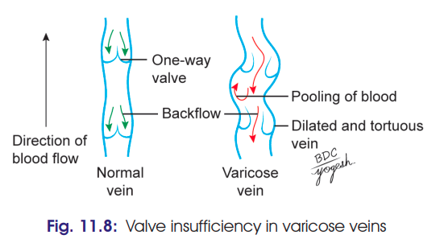

# Varicose Veins ⭐⭐⭐

### Definition

**Varicose veins** are **enlarged, swollen and tortuous veins**, resulting from **chronic venous insufficiency**.

### Predisposing Factors

* Commonly affects **superficial veins of the lower limb**.
* Common in occupations involving **prolonged standing** — bus conductors, traffic police, doctors, teachers, etc.
* **More common in females.**
* Common during the **3rd trimester of pregnancy** due to compression of iliac veins by the enlarged uterus; usually subsides after delivery.

---

## Anatomical Basis ⭐⭐⭐

The main cause is **incompetence of venous valves**.

### 1. Incompetent perforator valves

**Deep veins → superficial veins**
⬇
High-pressure reflux into superficial veins during muscle contraction
⬇
**Dilatation and tortuosity of superficial veins**

### 2. Incompetent saphenofemoral valve

* Causes progressive **dilatation and tortuosity of great/long saphenous vein**.

> 

---

# Tests for Incompetent Valves ⭐⭐⭐

## 1. Trendelenburg Test

**Purpose:** To locate the site of incompetent venous valves.

### Procedure

1. Patient lies down and **raises the limb** to empty superficial veins.
2. Apply pressure over the **saphenofemoral junction**.
3. Ask the patient to **stand quickly**.

### Interpretation

**A. Superficial vein incompetence**

* Release pressure at saphenofemoral junction.
* **Rapid filling from above downward → Positive test**
* Indicates incompetence of superficial veins.

**B. Perforator incompetence**

* Keep pressure at saphenofemoral junction for about **1 minute**.
* **Gradual filling from below upward → Positive test**
* Indicates incompetent perforators allowing blood to pass **deep → superficial**.

---

## 2. Perthes' Test ⭐

**Purpose:** Tests the **deep veins**.

### Procedure

* Apply a tourniquet around the **upper thigh** to occlude the great saphenous vein but **not the femoral vein**.
* Ask the patient to walk/exercise gently.

### Interpretation

* **Positive:** Varicose veins become **more distended** → suggests obstruction of deep/perforating veins.
* **Negative:** Varicose veins **shrink** → deep and perforating veins are functioning normally.

---

## Treatment

* **Sclerosing injections**
* **Laser treatment**

### 🔥 Exam flow to remember

**Valve incompetence**
→ **Venous reflux**
→ **Venous hypertension**
→ **Dilated + tortuous superficial veins**
→ **Varicose veins**

**Trendelenburg → superficial/perforator valves**

**Perthes → deep veins**
