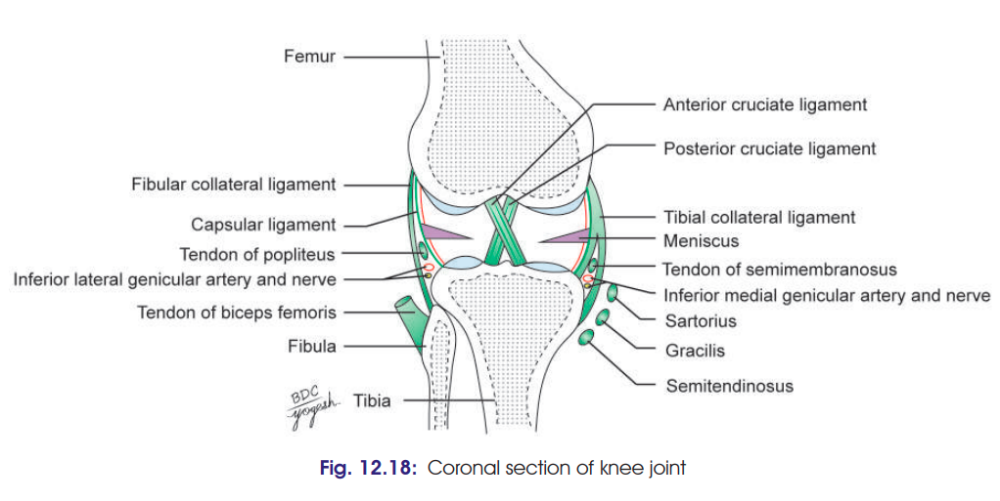
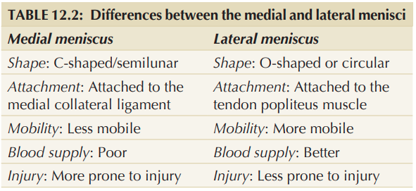
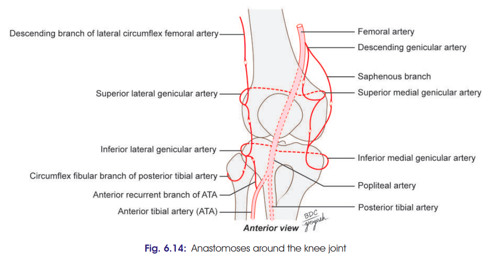

# KNEE JOINT

### 1. Type

* **Synovial, condylar joint**
* Formed by:

  * Medial femorotibial joint
  * Lateral femorotibial joint
  * Femoropatellar joint
* It is a **complex joint** because menisci divide the joint cavity.

### 2. Articular surfaces

**Femur**

* Medial and lateral condyles.

**Tibia**

* Superior articular surfaces of medial and lateral condyles.

**Patella**

* Upper **3/4th of posterior surface** articulates with femur.
* Divided by a vertical ridge into larger lateral and smaller medial areas.

---

# 3. Ligaments
  1. Fibrous capsule
  2. Ligamentum patellae
  3. Tibial collateral or medial ligament
  4. Fibular collateral or lateral ligament
  5. Oblique popliteal ligament
  6. Arcuate popliteal ligament
  7. Anterior and posterior cruciate ligaments
  8. Medial and lateral menisci
  9. Transverse ligament.
### A. Fibrous capsule

* Thin and deficient anteriorly.
* Anteriorly replaced by **quadriceps tendon, patella and ligamentum patellae**.
* Attached to femur and tibia around the articular margins.

### B. Ligamentum patellae

* Continuation of quadriceps tendon.
* **Apex of patella → tibial tuberosity.**
* Stabilizes patella.

### C. Tibial collateral ligament — MCL

* **Medial epicondyle of femur → medial surface of tibia.**
* Deep part blends with capsule and **medial meniscus**.
* Provides medial stability.

### D. Fibular collateral ligament — LCL

* **Lateral epicondyle of femur → head of fibula.**
* Cord-like.
* Not attached to lateral meniscus.

### E. Oblique popliteal ligament

* Expansion of **semimembranosus tendon**.
* Strengthens posterior capsule.

### F. Arcuate popliteal ligament

* Arises from **head of fibula**.
* Arches over popliteus tendon.

### G. Cruciate ligaments

**ACL**

* Anterior intercondylar area of tibia → posterior part of medial surface of lateral femoral condyle.
* **Taut in extension.**
* Prevents:

  * Anterior displacement of tibia
  * Posterior displacement of femur
  * Hyperextension

**PCL**

* Posterior intercondylar area of tibia → anterior part of lateral surface of medial femoral condyle.
* **Taut in flexion.**
* Prevents:

  * Posterior displacement of tibia
  * Anterior displacement of femur
  * Hyperflexion

### 🔑 ACL vs PCL

**ACL = Extension → prevents Anterior tibial displacement**

**PCL = Flexion → prevents Posterior tibial displacement**

---

# 4. Menisci

There are **two fibrocartilaginous crescent-shaped menisci**:

### Medial meniscus

* Nearly semicircular.
* **Firmly attached to MCL.**
* Therefore **less mobile**.

### Lateral meniscus

* Nearly circular.
* More mobile.
* Separated from LCL by **popliteus tendon**.
* Posterior end attached to femur by **meniscofemoral ligaments**.

### Functions

1. Increase **congruence** of articular surfaces.
2. Act as **shock absorbers**.
3. Help in **lubrication**.
4. Provide **proprioception**.

---

# 5. [Bursae](./Imp%20Applied/Bursae%20of%20Knee%20Joint%20and%20Applied.md)

- [click](./Imp%20Applied/Bursae%20of%20Knee%20Joint%20and%20Applied.md)

---

# 6. Relations

### Anteriorly

* Anterior bursae
* Ligamentum patellae
* Patellar plexus

### Posteriorly

* **Popliteal vessels**
* Tibial nerve
* Gastrocnemius
* Plantaris
* Common peroneal nerve
* Semimembranosus
* Popliteus

### Medially

* Sartorius
* Gracilis
* Semitendinosus
* Great saphenous vein
* Saphenous nerve

### Laterally

* Biceps femoris
* Popliteus tendon

---

# 7. Blood supply

Through **genicular anastomosis**:

* Five genicular branches of popliteal artery
* Descending genicular artery
* Descending branch of lateral circumflex femoral artery
* Recurrent branches of anterior tibial artery
* Circumflex fibular branch

---

# 8. Nerve supply

* **Femoral nerve** — branches to vasti
* **Tibial nerve** — genicular branches
* **Common peroneal nerve** — genicular branches
* **Obturator nerve** — posterior division

---

# 9. Movements

* **Flexion**
* **Extension**
* **Medial rotation**
* **Lateral rotation**

Flexion and extension are the chief movements.

---

# ⭐ 10. Locking and unlocking

### Locking

* Occurs during **last 30° of extension**.
* With foot on ground → **medial rotation of femur on tibia**.
* Mainly produced by **quadriceps, especially vastus medialis**.
* All ligaments become taut.
* Knee becomes rigid and stable.
* **Reduces muscular effort during standing.**

### Unlocking

* Initial movement of flexion.
* **Lateral rotation of femur on tibia**.
* Produced by **popliteus**.
* Ligaments become relaxed.

### 🔑 Remember

**LOCK = Medial rotation + Quadriceps**

**UNLOCK = Lateral rotation + Popliteus**

---

# 11. [Clinical](./Imp%20Applied/Knee%20Joint%20Applied.md)