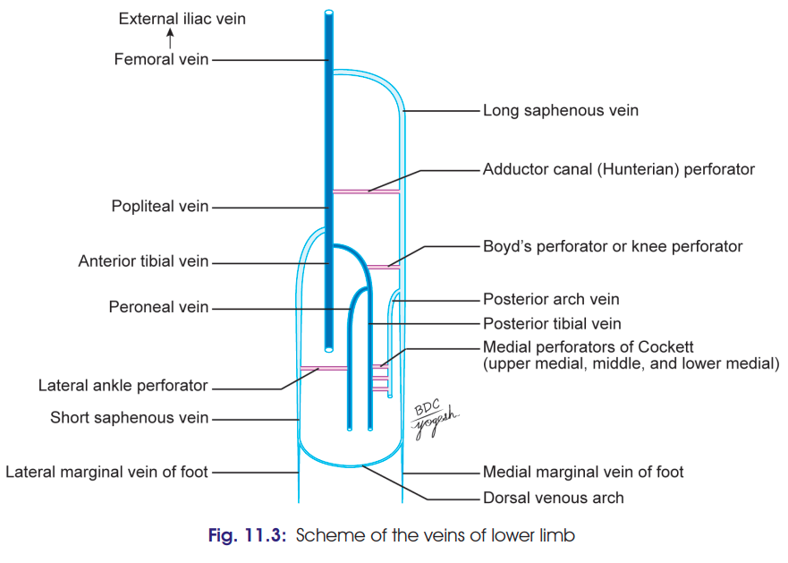

# Long Saphenous Vein

### 1. Introduction

* **Great/long saphenous vein** lies in the **superficial fascia of the lower limb**.
* It is the **longest vein of the body**.
* It represents the **preaxial vein of the lower limb**.

### 2. Formation

It is formed by union of:

* **Medial end of dorsal venous arch**
* **Medial marginal vein**, which drains the medial side of great toe.

### 3. Course ⭐

* Passes **in front of the medial malleolus**.
* Ascends along the medial side of tibia.
* Crosses the lower ⅓ of medial surface of tibia obliquely.
* Runs along the medial border of tibia to reach the back of knee.
* In the thigh, it inclines forwards to reach the **saphenous opening**.
* Pierces the **cribriform fascia** and terminates by opening into the **femoral vein**.
* **Saphenous nerve lies anterior to the vein.**

### 4. Tributaries & Connections

* Communicates with the **small saphenous vein** and deep veins through perforating veins.
* Important tributaries near the saphenous opening:

  * **Superficial epigastric vein**
  * **Superficial circumflex iliac vein**
  * **Superficial external pudendal vein**
  * **Deep external pudendal vein**
* Has about **10–20 valves**.
* Perforating veins normally allow blood flow **from superficial → deep veins**.
* Failure of valves → **varicose veins**.

>  

---

# Clinical Anatomy ⭐⭐⭐

### 1. Venesection / Cut-down

* The great saphenous vein is easily accessible **in front of the medial malleolus**.
* **Venesection (cut-down)** can therefore be performed here.
* It is useful for **transfusion of blood or fluids** when other peripheral veins are unavailable or collapsed.
* During the procedure, the **saphenous nerve must be identified and protected**, because it lies **anterior to the great saphenous vein**.

### 2. Varicose veins

* The great saphenous vein contains numerous valves and communicates with deep veins through **valved perforators**.
* **Incompetence of these valves** allows abnormal backward pooling of blood → **varicose veins**.
* Incompetence of the **saphenofemoral valve** is particularly important.

### 3. Coronary artery bypass graft ⭐

* The great saphenous vein is commonly used as a **graft for coronary artery bypass surgery (CABG)**.
* The vein is **reversed before implantation** because its valves would otherwise obstruct the flow of blood in the required direction.

### 🔑 Last-minute recall

**LSV = Longest vein + preaxial + in front of medial malleolus + saphenous opening → femoral vein**

**Clinical = Venesection + Varicose veins + CABG**.
