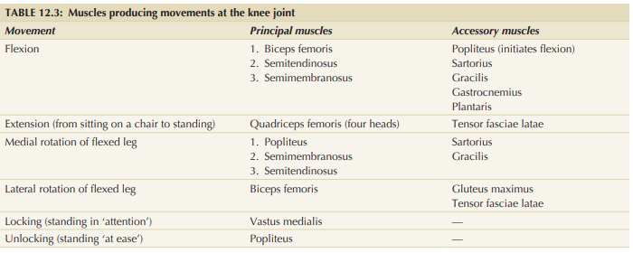
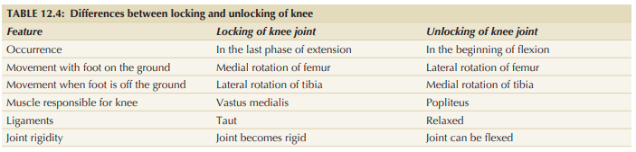

# Movements of Knee Joint — 5 Marks

### Introduction

The active movements of the knee joint are:

1. **Flexion**
2. **Extension**
3. **Medial rotation**
4. **Lateral rotation**
5. **Locking & Unlocking**

### 1. Flexion and Extension

* These are the **chief movements** of the knee.
* Occur mainly in the **meniscofemoral (upper) compartment**.
* Occur around a **transverse axis**.
* **Flexion:** posterior angle between thigh and leg decreases.
* **Extension:** posterior angle between thigh and leg increases.

### 2. Medial and Lateral Rotation

* Occur mainly in the **meniscotibial (lower) compartment**.
* Occur around a **vertical axis**.
* Range of movement is small.
* Usually occur in association with flexion and extension.

---

## 3. Locking of Knee ⭐

**Definition:** Position of the femur on the tibia that stabilizes the knee and minimizes muscular effort during standing.

* Occurs during the **last 30° of extension**.
* With foot on ground → **medial rotation of femur on tibia**.
* **Muscle:** Quadriceps femoris, mainly **vastus medialis**.
* All ligaments become **taut** and the knee becomes rigid.
* **Importance:** Reduces muscular effort during standing.

### Anatomical basis

* Anteroposterior diameter of **lateral femoral condyle is less** than that of medial condyle.
* During terminal extension, this produces medial rotation of the femur and completes the locking mechanism.

---

## 4. Unlocking of Knee ⭐

* Occurs during the **initial phase of flexion**.
* With foot on ground → **lateral rotation of femur on tibia**.
* **Muscle:** **Popliteus**.
* Ligaments become relaxed and the knee loses its rigidity.

### 🔑 Exam recall

**Movement → Compartment**

> **Flexion + Extension → Upper / meniscofemoral**
> **Rotation → Lower / meniscotibial**

**LOCK → Medial rotation + Quadriceps**

**UNLOCK → Lateral rotation + Popliteus**
