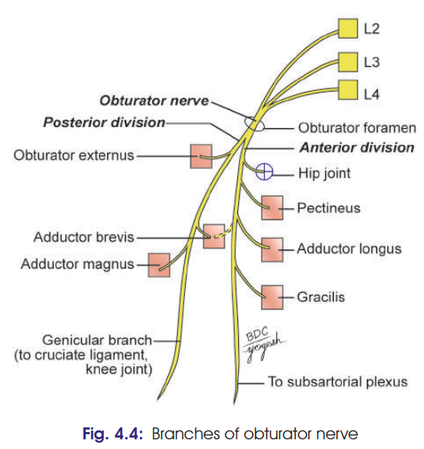
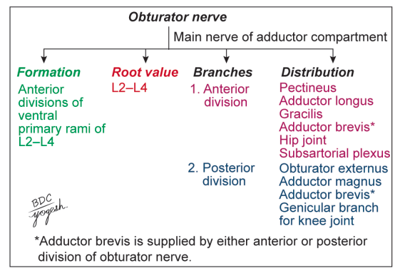

# OBTURATOR NERVE

### 1. Definition

The **obturator nerve** is the **chief nerve of the medial compartment of the thigh**.

### 2. Origin and Root Value

* Branch of **lumbar plexus**
* Formed by **ventral divisions of anterior primary rami of L2, L3 and L4**
* **Root value: L2–L4**

### 3. Course

* Proximal part lies in the **pelvis**.
* Enters the thigh through the **obturator canal**.
* Within the obturator canal, it divides into:

  * **Anterior division**
  * **Posterior division**

### 4. Distribution

#### A. Anterior division

Passes:

* In front of **obturator externus**
* Behind **pectineus and adductor longus**
* In front of **adductor brevis**

**Supplies:**

* Pectineus
* Adductor longus
* Gracilis
* Adductor brevis (may be supplied by posterior division)
* **Hip joint**
* Gives a twig to **subsartorial plexus**
* Ends by supplying the **femoral artery in adductor canal**

> 

#### B. Posterior division

* Pierces the **upper border of obturator externus**
* Descends **behind adductor brevis and in front of adductor magnus**

**Supplies:**

* Obturator externus
* Adductor magnus
* Adductor brevis (if not supplied by anterior division)
* Gives **genicular branch** to the knee joint

  * Enters popliteal fossa
  * Pierces oblique popliteal ligament
  * Supplies **capsule and cruciate ligaments of knee**

### 5. Clinical Anatomy ⭐

* **Obturator nerve block/division** may relieve severe **adductor spasm**, e.g. in spastic paraplegia.
* **Hip joint disease** may produce **referred pain in the knee and medial thigh** because both receive obturator nerve supply.
* May be involved along with the **femoral nerve in retroperitoneal tumours**.
* **Obturator nerve entrapment** can cause chronic pain over the **medial side of the thigh**, particularly in athletes with hypertrophied adductor muscles.

### ⭐ Exam-ending line

**Thus, the obturator nerve is the principal motor nerve of the medial compartment of the thigh and also supplies the hip and knee joints.**

> 