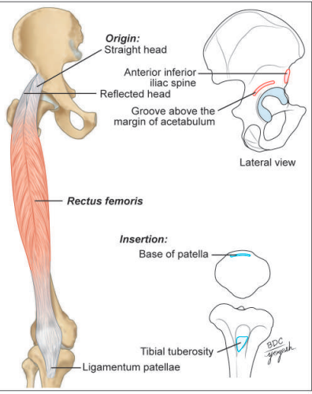
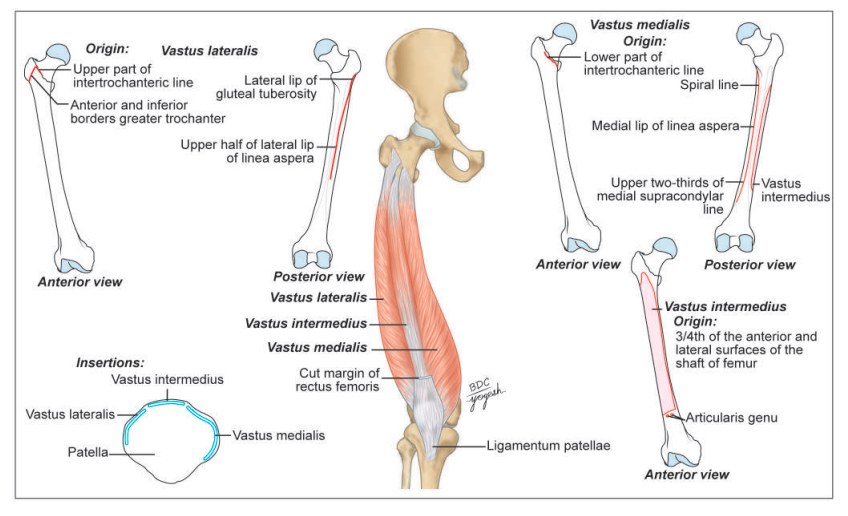

# **Quadriceps Femoris**

### **Headings**

* Introduction
* Muscles Involved
* Origin & Insertion
* Nerve Supply
* Blood Supply
* Actions
* Applied

## **1. Introduction**

* **Group of four muscles**
* Found in **anterior compartment of thigh**
* **Extensor Compartment muscles**
* The **patella** is a **sesamoid bone** in the tendon of the quadriceps femoris.
* The **ligamentum patellae** is the actual tendon of the quadriceps femoris, which is inserted into the upper part of **tibial tuberosity**

## **2. Muscles Involved**

* **Rectus Femoris:**

  * **Fusiform**, runs over the Vasti muscles
  * Superficial fibres: **bipennate**
  * Deep fibres: **straight**
* **Vasti muscles:**

  * **V. Lateralis, V. Intermedius, V. Medialis**
  * The three vasti are wrapped around the **femur shaft** in the positions indicated by their names

## **3. Origin & Insertion**

* **Rectus Femoris:**

  * **Origin**

    * **Straight Head:** Upper half of ASIS
    * **Reflected Head:** Groove above the margin of acetabulum
  * **Insertion**

    * **Base of Patella**
  * 
* **Vastus Lateralis:**

  * **Origin**

    * Upper part of intertrochanteric line
    * Anterior and inferior borders of greater trochanter
    * Lateral lip of gluteal tuberosity
    * Upper half of lateral lip of linea aspera
  * **Insertion**

    * **Lateral part of base of Patella**
* **Vastus Intermedius**

  * **Origin**

    * Upper 3/4th of the anterior and lateral surfaces of the shaft of femur
  * **Insertion**

    * **Base of Patella**
* **Vastus Medialis**

  * **Origin**

    * Lower part of intertrochanteric line
    * Spiral line
    * Medial lip of linea aspera
    * Upper 1/4th of medial supracondylar line
  * **Insertion**

    * Medial 1/3rd of the base of the base of patella
    * Upper 2/4th of the medial border of the patella
  * 

## **4. Nerve Supply**

* All of the quadriceps are supplied by **femoral nerve**

## **5. Blood Supply**

* All of the quadriceps are supplied by **femoral artery**

## **6. Actions**

* **Rectus Femoris:**

  * **Extensor of Knee Joint**
  * **Flexor of Hip Joint**
  * also k/n as **"Kicking Muscle"**
* **Vastus Lateralis:**

  * **Extensor of Knee Joint**
  * helps in **standing, walking and running**
* **Vastus Intermedius:**

  * **Extensor of Knee Joint**
* **Vastus Medialis:**

  * **Extensor of Knee Joint**
  * **prevents lateral displacement of patella**
  * Rotates femur medially during **locking stage of extension of knee joint.**
  * Action is **extremely important for stability of patella.**

## **7. Applied**

* **Testing for quadriceps femoris:**

  * Ask the person to **extend the knee against the resistance** and palpate the contracting muscle.
* **Patellar tendon reflex or knee jerk (L3, L4):**

  * The knee joint gets extended on tapping the **ligamentum patellae.**
* **Intramuscular injection**

  * can be given in **anterolateral region of thigh** in the **vastus lateralis muscle.**
