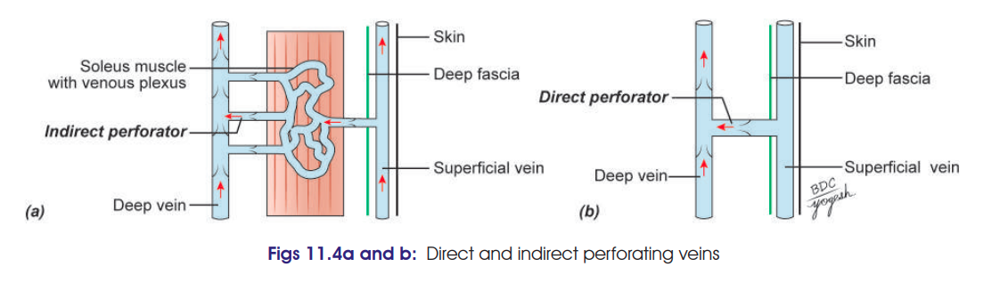

# Small / Short Saphenous Vein 

### 1. Formation

* Formed on the **dorsum of foot** by union of:

  * **Lateral end of dorsal venous arch**
  * **Lateral marginal vein**

### 2. Course ⭐

* Passes **behind the lateral malleolus** to enter the back of the leg.
* Ascends **lateral to tendo calcaneus**.
* Then runs upwards along the **middle line of the calf**.
* Reaches the **lower part of popliteal fossa**.
* Pierces the **deep fascia**.

### 3. Termination

* Opens into the **popliteal vein**.

### 4. Area Drained

Drains:

* **Lateral border of foot**
* **Heel**
* **Back of leg**

### 5. Relations & Communications

* Accompanied by the **sural nerve**.
* Communicates with:

  * **Great saphenous vein**
  * **Deep veins** of the lower limb.

---

## Clinical Anatomy ⭐

* Because the small saphenous vein communicates with the deep venous system through perforating veins, **incompetence of venous valves can contribute to varicose veins**.
* Its relation to the **sural nerve** is important during surgical procedures around the posterior leg.

---

# Perforating Veins 

### Definition

**Perforating veins connect the superficial veins with the deep veins** of the lower limb.

### Types

| Type                     | Connection                                          |
| ------------------------ | --------------------------------------------------- |
| **Indirect perforators** | Superficial veins → **muscular veins → deep veins** |
| **Direct perforators**   | Superficial veins → **directly → deep veins**       |

> 

### Important Direct Perforators ⭐

**1. Thigh**

* **Adductor canal perforator** → great saphenous vein → femoral vein.

**2. Below knee**

* Connects great saphenous/posterior arch vein → **posterior tibial vein**.

**3. Leg**

* **Lateral perforator** → small saphenous vein/tributary → **peroneal vein**.

**4. Medial perforators — 3**

* Connect **posterior arch vein → posterior tibial vein**:

  * **Upper medial** — junction of middle & lower thirds of leg
  * **Middle medial** — above medial malleolus
  * **Lower medial** — posteroinferior to medial malleolus

### 🔑 Exam recall

**SSV:**
**Lateral arch → behind lateral malleolus → middle of calf → popliteal vein**

**Perforators:**
**Superficial → Deep** ⬇️
and **valves normally prevent reverse flow**.
