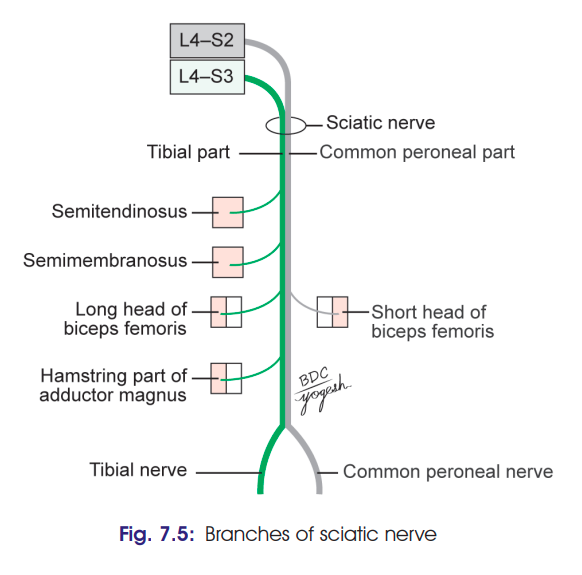

# Sciatic Nerve

### Headings

* Definition
* Origin & root value
* Course
  * Pelvis
  * Gluteal region
  * Thigh
* Companion Artery
* Relations
* Branches
* Applied anatomy

---

# 1. Definition

* **Sciatic nerve** is the **thickest nerve in the body**.
* It is the **largest branch of the sacral plexus**.
* It terminates by dividing into:

  * **Tibial nerve**
  * **Common peroneal nerve**

---

# 2. Origin & Root Value

* **Root value: L4, L5, S1, S2, S3**
* It has two parts:

| Part                     | Root contribution                       |
| ------------------------ | --------------------------------------- |
| **Tibial part**          | Ventral divisions of L4, L5, S1, S2, S3 |
| **Common peroneal part** | Dorsal divisions of L4, L5, S1, S2      |

### 🧠 Easy idea

**Sciatic = L4 → S3**

Then remember:

**Tibial = Ventral**
**Common peroneal = Dorsal**

---

# 3. Course ⭐

Think of the sciatic nerve as simply:

**Pelvis → below piriformis → between GT & IT → thigh → popliteal fossa → splits**

### A. In pelvis

* Lies **in front of piriformis**.
* Covered by **fascia of piriformis**.

### B. In gluteal region

* Enters through the **greater sciatic foramen**.
* Passes **below piriformis**.
* Runs downward with slight **lateral convexity**.
* Passes between:

  * **Ischial tuberosity medially**
  * **Greater trochanter laterally**

### 🧠 Most important picture in your head

**Piriformis**
↓
**Sciatic nerve comes BELOW it**
↓
**Ischial tuberosity ← nerve → Greater trochanter**

### C. In thigh

* Enters posterior thigh at the **lower border of gluteus maximus**.
* Runs **vertically downward**.
* Reaches the **superior angle of popliteal fossa**.
* Divides into:

  * **Tibial nerve**
  * **Common peroneal nerve**

📌 **Division:** approximately at the junction of **upper 2/3 and lower 1/3 of thigh**.

---

# 4. Relations ⭐

## A. Gluteal region

Don't memorize "superficial/deep/medial" randomly. Think:

### **Behind**

* **Gluteus maximus**

### **In front**

1. Body of ischium
2. Obturator internus + gemelli
3. Quadratus femoris
4. Obturator externus
5. Capsule of hip joint
6. Upper transverse fibres of adductor magnus

### **Medial**

* Inferior gluteal nerve
* Inferior gluteal vessels

### 🧠 One-line memory

**Sciatic nerve is sandwiched:**

> **Gluteus maximus behind + deep muscles/hip joint in front**

---

## B. Relations in Thigh ⭐

This is much easier.

| Direction                   | Relation                                   |
| --------------------------- | ------------------------------------------ |
| **Posterior / superficial** | Long head of **biceps femoris** crosses it |
| **Anterior / deep**         | **Adductor magnus**                        |
| **Medial**                  | **Semimembranosus + semitendinosus**       |
| **Lateral**                 | **Biceps femoris**                         |

### 🧠 Visualize the nerve in the middle:

**Semimembranosus + Semitendinosus** ⬅️ **SCIATIC NERVE** ➡️ **Biceps femoris**

And **Adductor magnus is underneath/deep to it.**

---

# 5. Companion Artery

* Sciatic nerve is accompanied by a small artery called **arteria nervi ischiadici**.
* It is a branch of the **inferior gluteal artery**.
* It accompanies the nerve for some distance before entering its substance.

---

# 6. Branches

### A. Articular branches

* Supply the **hip joint**.
* Arise in the **gluteal region**.

### B. Muscular branches

**Tibial part supplies:**

* Semitendinosus
* Semimembranosus
* Long head of biceps femoris
* Hamstring/ischial part of adductor magnus

**Common peroneal part supplies:**

* **Short head of biceps femoris ONLY**

### 🧠 High-yield

> **Sciatic → mostly hamstrings through tibial part; only short head of biceps through common peroneal part.**

### C. Terminal branches

* **Tibial nerve**
* **Common peroneal nerve**

---

# 7. Clinical Anatomy of Sciatic Nerve

### 1. "Sleeping foot"

* When sitting on a **hard edge**, the sciatic nerve may be compressed between the **edge of the chair/table and femur**.
* Causes **temporary numbness/tingling of the lower limb**.
* Sensation returns after relieving the pressure → commonly called **"sleeping foot."**

### 2. Sciatica ⭐

* **Shooting pain along the distribution of the sciatic nerve and its terminal branches.**
* Usually begins in the **gluteal region** and radiates:
  **Back of thigh → lateral side of leg → dorsum of foot**
* Usually caused by **compression of one or more nerve roots** forming the sciatic nerve.
* Common causes:

  * **Intervertebral disc prolapse**
  * Neuritis

### 3. Sciatic nerve injury ⭐

**Causes:**

* Penetrating wounds
* Hip dislocation

**Motor loss:**

* Loss of **hamstring function**
* **Foot drop**
* Loss of:

  * Dorsiflexion
  * Plantar flexion
  * Eversion
  * Movements of muscles of the sole

**Sensory loss:**

* Back of thigh
* Whole leg
* Foot

**Exception:** Area supplied by the **saphenous nerve** is spared.

### ⭐ Exam-ready summary

> **Sciatica = pain** along sciatic distribution.
> **Sciatic injury = motor + sensory loss**, with **foot drop** and sparing of the **saphenous nerve area**.

# ⭐ Ultra-High-Yield Revision

If you have only 1 minute before the exam:

**Sciatic nerve**
→ Thickest nerve
→ Largest branch of sacral plexus
→ **L4–S3**
→ **Below piriformis**
→ Between **ischial tuberosity & greater trochanter**
→ Descends posterior thigh
→ Divides at **upper 2/3 + lower 1/3 junction**
→ **Tibial + common peroneal**

### Relations

**Gluteal:**
**Behind:** Gluteus maximus
**In front:** deep structures + hip joint
**Medial:** inferior gluteal nerve/vessels

**Thigh:**
**Medial:** Semimembranosus + Semitendinosus
**Lateral:** Biceps femoris
**Deep:** Adductor magnus
**Crossed superficially by:** Long head of biceps femoris

---