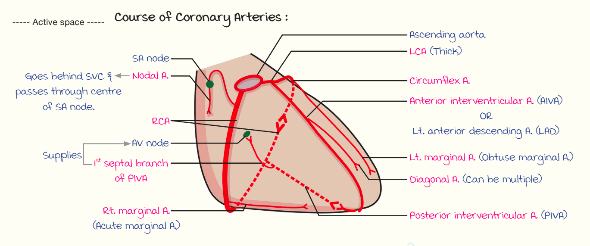

# Right Coronary Artery
### Headings 
- Position 
- Course 
- Branches
- Area of Distribution

## Position 
  - Smaller than LCA
  - Arises from anterior aortic sinus
## Course 
The course is divided into **two segments**:
  1. First Segment:
     - Passes **forwards and to the right**.
     - Emerges between the **root of the pulmonary trunk** and the **right auricle**.
     - Descends in the **right anterior coronary sulcus**.
     - Reaches the **junction of the right and inferior borders of the heart**.
  2. Second Segment:
     - Winds around the **inferior border** of the heart.
     - Reaches the **diaphragmatic surface**.
     - Runs **backwards and to the left** in the **right posterior coronary sulcus**.
     - Reaches the **crux of the heart**.
     - Terminates by **anastomosing with the circumflex branch of the left coronary artery** at the **crux of the heart (≈60%)**.

## Branches
 1. Atrial Branches
    - **Anterior, posterior, and lateral atrial branches**.
    - **SA nodal artery** is one of the anterior atrial branches.
    - Origin of SA nodal artery:
      - **Right coronary artery** – **60%**
      - **Circumflex branch of left coronary artery** – **40%**

 2. Right Conus Artery
    - Forms an **arterial circle** around the **pulmonary trunk**.
    - Anastomoses with the **left conus branch** of the left coronary artery.
    - This arterial circle is called the **Annulus of Vieussens**.

 3. Ventricular Branches
    - Divided into:
      - **Anterior group** – supplies the **sternocostal surface**.
      - **Posterior group** – supplies the **diaphragmatic surface**.

 4. Right Marginal Artery
    - Arises as the RCA crosses the **right border of the heart**.
    - Runs along the **inferior border** towards the **apex of the heart**.

 5. Posterior Interventricular Branch (Posterior Descending Artery)
    - Arises near the **crux of the heart**.
    - Runs in the **posterior interventricular groove**.
    - Gives:
      - **Septal branches** → supply the **posteroinferior one-third of the interventricular septum**.
      - **Nodal branch** → supplies the **AV node** (**60% of individuals**).
      - **Ventricular branches** → supply the **inferior surfaces of the right and left ventricles**.
## Area of Distribution
 1. Right Atrium
    - Supplies the **entire right atrium**.

 2. Ventricles
    - **Right ventricle:** Supplies the **greater part**, except the area adjoining the **anterior interventricular groove**.
    - **Left ventricle:** Supplies a **small part** adjoining the **posterior interventricular groove**.

 3. Interventricular Septum
    - Supplies the **posterior one-third** of the **interventricular septum**.

 4. Conducting System of the Heart
    - Supplies **almost the entire conducting system**, except **part of the left branch of the AV bundle**.
    - **SA node:**
      - Supplied by the **Right Coronary Artery** in **60%** of cases.
      - Supplied by the **Left Coronary Artery** in **40%** of cases.
