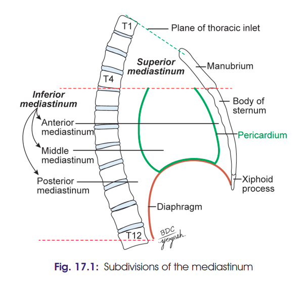

# Mediastinum
### Headings
 - Definition
 - Boundaries
 - Contents
 - Divisions of Mediastinum
 - Clinical
 
## Definition
- Mediastinum (Latin intermediate) is the middle space left in the thoracic cavity in-between the lungs.
## Boundaries of Mediastinum 
- Anterior: Sternum
- Posterior: Vertebral column
- Superior: Thoracic inlet
- Inferior: Diaphragm
- On each side (lateral): Mediastinal pleurae.
## Contents
1. Viscera: Thymus, heart enclosed in pericardial sac, trachea, oesophagus
2. Vessels: Thoracic aorta, pulmonary trunk, superior and inferior vena cava
3. Lymphatics: Lymph nodes, thoracic duct
4. Nerves: Vagus nerves, sympathetic trunks, and phrenic nerves.
5. Mediastinal pleurae.
## Divisions of Mediastinum
- divided into the superior mediastinum and the inferior mediastinum by an imaginary plane passing through the sternal angle anteriorly and the lower border of the body of the 4th thoracic vertebra posteriorly
- inferior mediastinum is further divided into the anterior, middle, and posterior mediastina by the pericardium 
  - Superior Mediastinum
    - Boundaries: 
       - Anteriorly: Manubrium sterni
       - Posteriorly: Upper four thoracic vertebrae
       - Superiorly: Plane of the thoracic inlet
       - Inferiorly: An imaginary plane passing through
       - the sternal angle in front, and the lower border of the body of the 4th thoracic vertebra behind.
       - On each side: Mediastinal pleura.
    - Contents:
    1. Trachea and oesophagus
    2. Arteries:
        i. Arch of aorta
        ii. Brachiocephalic artery
        iii. Left common carotid artery
        iv. Left subclavian artery
    3. Veins:
        i. Right and left brachiocephalic veins
        ii. Upper half of the superior vena cava
        iii. Left superior intercostal vein.
    4. Nerves:
        i. Vagus
        ii. Phrenic
        iii. Cardiac nerves of both sides
        iv. Left recurrent laryngeal nerve.
    5. Thymus
    6. Muscles:
        i. Sternohyoid
        ii. Sternothyroid
        iii. Lower ends of longus colli.
    7. Thoracic duct
    8. Lymph nodes: Paratracheal, brachiocephalic, and tracheobronchial.

  - Inferior Mediastinum
  - Anterior Mediastinum 
    - Boundaries
       - Anteriorly: Body of sternum
       - Posteriorly: Pericardium
       - Superiorly: Imaginary plane separating the superior
       - mediastinum from the inferior mediastinum.
       - Inferiorly: Superior surface of diaphragm
       - On each side: Mediastinal pleura.
    - Contents
      1. Sternopericardial ligaments
      2. Lymph nodes with lymphatics
      3. Small mediastinal branches of the internal thoracic artery
      4. The lowest part of the thymus
      5. Areolar tissue.

  - Middle Mediastinum
    - Boundaries
       - Anteriorly: Sternopericardial ligaments
       - Posteriorly: Oesophagus, descending thoracic aorta,
       - azygos vein
       - On each side: Mediastinal pleura.
    - Contents
      1. Heart enclosed in pericardium
      2. Arteries:
        i. Ascending aorta
        ii. Pulmonary trunk
        iii. Two pulmonary arteries.
      3. Veins:
        i. Lower half of the superior vena cava
        ii. Terminal part of the azygos vein
        iii. Right and left pulmonary veins.
      4. Nerves:
        i. Phrenic
        ii. Deep cardiac plexus.
      5. Lymph nodes: Tracheobronchial nodes.

  - Posterior Mediastinum
    - Boundaries
      - Anteriorly:
          i. Pericardium
          ii. Bifurcation of trachea
          iii. Pulmonary vessels
          iv. Posterior part of the upper surface of the diaphragm.
      - Posteriorly: 
        - Lower eight thoracic vertebrae and intervening discs.
      - On each side: Mediastinal pleura.
    - Contents
      1. Oesophagus 
      2. Arteries: Descending thoracic aorta and its branches.
      3. Veins:
          i. Azygos vein
          ii. Hemiazygos vein
          iii. Accessory hemiazygos vein.
      4. Nerves:
          i. Vagi
          ii. Splanchnic nerves: Greater, lesser and least,arising from the lower eight thoracic ganglia of the sympathetic chain.
      5. Lymph nodes and lymphatics:
          i. Posterior mediastinal lymph nodes lying alongside the aorta 
          ii. The thoracic duct

## Clinical
- [**Mediastinal Syndrome:**](./Imp%20applied/Mediastinal%20Syndrome.md)
  - **Definition:**
    - Compression of mediastinal structures by a tumour or other mass lesions produces a group of symptoms known as **mediastinal syndrome**.

  - **Clinical features:**

    - **Superior vena cava obstruction:**
      - Causes engorgement of veins in the **upper half of the body**.

    - **Tracheal compression:**
      - Produces **dyspnoea and cough**.

    - **Oesophageal compression:**
      - Causes **dysphagia**.

    - **Left recurrent laryngeal nerve compression:**
      - Causes **hoarseness of voice (dysphonia)**.

    - **Phrenic nerve compression:**
      - Results in **paralysis of diaphragm** on the affected side.

    - **Intercostal nerve compression:**
      - Produces pain along the area supplied by the nerve.
      - Known as **intercostal neuralgia**.

    - **Vertebral column compression:**
      - May cause **erosion of vertebral bodies**.

  - **Common causes:**
    - **Bronchogenic carcinoma**
    - **Hodgkin’s disease** with enlargement of mediastinal lymph nodes
    - **Aneurysm or dilatation of aorta**
    - Other mediastinal tumours or mass lesions

- **Spread of infection through prevertebral fascia:**
  - Prevertebral layer of deep cervical fascia extends into the **superior mediastinum**.
  - It is attached to the **4th thoracic vertebra (T4)**.
  - Infection behind this fascia can spread into the **superior mediastinum** but cannot extend below T4.

- **Spread of infection through pretracheal fascia:**
  - Pretracheal fascia extends into the **superior mediastinum** and blends with the **arch of aorta**.
  - Infections between pretracheal and prevertebral fasciae can spread into:
    - Superior mediastinum
    - Posterior mediastinum
  - May result in **mediastinitis**.

- **Mediastinum as a potential dead space:**
  - In superior mediastinum:
    - Veins occupy the **right side**
    - Arteries occupy the **left side**
  - Veins expand greatly during increased blood flow, while arteries do not.
  - This creates a **potential dead space on the right side**.
  - Tumours and fluid collections tend to project into this space.

- **Widening of mediastinum:**
  - Seen on **chest radiographs**.
  - Causes include:
    - Haemorrhage from lacerated blood vessels
    - Enlarged lymph nodes
    - Cardiac hypertrophy
    - Mediastinal tumours

- **Mediastinal shift:**
  - Displacement of mediastinum from its normal position.
  - **Atelectasis (lung collapse):** Mediastinum shifts **towards the affected side**.
  - **Pleural effusion:** Mediastinum shifts **away from the affected side**.
  - Trachea, normally central at the suprasternal notch, deviates in the **same direction as the mediastinal shift**.