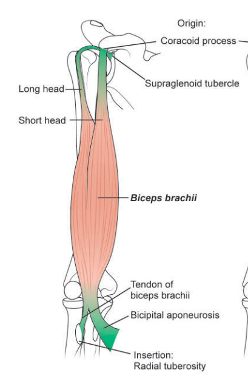

# Biceps Brachii

## Origin
* It has two heads of origin:
  * 1. Short head: Arises with coracobrachialis from the tip of the coracoid process
  * 2. Long head: Arises from the supraglenoid tubercle of the scapula and from the glenoidal labrum. The tendon of Long head is intracapsular

## Insertion
* Posterior rough part of the radial tuberosity
* The tendon is separated from the anterior part of the tuberosity by a bursa, Bicipitoradial bursa
* The tendon gives off an extension called the bicipital aponeurosis, which extends to ulna and it separates median cubital vein from brachial artery

> 

## Nerve supply
* Musculocutaneous Nerve

## Actions 
* strong supinator when the forearm is flexed
* screwing movements
* flexor of the elbow
* short head is a flexor of the arm
* long head prevents upwards displacement of the head of the humerus

## Applied anatomy
### Clinical Testing of Biceps Brachii:
* Physician holds the wrist firmly while the patient flexes the elbow against resistance.

### Positive test: 
* Biceps brachii becomes visibly and palpably hard/contracted.