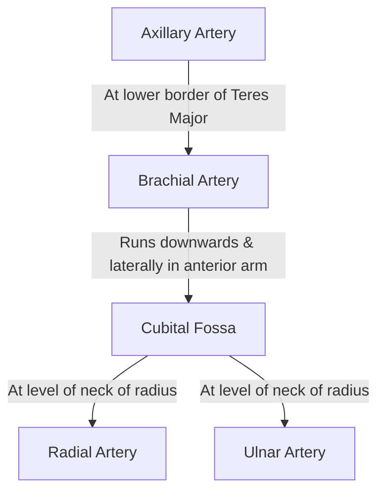
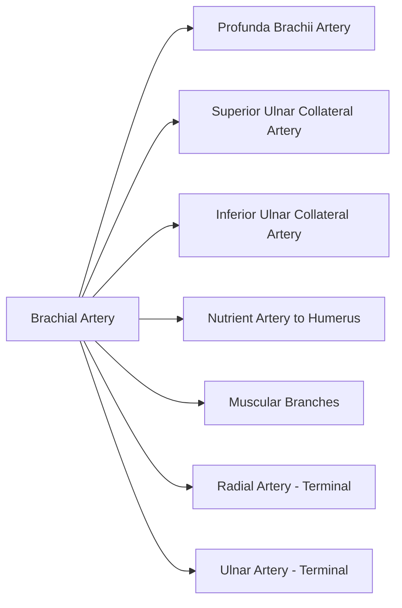
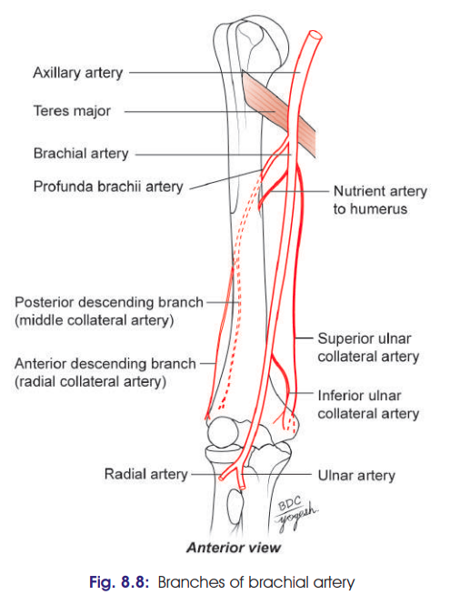

# Brachial Artery: High-Yield Exam Notes

**Q. Describe the Brachial Artery under the following headings: Origin, Extent & Termination, Relations, Branches, and Clinical Anatomy.**

---

## 1. Introduction & Overview

* **Type:** Main arterial trunk of the arm.
* **Continuity:** Direct continuation of the **axillary artery**.
* **Flowchart of Course & Division:**

---

## 2. Origin, Extent & Termination

* **Origin / Beginning:** Lower border of the **teres major** muscle.
* **Course:** Passes downwards and laterally from the medial side of the arm to the anterior aspect of the elbow joint.
* **Termination:** At the **level of the neck of the radius** (in the cubital fossa) by bifurcating into:
1. **Radial artery** (smaller lateral terminal branch)
2. **Ulnar artery** (larger medial terminal branch)

---

## 3. Relations

### General Features

* **Depth:** Superficial throughout its entire extent.
* **Venae Comitantes:** Accompanied by **two venae comitantes** along its path.

### Detailed Anatomical Relations
<table>
  <thead>
    <tr>
      <th align="left">Direction</th>
      <th align="left">Upper Arm / Middle Arm</th>
      <th align="left">At the Elbow (Cubital Fossa)</th>
    </tr>
  </thead>
  <tbody>
    <tr>
      <td><strong>Anterior</strong></td>
      <td>Crossed by <strong>median nerve</strong> (from lateral to medial side near mid-arm)</td>
      <td>Covered by <strong>bicipital aponeurosis</strong> and <strong>median cubital vein</strong></td>
    </tr>
    <tr>
      <td><strong>Posterior</strong></td>
      <td>
        <ul>
          <li><strong>Triceps brachii</strong></li>
          <li><strong>Radial nerve</strong></li>
          <li><strong>Profunda brachii artery</strong></li>
        </ul>
      </td>
      <td>Joint capsule / Brachialis muscle</td>
    </tr>
    <tr>
      <td><strong>Medial</strong></td>
      <td>
        <ul>
          <li><strong>Ulnar nerve</strong> (upper part)</li>
          <li><strong>Basilic vein</strong> (upper part)</li>
          <li><strong>Median nerve</strong> (lower part)</li>
        </ul>
      </td>
      <td><strong>Median nerve</strong></td>
    </tr>
    <tr>
      <td><strong>Lateral</strong></td>
      <td>
        <ul>
          <li><strong>Coracobrachialis</strong></li>
          <li><strong>Biceps brachii</strong></li>
          <li><strong>Median nerve</strong> (upper part)</li>
        </ul>
      </td>
      <td><strong>Tendon of biceps brachii</strong></td>
    </tr>
  </tbody>
</table>

### Arrangement at the Cubital Fossa (Medial to Lateral)

* **Mnemonic: `MBBR`**
1. **M** – **M**edian nerve
2. **B** – **B**rachial artery
3. **B** – **B**iceps brachii tendon
4. **R** – **R**adial nerve *(located on a deeper plane)*

---

## 4. Branches

* **Profunda Brachii Artery:** Largest branch; arises just below teres major and accompanies the **radial nerve** in the radial groove.
* **Superior Ulnar Collateral Artery:** Arises in upper arm; accompanies the **ulnar nerve**.
* **Inferior Ulnar Collateral (Supratrochlear) Artery:** Arises in lower arm; participates in the **anastomosis around the elbow joint**.
* **Nutrient Artery:** Enters the nutrient foramen of the **humerus**.
* **Muscular Branches:** Unnamed supply to anterior compartment muscles of the arm.
* **Terminal Branches:** **Radial** and **Ulnar** arteries at the neck of the radius.

---

## 5. Clinical Anatomy

* **Blood Pressure (BP) Measurement:**
* Brachial artery pulsations are auscultated/palpated in front of the elbow, **just medial to the biceps brachii tendon**.

* **Compression to Control Hemorrhage:**
* Most effectively compressed against the shaft of the humerus in the **middle of the arm** over the insertion of the **coracobrachialis** muscle.

* **Arterial Blood Gas (ABG) Sampling:**
* Readily accessible for puncture to sample arterial blood for blood gas and pH analysis.