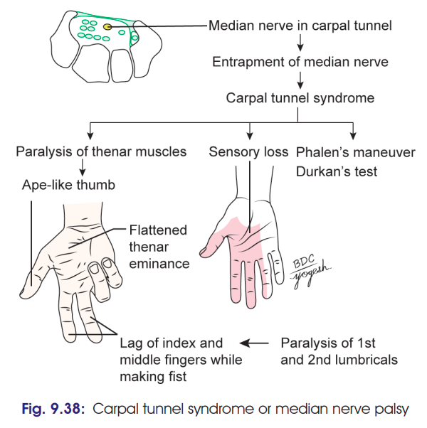
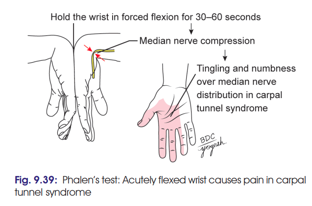
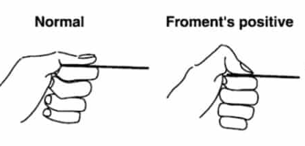

# CARPAL TUNNEL SYNDROME

### Definition

* **CTS** is caused by **compression of the median nerve within the carpal tunnel at the wrist**.
* Produces **motor, sensory, vasomotor and trophic changes**.

### Clinical Features

**1. Motor changes ⭐**

* Wasting of **thenar eminence** → **ape-like hand**.
* Loss of **opposition of thumb**.
* **1st and 2nd lumbricals** affected → index and middle fingers lag behind while making a fist.

**2. Sensory changes ⭐**

* Hypoaesthesia/loss of sensation over **lateral 3½ digits**.
* Nail beds and distal dorsal aspects of these digits are also affected.
* **Skin over thenar eminence is spared** because the **palmar cutaneous branch of median nerve arises proximal to the carpal tunnel** and passes superficial to flexor retinaculum.

**3. Vasomotor changes**

* Affected skin becomes:

  * **Warmer** → arteriolar dilatation.
  * **Drier** → loss of sympathetic sweating.

**4. Trophic changes**

* Long-standing cases → **dry, scaly skin**.
* Nails may become **cracked**.
* Atrophy of finger pulp may occur.

### Special Tests ⭐

**Phalen's test**

* Used for diagnosis of CTS.

**Froment's / book-holding test**

* Patient has difficulty holding a book between thumb and fingers because of impaired thumb function.

**Paper-holding test**

* Patient is unable to firmly hold paper between thumb and fingers.

### Pain

* Intermittent **pain/tingling in median nerve distribution**.
* Often worse **at night**.
* Pain may radiate proximally into the **forearm and arm**.

### Important Clinical Point ⭐

> **Thenar skin is spared in CTS** because the **palmar cutaneous branch of median nerve does not pass through the carpal tunnel.**

### 🔥 Recall

**CTS = Compression → Motor + Sensory + Vasomotor + Trophic + Tests**

* **Motor:** Ape thumb, thenar wasting
* **Sensory:** Lateral 3½ digits
* **Thenar skin:** **Spared**
* **Vasomotor:** Warm + dry
* **Trophic:** Scaly skin + cracked nails
* **Tests:** **Phalen + paper/book holding**
