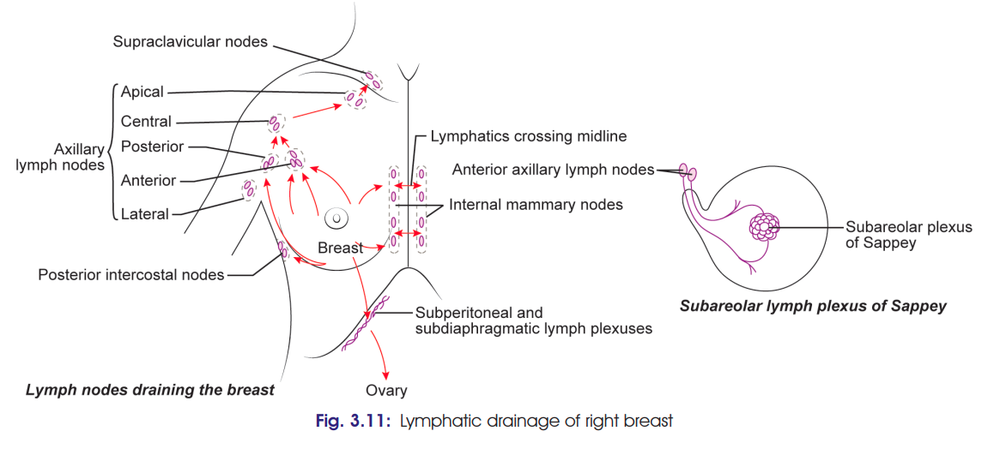

# Lymphatic Drainage of Breast 
### Headings 
 - Introduction
 - Lymph Nodes
 - Lymphatic Vessels
 - Imp Lymphatic Pathways
 - Clinical Importance
  
### Introduction

* Lymphatic drainage of breast is **clinically important** because carcinoma breast commonly spreads through lymphatics.

### Lymph Nodes

1. **Axillary lymph nodes — ~75%**

   * Mainly **anterior/pectoral group**
   * Also posterior, central, lateral and apical groups.
2. **Anterior thoracic (parasternal) nodes — ~20%**

   * Along internal thoracic vessels.
3. **Other nodes — ~5%**

   * Posterior intercostal
   * Supraclavicular
   * Deltopectoral (cephalic) nodes.

### Lymphatic Vessels

**1. Superficial lymphatics**

* Drain skin of breast **except nipple and areola**.
* Pass radially to surrounding lymph nodes.

**2. Deep lymphatics**

* Drain **breast parenchyma, nipple and areola**.

### Important Lymphatic Pathways

* **Subareolar plexus of Sappey**

  * Lies deep to areola.
  * Drains mainly to **anterior/pectoral axillary nodes**.
* Lymphatics from deep surface may pass through **pectoralis major + clavipectoral fascia → apical axillary nodes**.
* Lymphatics from lower/medial breast may communicate with **subdiaphragmatic and subperitoneal plexuses**.

### Clinical Importance

* **Carcinoma breast → lymphatic spread → axillary nodes**, especially anterior/pectoral group.
* Anterior and central axillary groups are commonly involved.

### ⭐ Must-remember

**75% → Axillary**
**20% → Parasternal**
**5% → Posterior intercostal**

**Flowchart:**
**Breast → Axillary (75%) → Central → Apical → Supraclavicular**
**Breast → Parasternal (20%)**
**Breast → Posterior intercostal (5%)**
