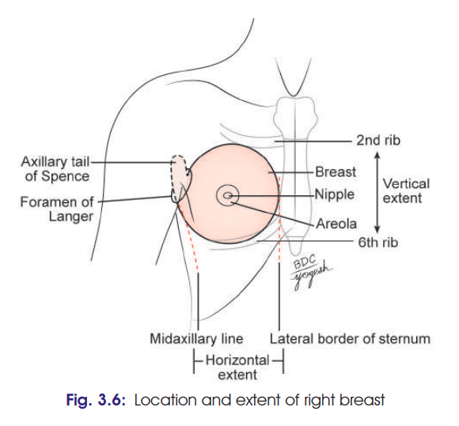
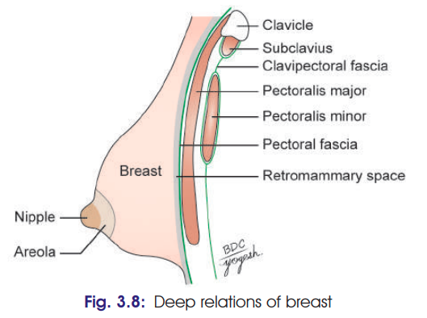
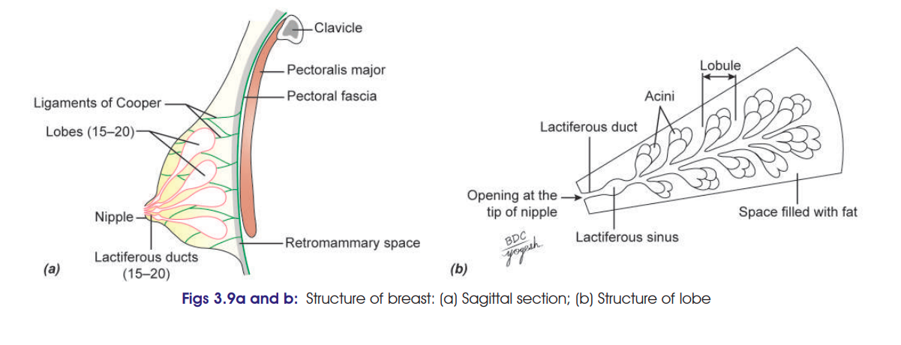

# MAMMARY GLAND / BREAST 
### Headings
 * Introduction 
 * Location
 * Shape 
 * Extent of the Base
 * Deep Relations
 * Structure
   * Skin
     * Nipple
     * Areola
   * Stroma
     * Fibrous
     * Fatty
   * Parenchyma
 * Arterial Supply
 * Venous Drainage
 * Nerve Supply
 * Lymphatics
 * Clinical
  
## 1. Introduction

* Mammary gland is a **modified sweat gland**.
* Located in the **superficial fascia of pectoral region**.
* Rudimentary in male; well developed in female after puberty.
* It is an important **accessory organ of female reproductive system** and provides milk for nutrition of newborn.

## 2. Location

* Lies in the **superficial fascia of pectoral region**.
* Superolateral extension → **axillary tail of Spence**.
* Axillary tail passes through an opening in deep fascia called **foramen of Langer** and enters the axilla.

## 3. Shape

Variable:

* Hemispherical
* Conical
* Pyriform
* Pendulous
* Flat

## 4. Extent of the Base ⭐

### Vertical

* **2nd to 6th ribs**

### Horizontal

* **Lateral border of sternum → midaxillary line**

## 5. Deep Relations

From superficial to deep:

1. **Pectoral fascia** covering pectoralis major
2. Muscles:

   * Pectoralis major
   * Serratus anterior
   * External oblique muscle of abdomen
3. **Retromammary space**

   * Loose areolar tissue between breast and pectoral fascia.
   * Allows free movement of breast over pectoralis major.

---

# 6. Structure of Breast ⭐⭐⭐
The breast consists of: Skin, Stroma & Parenchyma

### A. Skin

#### Nipple

* Conical projection near centre of breast.
* At level of **4th intercostal space**.
* About **10 cm from midline**.
* Pierced by **15–20 lactiferous ducts**.
* Contains circular and longitudinal **smooth muscle fibres**.
* Rich nerve supply → becomes stiff or flattened on stimulation.

#### Areola

* Pigmented circular area surrounding nipple.
* Contains modified sebaceous glands.
* During pregnancy/lactation → enlarged glands form **tubercles of Montgomery**.
* Secretions lubricate nipple and prevent cracking.
* Becomes **darker during pregnancy**.
* Nipple and areola are devoid of hair and underlying fat.

### B. Stroma

Supporting framework of breast.

**1. Fibrous stroma**

* Forms septa called **suspensory ligaments of Cooper**.
* Attach skin and gland to pectoral fascia.
* Help maintain shape of breast.

**2. Fatty stroma**

* Forms major bulk of breast.
* Present throughout breast **except beneath nipple and areola**.

### C. Parenchyma / Mammary gland ⭐

* **Compound tubuloalveolar gland**.
* Modified sweat gland.
* Consists of **15–20 lobes**.
* Each lobe consists of clusters of **alveoli**.
* Each lobe is drained by a **lactiferous duct**.
* Lactiferous ducts converge towards nipple.
* Near termination → dilatation called **lactiferous sinus**.
* Ducts open on nipple.

---

# 7. Arterial Supply ⭐

  1. **Internal thoracic artery**

     * Through perforating branches.

  2. **Axillary artery branches**

     * Lateral thoracic artery
     * Superior thoracic artery
     * Thoracoacromial artery

  3. **Posterior intercostal arteries**

     * Through lateral branches.

---

# 8. Venous Drainage

* Veins converge towards base of nipple → form **anastomotic venous circle**.

### Superficial veins

→ **Internal thoracic vein**

### Deep veins

→ **Axillary vein**
→ **Posterior intercostal veins**

---

# 9. Nerve Supply ⭐

* **Anterior and lateral cutaneous branches of 2nd–6th intercostal nerves.**
* Carry:

  * Sensory fibres to skin
  * Autonomic fibres to smooth muscle and blood vessels.

> **Important:** Nerves do **not** control milk secretion.

* Milk secretion → controlled by **prolactin** from anterior pituitary.

---
# 10. [Lymphatics](Lymphatics%20of%20Breast.md) 
# 11. [Clinical](./Imp%20Applied/Clinical%20of%20Breast.md)

### 🔥 Absolute must-write facts

* **2nd–6th ribs + sternum–midaxillary line**
* **Axillary tail of Spence**
* **Retromammary space**
* **15–20 lobes**
* **Cooper's ligaments**
* **Lactiferous ducts + sinus**
* **Arterial supply**
* **Venous drainage**
* **2nd–6th intercostal nerve supply**

