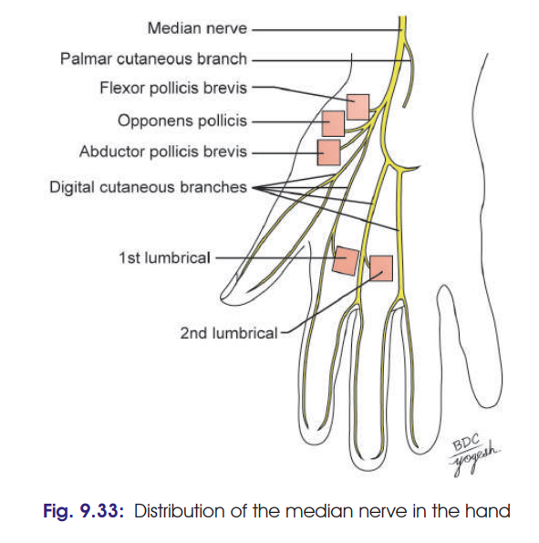

# MEDIAN NERVE IN HAND

### Introduction

* Median nerve is the **main nerve controlling movements of the thumb** and is important for **gripping**.
* It is called:

  * **Labourer's nerve** → supplies most long flexors of forearm.
  * **Eye of the hand** → supplies sensation to most of the hand.

### Course

* Enters palm through the **carpal tunnel**, deep to the **flexor retinaculum**.
* Terminates by dividing into:

  * **Lateral division**
  * **Medial division**

### Relations / Distribution in Hand

**1. At carpal tunnel**

* Lies **deep to flexor retinaculum**.
* Lies in the narrow carpal tunnel **anterior to the ulnar bursa** containing flexor tendons.
* Immediately below flexor retinaculum → divides into **lateral and medial divisions**.

**2. Lateral division**

* Gives **thenar muscular branch** → supplies thenar muscles.
* Gives **3 digital branches** to lateral **1½ digits**:

  * 2 branches → thumb
  * 1 branch → lateral side of index finger
* Digital branch to index finger also supplies **1st lumbrical**.

**3. Medial division**

* Divides into **2 common digital branches**.
* Supply adjoining sides of:

  * Index finger
  * Middle finger
  * Ring finger
* Lateral common digital branch also supplies **2nd lumbrical**.

### Branches
#### Motor Supply

Median nerve in hand supplies **5 muscles**:
* 3 Thenar muscles & 2 Lumbricals
 
**LOAF**

* **L** → 1st & 2nd Lumbrical
* **O** → Opponens pollicis
* **A** → Abductor pollicis brevis
* **F** → Flexor pollicis brevis

#### Sensory Supply

* **Palmar skin of lateral 3½ digits**
* Their corresponding **nail beds**.

### Clinical
#### [CTS](./Imp%20Applied/CTS.md)