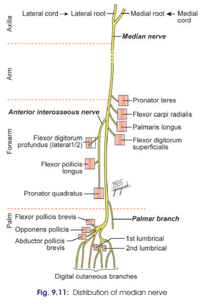

# Median Nerve

### Introduction
* Root value: C5, C6, C7, C8, T1
  * Lateral root of Median Nerve: C5, C6, C7
  * Medial root of Median Nerve: C8, T1
* **Main nerve of the front of forearm**.
* Supplies most of the long flexor muscles of forearm and muscles of **thenar eminence**.
* Controls coarse movements of hand.
* Hence called **“Labourer's nerve.”**

---

## 1. Course

**Arm → Cubital fossa → Forearm → Wrist → Palm**

* In the arm, median nerve lies **medial to brachial artery**.
* Enters the **cubital fossa** as its most medial content.
* Enters forearm **between two heads of pronator teres**.
* Passes between **flexor digitorum superficialis (FDS)** and **flexor digitorum profundus (FDP)**.
* Descends towards wrist.
* At wrist, lies **deep and lateral to palmaris longus tendon**.
* Passes deep to **flexor retinaculum through carpal tunnel**.
* Enters the **palm**.

### 🔥 Course in one line

**Brachial artery medial → cubital fossa → between pronator teres → between FDS & FDP → deep/lateral to PL → carpal tunnel → palm**

---

# 2. Relations

### A. In Cubital Fossa

* **Medial to brachial artery**
* **Behind bicipital aponeurosis**
* **In front of brachialis**

### B. At Pronator Teres

* Passes **between two heads of pronator teres**.
* Crosses the **ulnar artery**.
* Separated from ulnar artery by the **deep head of pronator teres**.

### C. In Forearm

* Passes beneath the **fibrous arch of FDS**.
* Runs **deep to FDS** and on the surface of **FDP**.
* Accompanied by **median artery**.
* About **5 cm above flexor retinaculum**, becomes superficial.
* Lies between:

  * **FCR tendon laterally**
  * **FDS tendon medially**
* **Palmaris longus tendon overlaps it.**

### D. At Wrist

* Passes **deep to flexor retinaculum through carpal tunnel**.

---

# Branches of Median Nerve

### 1. Muscular branches

Given in the forearm to:

* **Pronator teres**
* **Flexor carpi radialis**
* **Palmaris longus**
* **Flexor digitorum superficialis**

### 2. Anterior interosseous nerve

* Arises from the **upper part of forearm**.
* Supplies:

  * **Flexor pollicis longus**
  * **Lateral half of flexor digitorum profundus**
  * **Pronator quadratus**
* Also supplies **distal radioulnar and wrist joints**.

### 3. Palmar cutaneous branch ⭐

* Arises **just above flexor retinaculum**.
* Passes **superficial to flexor retinaculum**.
* Supplies skin over:

  * **Lateral 2/3 of palm**
  * **Thenar eminence**
  * **Central part of palm**

### 4. Articular branches

* Supply:

  * **Elbow joint**
  * **Proximal radioulnar joint**

### 5. Vascular branches

* Supply **radial and ulnar arteries**.

### 6. Communicating branch

* Communicates with the **ulnar nerve**.

---

### 🔥 Branches recall

**M → A → P → A → V → C**

* **M**uscular
* **A**nterior interosseous
* **P**almar cutaneous
* **A**rticular
* **V**ascular
* **C**ommunicating

And for the **anterior interosseous nerve**:

**FPL + lateral FDP + PQ**

That's a particularly important combination for exams.

---

### [Clinical](./Imp%20Applied/Clinical%20of%20Median%20Nerve.md)
## 🧠 Visual course to memorize

**Median nerve**

**Arm**
↓
**Medial to brachial artery**
↓
**Cubital fossa**
↓
**Between heads of pronator teres**
↓
**Between FDS & FDP**
↓
**Deep + lateral to palmaris longus**
↓
**Carpal tunnel**
↓
**Palm**
