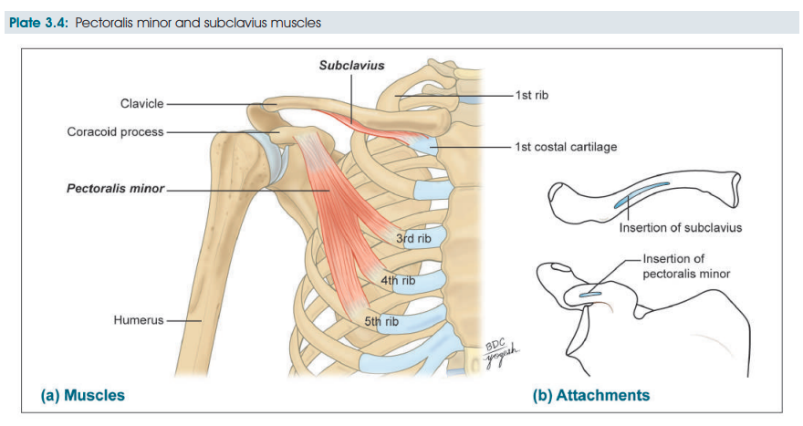

# Pectoral Region Muscles
### Headings
 * Introduction
 * Muscles Involved
 * Origin & Insertion 
 * Nerve Supply
 * Blood Supply
 * Actions

## Introduction
 - The pectoral region lies on the front of the chest.
 - consists of structures that connect the upper limb to the anterolateral chest wall.
## Muscles Involved
 1. Pectoralis major: Thick, bulky, fan-shaped muscle
 2. Pectoralis minor
 3. Subclavius.
## Origin & Insertion 
 * [Pectoralis Major:](Pectoralis%20Major.md)
 * Pectoralis Minor: 
   * Origin 
     * 3, 4, 5 ribs near the costochondral junction
     * Intervening fascia covering external intercostal muscles
   * Insertion
     * Medial border and upper surface of the coracoid process of scapula
 * Subclavius:
   * Origin
     * First rib at the costochondral junction
   * Insertion
     * Subclavian groove (on the inferior surface of middle-third of clavicle)
## Nerve Supply
* **Pectoralis major and minor** are supply by both **Medial and lateral pectoral nerves**
* Subclavius is supplied by **Nerve to subclavius** (branch of **upper trunk** of **brachial plexus**)
## Blood Supply
## Actions
* [Pectoralis Major](Pectoralis%20Major.md)
* Pectoralis Minor: 
  * Draws the scapula forward (with serratus anterior)
  * Depresses the shoulder
  * Accessory muscle of respiration in forced inspiration
* Subclavius:
  * Stabilises the clavicle during movements of the shoulder joint
  * Forms a cushion for axillary vessels and brachial plexus

