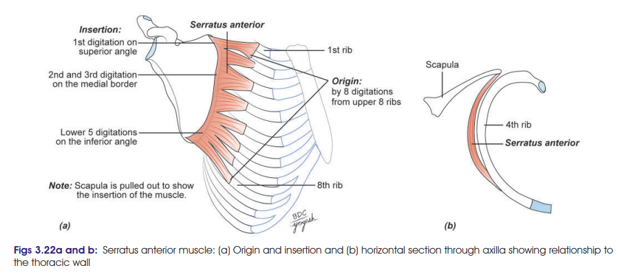
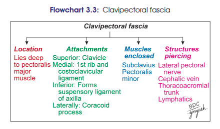
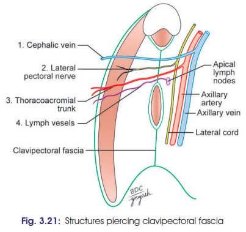

# Pectoralis Major
### Headings
- Introduction
- Origin
- Insertion
- Nerve Supply 
- Blood Supply
- Action
- Clinical

## Introduction
 - boxer’s muscle/swimmer’s muscle 
## Origin
 -  arises by eight digitations from the upper 8 ribs in the midaxillary plane 
 -  from the fascia covering the intervening intercostal muscles
 -  first digitation arises from the 1st and 2nd ribs
 -  all other digitations arise from their corresponding ribs
## Insertion
- inserted into the costal surface of the scapula along its medial border as follows:
- 1st digitation at the superior angle
- 2nd and 3rd digitations along the entire medial border
- Remaining digitations on the triangular area at the costal surface of inferior angle of scapula.

## Nerve Supply 
- Long thoracic nerve (branch of C5, C6, C7 roots of brachial plexus)
## Blood Supply
- Superior Thoracic Artery: Top part of the muscle
- Lateral Thoracic Artery: Middle and the side parts along the chest wall
- Thoracodorsal Artery: Lower part of the muscle
## Action

### 1. Protraction of scapula — **“Boxer’s muscle”**

* Along with **pectoralis minor**, pulls the scapula forwards around the thoracic wall.
* Produces **protraction of upper limb**.
* Important in **pushing and punching**.

### 2. Overhead abduction of arm

* Fibres attached to the **inferior angle of scapula** pull it forwards and rotate it.
* Turns the **glenoid cavity upwards**.
* Works with **trapezius** to produce upward rotation of scapula.

### 3. Stabilization of scapula

* **Steadies the scapula** against the thoracic wall during weight carrying.

### 4. Respiration

* Helps in **forced inspiration** by assisting elevation of the ribs when the scapula is fixed.

### 🔥 Recall

**Serratus anterior = P-P-S-R**

* **P**rotraction → boxer
* **P**owers overhead abduction
* **S**teadies scapula
* **R**espiration → forced inspiration

## Clinical

### 1. Winging of Scapula

* **Paralysis of serratus anterior** → **winging of scapula**.
* Commonly due to injury of the **long thoracic nerve**.
* **Medial border and inferior angle of scapula become prominent**.
* Patient is unable to:

  * Perform **pushing movements**
  * **Raise the arm above the head**
* Attempted pushing or overhead movement makes the **winging more prominent**.

### 2. Clinical Testing

* Ask the patient to **push the hands against a wall** or against resistance.
* If serratus anterior is paralysed → **medial border and inferior angle become prominent** → positive **winging of scapula**.

### 🔥 Exam reasoning

**Long thoracic nerve injury**
→ **Serratus anterior paralysis**
→ loss of scapular protraction/stabilization
→ **medial border + inferior angle prominent**
→ **winged scapula**
→ difficulty **pushiraising arm overhead**.

# Clavipectoral Fascia:
## 
## 