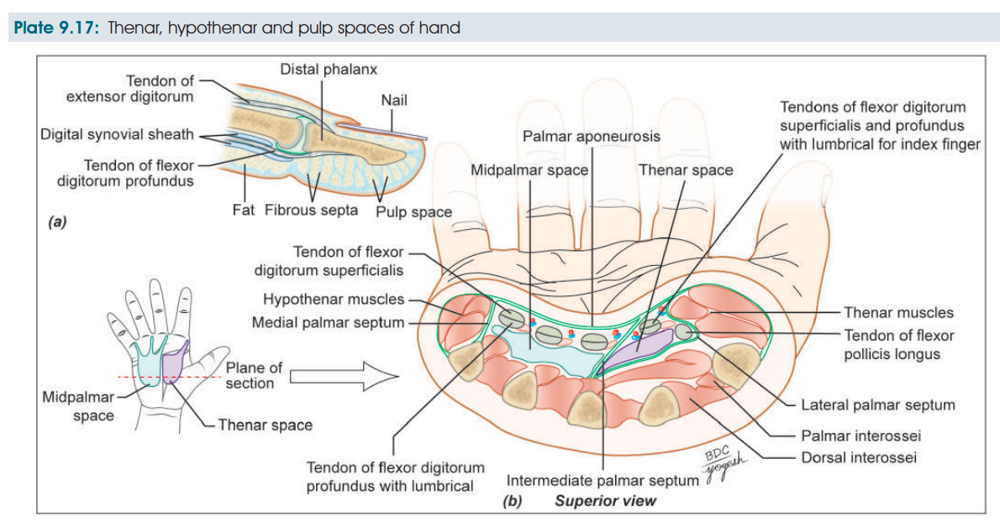

# FASCIAL SPACES OF HAND — 5 MARKS

### Introduction

* Fascial spaces are potential spaces formed by the arrangement of **fascia and fascial septa** in the hand.
* They are clinically important because **infection may spread into these spaces and accumulate pus**.

### Classification ⭐

**A. Palmar spaces**

1. Pulp spaces of fingers
2. Midpalmar space
3. Thenar space

**B. Dorsal spaces**

1. Dorsal subcutaneous space
2. Dorsal subaponeurotic space

**C. Forearm space of Parona**

---

## 1. Pulp Space ⭐

* Present at the tips of fingers and thumb.
* Subcutaneous fat is divided into **tight compartments by fibrous septa** extending from skin to periosteum of terminal phalanx.
* Infection → **whitlow**.
* Increased pressure causes **severe throbbing pain**.

**Clinical:**

* Drained by a **lateral incision**, avoiding injury to tactile tissue.
* If neglected → vascular compression → necrosis of distal part of terminal phalanx.

---

## 2. Midpalmar Space

* **Triangular** space beneath the **medial half of the hollow of palm**.
* **Anterior:** Palmar aponeurosis, flexor tendons of 3rd–5th digits and lumbricals.
* **Posterior:** Fascia over interossei and metacarpals.
* **Lateral:** Intermediate palmar septum.
* **Medial:** Medial palmar septum.
* **Communications:**

  * Proximally → **space of Parona**
  * Distally → fascial sheaths of **3rd and 4th lumbricals**
* **Drainage:** Incision through **3rd or 4th web space**.

---

## 3. Thenar Space

* **Triangular** space beneath the **lateral half of the hollow of palm**.
* **Anterior:** Palmar aponeurosis, short muscles of thumb, flexor tendon of index finger and 1st lumbrical.
* **Posterior:** Transverse head of adductor pollicis.
* **Lateral:** Lateral palmar septum.
* **Medial:** Intermediate palmar septum.
* **Communications:**

  * Proximally → **space of Parona**
  * Distally → fascial sheath of **1st lumbrical**
* **Drainage:** Incision in the **1st web space posteriorly**.

---

## 4. Dorsal Spaces

* **Dorsal subcutaneous space:** Immediately deep to the loose skin of dorsum of hand.
* **Dorsal subaponeurotic space:** Between **metacarpals and extensor tendons**, which are joined by a thin aponeurosis.

---

## 5. Space of Parona ⭐

* Rectangular space in the **lower forearm**, just above the wrist.
* Lies **anterior to pronator quadratus** and **deep to long flexor tendons**.
* **Superiorly:** extends to oblique origin of flexor digitorum superficialis.
* **Inferiorly:** extends to flexor retinaculum.
* Communicates inferiorly with the **midpalmar space**.
* Infection may spread into it from **flexor synovial sheaths**, especially the ulnar bursa.

> 

### 🧠 Exam priority

**classification + pulp space + midpalmar/thenar spaces + Parona space + clinical importance**.

---

## Synovial Sheaths of Hand

**Definition:**
Synovial sheaths are synovial membrane-lined coverings around tendons entering the hand. Their extent is clinically important because **infection can spread along them**.

### Digital synovial sheaths

* **2nd, 3rd & 4th digits:**
  → Independent sheaths
  → End proximally at the **heads of metacarpals**.
* **Little finger:**
  → Continuous proximally with **ulnar bursa**.
* **Thumb:**
  → Continuous proximally with **radial bursa**.
* Therefore, **infections of thumb and little finger are more dangerous** because infection can spread:
  → into palm
  → up to **2.5 cm above the wrist**.

### Ulnar bursa

* Infection usually follows infection of the **little finger**.
* May spread to **forearm space of Parona**.
* Produces **hourglass swelling**:
  → one swelling in palm
  → another in distal forearm
  → connected by constriction at flexor retinaculum.
* Also called **compound palmar ganglion**.

### Radial bursa

* Infection of the **thumb** may spread into the **radial bursa**.

**Clinical importance:** Infection of synovial sheaths can spread proximally, making infections of the **thumb and little finger particularly significant**.
