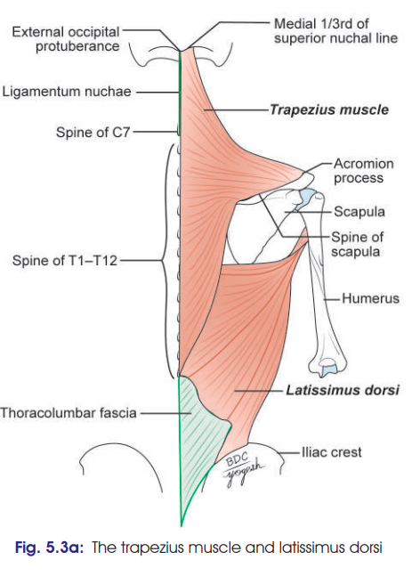

# Trapezius Muscle
### Headings 
 * Introduction
 * Origin
 * Insertion
 * Nerve supply
 * Blood supply
 * Actions
 * Clinical Testing
## Introduciton
 * **Superficial** muscle of back region

## Origin 
 * External occipital protuberance
 * Medial 1/3rd of Superior nuchal line
 * Spines of C7 to T12 vertebrae
 * Corresponding supraspinous ligaments
 * Ligamentum nuchae

## Insertion
 * Upper fibres: 
   * posterior border of lateral 1/3rd of clavicle
 * Middle fibres:
   * medial margin of the acromion process
   * upper lip of the crest of spine of the scapula
 * Lower fibres:
   * on the deltoid tubercle at the junction of medial and middle third of spine of scapula

## Nerve supply
 * Motor: Spinal part of 11th cranial nerve
 * Proprioceptive fibres: Branches from C3, C4

## Blood supply
* **Transverse Cervical Artery:** 
  * Main supply; 
  * runs deep to the muscle.
* **Dorsal Scapular Artery:** Supplies middle and lower parts.
* **Occipital Artery:** Supplies the top part near the head.
* **Posterior Intercostal Arteries:** Supplies the middle and lower parts near the spine.

## Actions
 * Upper fibres: 
   * act with levator scapulae and elevate the scapula, as in shrugging. 
   * upper fibres of both sides extend the neck
 * Middle fibres:
   * act with rhomboids and retract the scapula
 * Lower fibres:
   * along with upper fibres act with serratus anterior and rotate the scapula forwards around the chest wall, thus playing an important role in abduction of the arm beyond 90°
 * Together, all fibres steadies the scapula

 ## Clinical testing: 
 * Clinically, the muscle is tested by asking the patient to shrug their shoulder against resistance.
