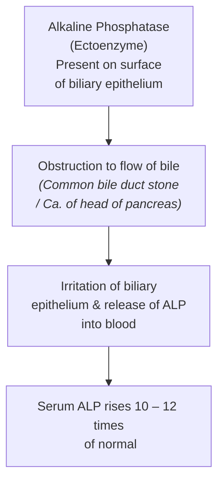

# ISOENZYMES

> **SAQ Question :** What are the Isoenzymes? Give isoenzymes of LDH and ALP.

* **Definition :** Different forms of the same enzyme catalysing the same chemical reaction are called **Isoenzymes / Isozymes**.

* **Example :—**
  $$\text{Lactate} + \text{NAD}^+ \xrightleftharpoons[\text{LDH 1, 2, 3, 4, 5}]{\text{LDH}} \text{Pyruvate} + \text{NADH} + \text{H}^+$$
  *(All 5 isoenzymes catalyze the same reaction)*

---

### HOW THEY ARE FORMED?
*(Mnemonic: **T**rue **L**ady **I**s **A**llowed)*

* a. **True Isoenzymes (T) :—**
  * Originate from **different genes**, may be present on different chromosomes.
  * *Example :* Amylase $\longrightarrow$ Pancreatic Amylase & Salivary Amylase.
  * *Example :* Lactate Dehydrogenase (LDH) $\longrightarrow$ all isoenzymes ($\text{LDH}_1$ to $\text{LDH}_5$) are present in the same individual & all individuals of a population.

* b. **Isoforms (I) :—**
  * Formed due to **post-translational modification** of protein.
  * *Example :* Alkaline Phosphatase (ALP).

* c. **Alloenzymes (A) :—**
  * Originate from **different alleles of the same locus** of the gene.
  * *Example :* Glucose-6-Phosphate Dehydrogenase (G6PD) $\longrightarrow \approx 400$ isoenzymes, but only one variant is present in a single individual.

---

## CHARACTERISTICS (HOW THEY DIFFER)

* a. **Electrophoretic Mobility :—**
  $$\text{LDH}_1 > \text{LDH}_2 > \text{LDH}_3 > \text{LDH}_4 > \text{LDH}_5$$
  $$\text{CK-BB} > \text{CK-MB} > \text{CK-MM}$$

* b. **Sensitivity to Heat :—**
  * $\text{ALP }\alpha_2\text{HL}$ (Liver) $\longrightarrow$ Sensitive to heat.
  * $\text{ALP }\alpha_2\text{HS}$ (Placenta) $\longrightarrow$ Resistant to heat.

* c. **Susceptibility to Inhibitors :—**
  * Tartrate labile acid phosphatase.

* d. **Requirement of Cofactors :—**
  * Cytosolic Isocitrate Dehydrogenase $\longrightarrow \text{NADP}^+$
  * Mitochondrial Isocitrate Dehydrogenase $\longrightarrow \text{NAD}^+$

* e. **Antibodies Produced :—**
  * Different antibodies are produced in response to different isoenzymes.

* f. **Tissue of Origin :—**
  * ALP originates from bone, placenta, liver, intestine, biliary tract.

* g. **$K_\text{m}$ Value & Affinity :—**
  * Differences seen between Glucokinase & Hexokinase.

---

## DIAGNOSTIC USES OF ISOENZYMES

### 1. LACTATE DEHYDROGENASE (LDH)
* **Structure :** Tetramer composed of **H** (Heart) and **M** (Muscle) subunits ($5\text{ isoenzymes}$).

| Isoenzyme | Subunit | Tissue of Origin | Serum Concentration |
| :--- | :---: | :--- | :---: |
| **$\text{LDH}_1$** | $\text{H}_4$ | Heart | 17 – 27% |
| **$\text{LDH}_2$** | $\text{H}_3\text{M}$ | RBC, Brain | 27 – 37% |
| **$\text{LDH}_3$** | $\text{H}_2\text{M}_2$ | Brain, Leukocytes | 18 – 25% |
| **$\text{LDH}_4$** | $\text{HM}_3$ | Liver, Skeletal muscle | 3 – 8% |
| **$\text{LDH}_5$** | $\text{M}_4$ | Liver, Skeletal muscle | 2 – 5% |

* **Electrophoretic Mobility :** $\text{LDH}_1 > \text{LDH}_2 > \text{LDH}_3 > \text{LDH}_4 > \text{LDH}_5$

> **Flipped Pattern in Myocardial Infarction (MI) :—**  
> * **Normal Condition :** $\text{LDH}_2 > \text{LDH}_1$  
> * **In MI :** $\text{LDH}_1 > \text{LDH}_2$ (*Flipped Pattern*). It is a **specific and late marker** in MI.

---

### 2. CREATINE KINASE (CK)
* **Structure :** Dimer composed of **M** (Muscle) and **B** (Brain) subunits.

$$\text{Creatine} + \text{ATP} \xrightleftharpoons[\text{CK 1, 2, 3}]{\text{CK}} \text{Phosphocreatine} + \text{ADP}$$

| Isoenzyme | Subunit | Tissue | Clinical Condition / Diseases |
| :--- | :---: | :--- | :--- |
| **CK-1** | $\text{BB}$ | Brain | Brain diseases |
| **CK-2** | $\text{MB}$ | Heart | Myocardial infarction (MI) |
| **CK-3** | $\text{MM}$ | Muscle | Muscular dystrophies, Myopathies |

* **CK-MB in Myocardial Infarction :—**
  * **Earliest enzymatic marker** to rise in MI.
  * Starts rising in **6 hours**, reaches peak in **24 hours**, and returns to normal in **2 – 3 days**.
* **Electrophoretic Mobility :** $\text{CK-1 (BB)} > \text{CK-2 (MB)} > \text{CK-3 (MM)}$
* **Normal Level :** $5 - 25\text{ IU/L}$ OR $3 - 5\%$ of total CK activity.

---

### 3. ALKALINE PHOSPHATASE (ALP)
* Important enzyme to differentiate between **hepatic diseases** and **obstructive pathology**.
* It is an **ectoenzyme**, present on the cell surface.

| Isoenzyme | Tissue of Origin | Clinical Significance / Diseases |
| :--- | :--- | :--- |
| **$\alpha_1\text{-ALP}$** | Biliary canaliculi [10%] | Obstructive jaundice |
| **$\alpha_2\text{ HL-ALP}$** | Hepatic cells [25%] | Hepatitis |
| **$\text{H}_2\text{ HS-ALP}$** | Placenta | Normal in pregnancy |
| **$\text{Pre-}\beta\text{-ALP}$** | Bone osteoblasts [50%] | Paget's disease, Rickets, Osteomalacia, Bone tumors |
| **$\gamma\text{-ALP}$** | Intestine | Intestinal disorders |
| **$\text{Leukocyte ALP}$** | Leukocytes | Lymphoma / Leukemia |

---

### UNUSUAL / CARCINOFETAL ISOENZYMES OF ALP

* a. **Regan Isoenzyme :** Carcinoplacental variant $\longrightarrow$ Found in carcinoma of lung, liver, and GIT.
* b. **Kasahara Isoenzyme :** Fetal intestinal variant $\longrightarrow$ Inappropriate expression in malignancy.
* c. **Nagao Isoenzyme :** Germ-cell variant $\longrightarrow$ Inappropriate expression in malignancy.

---

### ALP IN OBSTRUCTIVE JAUNDICE

---

### DIAGNOSTIC LEVELS OF SERUM ALP

* a. **In Hepatic Diseases (Viral Hepatitis) :** $2 - 3 \times$ upper limit of normal ($\text{N}$).
* b. **In Obstructive Jaundice (Gallstone) :** $10 - 12 \times$ upper limit of normal ($\text{N}$).
* c. **In Bone Disorders & Tumors of Bones :** Up to $25 \times$ upper limit of normal ($\text{N}$) level.

