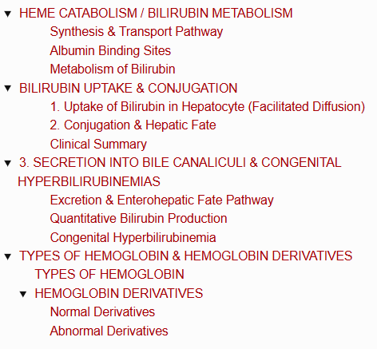
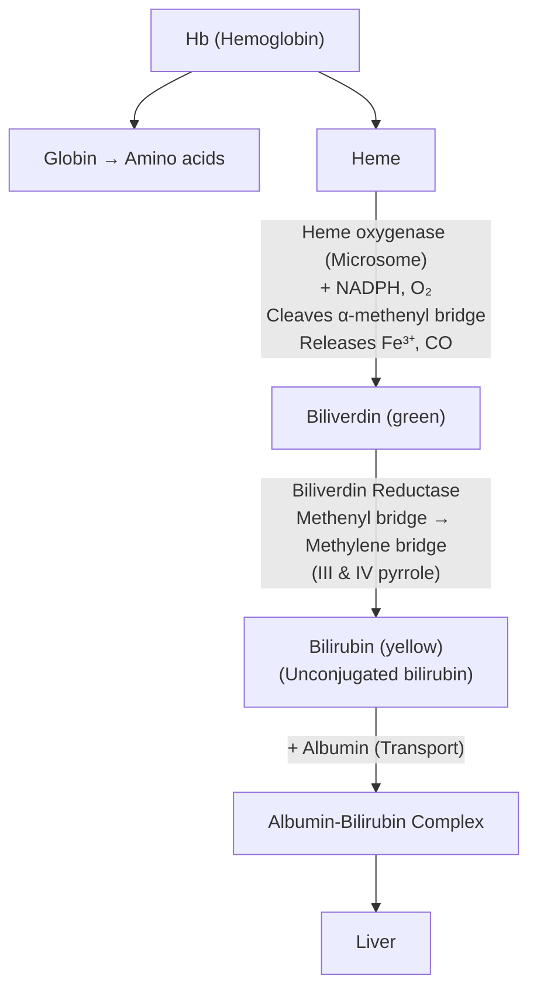
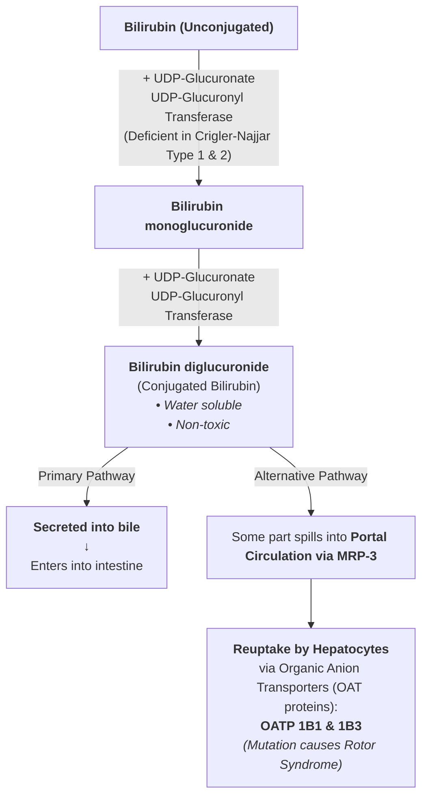
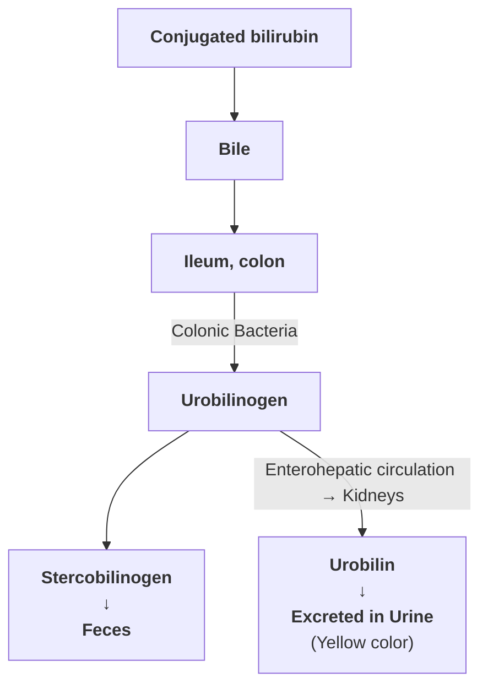
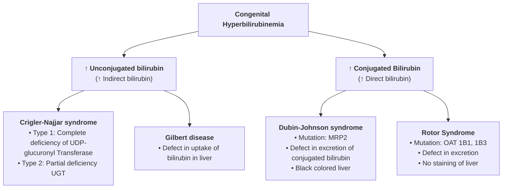
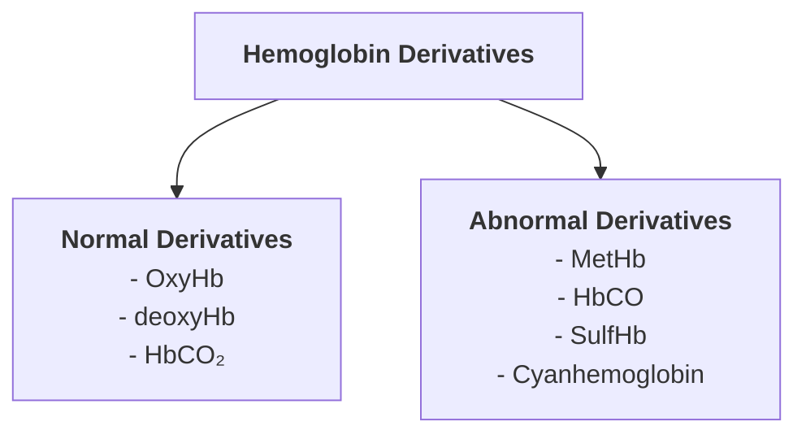

# HEME CATABOLISM / BILIRUBIN METABOLISM

> ### Headings
> 

**Site :** Macrophages of Reticuloendothelial System (Liver, Spleen, Bone Marrow)

---

### Synthesis & Transport Pathway

---

### Albumin Binding Sites

* **High affinity binding site :** $\approx 25\text{ mg}$
* **Low affinity site :** Easily detached and diffuses into tissue in diseases

---

### Metabolism of Bilirubin

* 1. Uptake of bilirubin in Hepatocytes

* 2. Conjugation

* 3. Secretion into bile canaliculi

# BILIRUBIN UPTAKE & CONJUGATION

---

### 1. Uptake of Bilirubin in Hepatocyte (Facilitated Diffusion)

* **Transport Mechanism :** Albumin-bound bilirubin ($\text{Alb-Bil}$) in the blood dissociates; free bilirubin crosses the sinusoidal membrane into hepatocytes via **facilitated diffusion**.
* **Kinetics :**
  * Large capacity system.
  * **Not a rate-limiting step**, even in pathological states.
* **Intracellular Binding (Ligandin Proteins / Y-Protein) :**
  * Binds bilirubin inside the hepatocyte.
  * **Prevents efflux** of bilirubin back into the bloodstream.
  * Keeps bilirubin in a **solubilized state**.
* **Clinical Correlation :** Defect in uptake is associated with **Gilbert syndrome / disease**.

---

### 2. Conjugation & Hepatic Fate

---

### Clinical Summary

* **Crigler-Najjar Syndrome (Types 1 & 2) :** Deficiency of **UDP-Glucuronyl Transferase**, impairing conversion of unconjugated bilirubin to its glucuronide forms.
* **Rotor Syndrome :** Mutation in **$\text{OATP 1B1}$ & $\text{OATP 1B3}$**, impairing hepatic reuptake and storage of conjugated bilirubin.

--- 

# 3. SECRETION INTO BILE CANALICULI & CONGENITAL HYPERBILIRUBINEMIAS

* **Rate Limiting Step :** Active transport via **MRP 2 (Multidrug Resistance-like Protein 2)**.
* **Mutation :** Mutation in MRP 2 leads to **Dubin-Johnson Syndrome**.

---

### Excretion & Enterohepatic Fate Pathway

---

### Quantitative Bilirubin Production

* $1\text{ gm Hb} \longrightarrow 35\text{ mg bilirubin}$
* $\mathbf{6\text{ gm Hb}}$ degraded per day

---

### Congenital Hyperbilirubinemia

---

# TYPES OF HEMOGLOBIN & HEMOGLOBIN DERIVATIVES

---

## TYPES OF HEMOGLOBIN

<table>
  <thead>
    <tr>
      <th align="left">Type of Hb</th>
      <th align="center">Component Subunit</th>
      <th align="left">Description / Significance</th>
    </tr>
  </thead>
  <tbody>
    <tr>
      <td><b>Adult Hb (HbA)</b></td>
      <td align="center">$\alpha_2\beta_2$</td>
      <td>The major Hb in humans (<b>90%</b>)</td>
    </tr>
    <tr>
      <td><b>HbA₂</b></td>
      <td align="center">$\alpha_2\delta_2$</td>
      <td>Minor component in adult (<b>2 - 5%</b>)</td>
    </tr>
    <tr>
      <td><b>Fetal Hb (HbF)</b></td>
      <td align="center">$\alpha_2\gamma_2$</td>
      <td><b>&lt; 2%</b> in adults</td>
    </tr>
    <tr>
      <td><b>Glycated Hb (HbA₁c)</b></td>
      <td align="center">$\alpha_2\beta_2\text{-Glucose}$</td>
      <td><b>&lt; 5%</b>; increases in Diabetes Mellitus (DM)</td>
    </tr>
  </tbody>
</table>
---

## HEMOGLOBIN DERIVATIVES

---

### Normal Derivatives

* **1. Oxyhemoglobin ($\text{OxyHb}$) :**

$$\text{Hb with } \text{O}_2$$

* **2. Deoxyhemoglobin ($\text{deoxyHb}$) :**

$$\text{Hb without } \text{O}_2$$

* **3. Carbaminohemoglobin ($\text{HbCO}_2$) :**
  * $\text{CO}_2$ is non-covalently bound to the globin chain of $\text{Hb}$.
  * Transports $\text{CO}_2$ in blood.

---

### Abnormal Derivatives

* **4. Methemoglobin ($\text{MetHb}$) :**
  * Contains $\mathbf{Fe^{3+}}$ instead of $\text{Fe}^{2+}$ in the heme group.
  * **Unable to transport oxygen**.

* **5. Carbonylhemoglobin / Carboxyhemoglobin ($\text{HbCO}$) :**
  * $\text{CO}$ binds to $\text{Fe}^{2+}$ in heme in cases of **$\text{CO}$ poisoning** or **smoking**.
  * Carbon monoxide has a **much higher affinity** for $\text{Fe}^{2+}$ than $\text{O}_2$.

* **6. Sulfhemoglobin & Cyanhemoglobin :**
  * **Sulfhemoglobin :** Formed in poisoning by $\mathbf{H_2S}$.
  * **Cyanhemoglobin :** Formed in **cyanide poisoning**.

