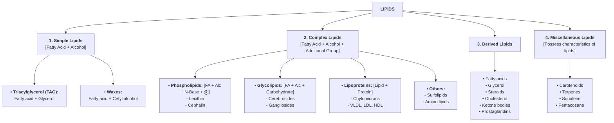

# LIPIDS

* **Definition :** Heterogeneous group of organic compounds, relatively **insoluble in water** and **soluble in organic solvents** *(ether, benzene, chloroform, hot alcohol, acetone, etc.)*, related to fatty acids.

---

## CLASSIFICATION OF LIPIDS

---

### 1. SIMPLE LIPIDS

*(Fatty Acid + Alcohol)*

* a. **Triacylglycerol (Neutral Fat / Triglyceride) :—**
* **Composition :** 3 Fatty Acids + 1 Glycerol molecule linked via **ester bonds**.
* **Storage form of lipid in animals.**
* **Never found in plasma membrane structure.**

$$\begin{matrix}
\text{CH}_2 - \text{O} - \overset{\overset{\text{O}}{\parallel}}{\text{C}} - \text{R}_1 & \quad (\text{Ester linkage with FA}_1) \\
\mid \qquad\qquad\quad & \\
\text{CH} - \text{O} - \overset{\overset{\text{O}}{\parallel}}{\text{C}} - \text{R}_2 & \quad (\text{Ester linkage with FA}_2) \\
\mid \qquad\qquad\quad & \\
\text{CH}_2 - \text{O} - \overset{\overset{\text{O}}{\parallel}}{\text{C}} - \text{R}_3 & \quad (\text{Ester linkage with FA}_3)
\end{matrix}$$

* b. **Waxes :—**
* **Composition :** Fatty acid + High molecular weight alcohol *(e.g., Cetyl alcohol)*.

---

### 2. COMPLEX (COMPOUND) LIPIDS

*(Fatty Acid + Alcohol + Additional Group)*

* a. **Phospholipids :—**
* Contain Fatty Acids + Alcohol + Nitrogenous Base + Phosphate group ($\text{P}$).
* *Examples :* Lecithin, Cephalin.

* b. **Glycolipids :—**
* Contain Fatty Acids + Alcohol + Carbohydrate.
* *Examples :* Cerebrosides, Gangliosides.

* c. **Lipoproteins :—**
* Contain Lipid + Protein (*SAQ*).
* *Examples :* Chylomicrons, VLDL, LDL, HDL.

* d. **Other Complex Lipids :—**
* Sulfolipids, Amino lipids.

---

### 3. DERIVED LIPIDS

* Substances derived from simple and complex lipids by hydrolysis:
* Fatty acids
* Glycerol
* Steroids
* Cholesterol
* Ketone bodies
* Prostaglandins

---

### 4. MISCELLANEOUS LIPIDS

* Compounds possessing characteristics of lipids:
* Carotenoids
* Terpenes
* Squalene
* Pentacosane

