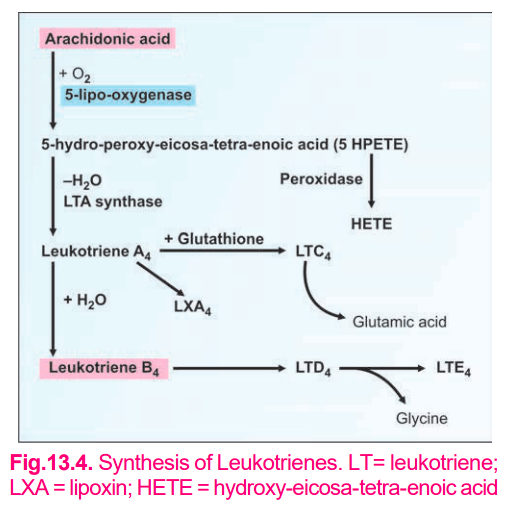

# Leukotrienes (LTs)

## Definition
- **Leukotrienes (LTs)** are **eicosanoids** derived from **arachidonic acid** via the **lipoxygenase pathway**.
- They are important mediators of **inflammation** and **hypersensitivity reactions**.

---

## Biosynthesis


---

## Biological Actions

### LTB₄
- Produced mainly by **neutrophils**.
- **Most potent chemotactic agent**.
- Attracts leukocytes to the site of inflammation.

### LTC₄, LTD₄ & LTE₄
- Together form the **Slow Reacting Substance of Anaphylaxis (SRS-A)**.
- Cause:
  - Smooth muscle contraction
  - Bronchoconstriction
  - ↑ Capillary permeability
  - Leukocyte activation
  - Vasoconstriction

---

## Clinical Importance

### SRS-A
- Major mediator of **Type I hypersensitivity reactions**.
- Important role in **bronchial asthma**.

---

# Lipoxins

## Definition
- **Lipoxins** are **anti-inflammatory eicosanoids** produced by **leukocytes**.
- Formed by the sequential action of **5-lipoxygenase** and **15-lipoxygenase**.

---

## Biosynthesis

```text
Arachidonic Acid
        │
        ▼
5-Lipoxygenase
        │
        ▼
15-Lipoxygenase
        │
        ▼
Lipoxins (LXA₄ - Most common)
```

---

## Actions

- Anti-inflammatory
- ↓ Immune response

> **High-Yield Points**
> - **LTB₄** → Most potent **chemotactic agent**.
> - **LTC₄ + LTD₄ + LTE₄** → **SRS-A** → Bronchoconstriction & asthma.
> - **LXA₄** → Anti-inflammatory.