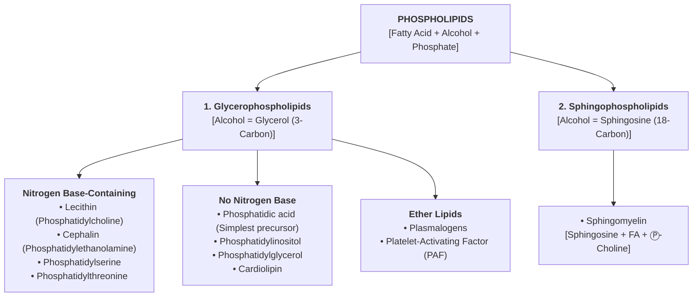
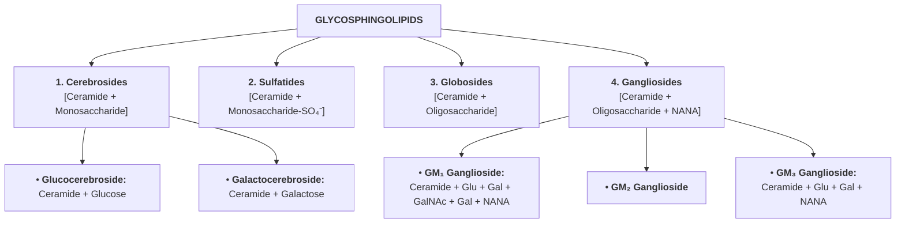

# PHOSPHOLIPIDS

> **SAQ Question :** Enumerate different types of phospholipids. Add a note on their role in the human body.

* **Type :** Complex / Compound lipid.
* **Composition :** $\text{Fatty Acid} + \text{Alcohol} + \text{Phosphate } (\text{P})$.

---

## CLASSIFICATION OF PHOSPHOLIPIDS

---

### STRUCTURAL MOTIFS OF MAJOR PHOSPHOLIPIDS

$$\begin{matrix}
\textbf{Phosphatidic Acid} & \textbf{Lecithin} & \textbf{Phosphatidylinositol} & \textbf{Plasmalogen} \\
\begin{bmatrix}
\text{Glycerol} - \text{FA}_1 \\
\mid \\
\text{Glycerol} - \text{FA}_2 \\
\mid \\
\text{Glycerol} - \text{P}
\end{bmatrix}
&
\begin{bmatrix}
\text{Glycerol} - \text{FA}_1 \\
\mid \\
\text{Glycerol} - \text{FA}_2 \\
\mid \\
\text{Glycerol} - \text{P} - \text{Choline}
\end{bmatrix}
&
\begin{bmatrix}
\text{Glycerol} - \text{FA}_1 \\
\mid \\
\text{Glycerol} - \text{FA}_2 \\
\mid \\
\text{Glycerol} - \text{P} - \text{Myoinositol}
\end{bmatrix}
&
\begin{bmatrix}
\text{Glycerol} \xleftarrow{\text{Ether}} \text{FA}_1 \\
\mid \\
\text{Glycerol} - \text{FA}_2 \\
\mid \\
\text{Glycerol} - \text{P} - \text{Ethanolamine}
\end{bmatrix}
\end{matrix}$$

> **Plasmalogen Note :—** Predominant in the **Central Nervous System (CNS)**.

---

## FUNCTIONS OF PHOSPHOLIPIDS

* a. **Membrane Structure & Transport :—** Structural component of plasma membrane; responsible for selective permeability and transport across membrane.
* b. **Lecithin (Phosphatidylcholine) :—**
* Acts as a **respiratory surfactant** (Dipalmitoyl lecithin) $\longrightarrow$ Prevents alveolar collapse in lungs *(Deficiency causes **ARDS / Respiratory Distress Syndrome**)*.
* Depot for choline $\longrightarrow$ Helps in **nerve transmission** and acts as an important donor in **transmethylation reactions**.
* Important in **reverse cholesterol transport**, **LCAT activity**, and **HDL metabolism**.

* c. **Cephalin (Phosphatidylethanolamine) :—**
* Helps in **blood coagulation** *(converts prothrombin to thrombin)*.

* d. **Phosphatidylserine :—**
* Important component of cell membranes.
* **Mediator of programmed cell death (apoptosis)** when flipped to the outer membrane leaflet.

* e. **Phosphatidylinositol (Myoinositol) :—**
* Cleaved into **Diacylglycerol (DAG)** and **Inositol Triphosphate ($\text{IP}_3$)** $\longrightarrow$ act as **second messengers** in hormone action *(mediator: $\text{Ca}^{2+}$, for Group II-C hormones)*.

* f. **Cardiolipin (Diphosphatidylglycerol) :—**
* First isolated from cardiac muscle; present predominantly in the **inner mitochondrial membrane**.
* Essential for mitochondrial function *(defects cause mitochondrial dysfunction)*.
* Responsible for **antigenicity** in diagnostic tests (e.g., Wassermann test).

* g. **Platelet-Activating Factor (PAF) :—**
* Promotes **platelet aggregation**.
* Acts as a key mediator in **inflammation, chemotaxis, and allergic responses**.

* h. **Sphingomyelin :—**
* Essential for the **formation of myelin sheath** $\longrightarrow$ aids nerve impulse conduction.
* Participates in the formation of **lipid rafts** in cell membranes.

* i. **Lipid Digestion & Solubilization :—**
* Helps dissolve cholesterol in bile acids.
* Aids in the digestion and absorption of dietary lipids.

---

### CLINICAL SIGNIFICANCE

* a. **Acute Respiratory Distress Syndrome (ARDS) :—** Due to surfactant (dipalmitoyl lecithin) deficiency in premature infants.
* b. **Antiphospholipid Syndrome (APS) :—**
* Autoimmune disease where antibodies are produced against phospholipids on plasma membranes.
* Causes **venous thrombosis**, **stroke**, and **pregnancy-related complications** *(recurrent miscarriage, IUGR, preterm birth)*.

---

# SPHINGOLIPIDS & GLYCOSPHINGOLIPIDS

* **Composition :** $\text{Carbohydrate} + \text{Lipid } [\text{Sphingosine as Alcohol}]$.
* **Ceramide :** $\text{Sphingosine} + \text{Fatty Acid}$.

---

### STRUCTURAL SCHEMATICS OF GLYCOSPHINGOLIPIDS

$$\begin{matrix}
\textbf{Ceramide} & \textbf{Glucocerebroside} & \textbf{Sulfatide} \\
\begin{bmatrix}
\text{Sphingosine} \\
\mid \\
\text{FA}
\end{bmatrix}
&
\begin{bmatrix}
\text{Sphingosine} \\
\mid \\
\text{FA} \\
\mid \\
\text{Glucose}
\end{bmatrix}
&
\begin{bmatrix}
\text{Sphingosine} \\
\mid \\
\text{FA} \\
\mid \\
\text{Glucose} - \text{SO}_4^-
\end{bmatrix}
\end{matrix}$$

---

### FUNCTIONS & CLINICAL SIGNIFICANCE

* a. Important constituents of **nervous tissues and cell membranes**.
* b. Act as **cell surface receptors** for many hormones and drugs.
* c. Play an important role in **cellular interaction, growth, and development**.
* d. **$\text{GM}_1$ Ganglioside :—** Acts as the receptor for **cholera toxin** *(High-Yield MCQ)*.
* e. **Sphingolipidoses :—** Defect in specific lysosomal hydrolases causes accumulation of glycosphingolipids, leading to storage diseases.

