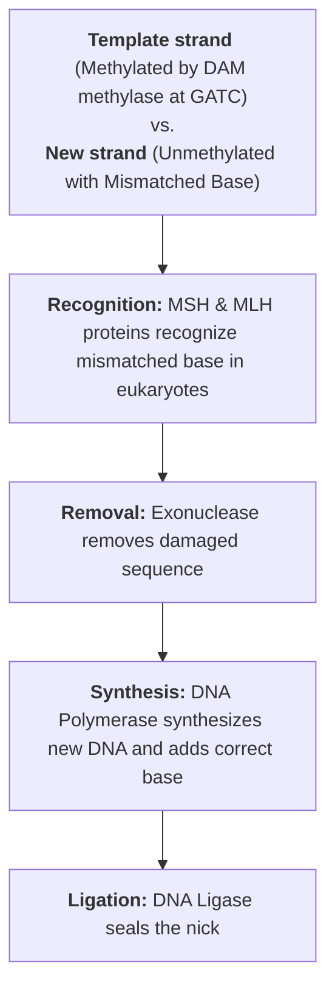
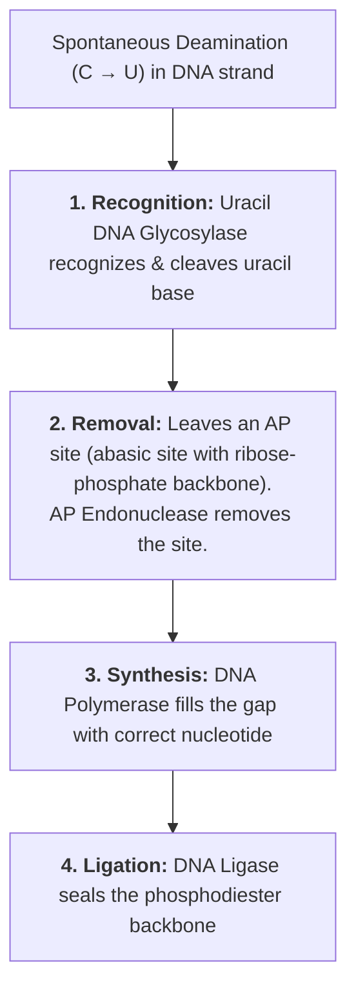
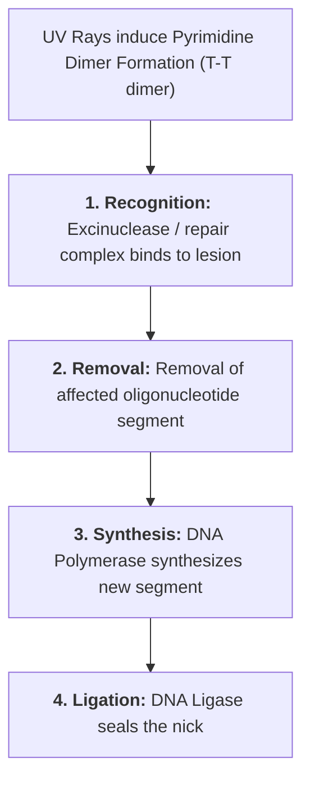
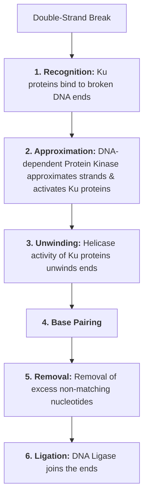
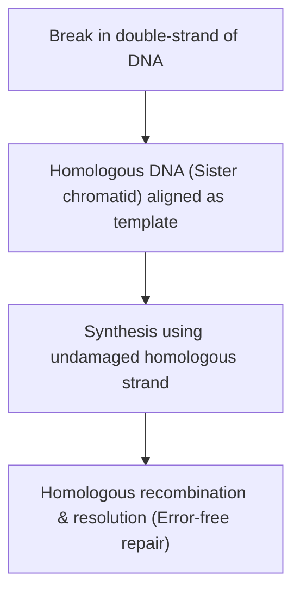
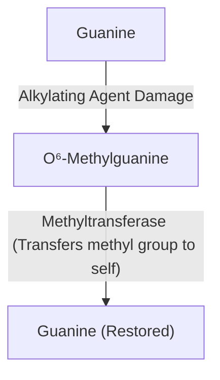

# DNA REPAIR

### CAUSES OF DNA DAMAGE

* a. **Free Radicals**
* b. **Physical Agents :—** UV rays, X-rays
* c. **Chemical Agents :—** Aflatoxin, Alkylating agents, Hydrazine, Ozone

---

### TYPES OF DNA DAMAGE

* a. **Single Base Alterations :—**
  * Spontaneous deamination:
    * $\text{Cytosine} \longrightarrow \text{Uracil}$
    * $\text{Adenine} \longrightarrow \text{Hypoxanthine}$
  * Depurination
  * Deletion or insertion of nucleotide
  * Base analog incorporation
  * Alkylating agents

* b. **Two Base Alterations :—**
  * $\text{T-T}$ dimer formation (by UV rays)
  * Alkylating agents

* c. **Chain Breaks :—**
  * Ionizing radiation
  * Radioactive disintegration
  * Oxidative damage

* d. **Cross-Linkage :—**
  * Between bases of same or opposite strand
  * Between DNA & protein

---

## DNA REPAIR MECHANISMS (OVERVIEW)

* a. **Mismatch Repair :—** Repair of mismatched base
* b. **Base Excision Repair (BER) :—** For deamination, depurination, or damage by alkylating agents
* c. **Nucleotide Excision Repair (NER) :—** UV light-induced $\text{T-T}$ dimer repair or $\text{T-C}$ cross-linkage
* d. **Double-Strand Break Repair (DSBR) :—** Break in DNA strand (NHEJ & Homologous Recombination)
* e. **Direct Repair :—** For modified bases, damage by alkylating agents, $\text{T-T}$ pyrimidine dimer formation

> **4 Basic Steps in DNA Repair :—**  
> 1. **Recognition**  
> 2. **Removal**  
> 3. **Synthesis**  
> 4. **Ligation (Ligase)**

---

## 1. MISMATCH REPAIR (METHYL-DIRECTED)

### Clinical Significance:

* **Faulty Mismatch Repair causes :—** **Hereditary Nonpolyposis Colorectal Cancer (HNPCC / Lynch Syndrome)**.
* **Inheritance :** Autosomal dominant.
* **Cause :** Mutation in `MSH` and `MLH` repair proteins.
* **Risks :** Colon cancer, endometrial cancer, ovarian cancer, etc.

---

## 2. BASE EXCISION REPAIR (BER)

* Repairs the type of DNA damage where a **single base is damaged**.
* **Causes :** Spontaneous deamination ($\text{Cytosine} \longrightarrow \text{Uracil}$, $\text{Adenine} \longrightarrow \text{Hypoxanthine}$), depurination, and alkylating agent damage.

---

## 3. NUCLEOTIDE EXCISION REPAIR (NER)

* Repairs **UV light-induced damage** ($\text{T-T}$ pyrimidine dimers, $\text{T-C}$ cross-linkage).

### Clinical Significance:

* **Faulty Nucleotide Excision Repair causes :—** **Xeroderma Pigmentosum**.
* UV-rays induce $\text{T-T}$ pyrimidine dimer formation (covalent bonding).
* Person is highly sensitive to sunlight.
* Multiple freckles / pigmentation on sun-exposed parts of body.
* Precancerous condition (high risk of skin cancers).

---

## 4. DOUBLE-STRAND BREAK REPAIR (DSBR)

* Repairs double-strand breaks caused by **ionizing radiation**, **oxidative stress**, and **bleomycin drug**.
* Occurs via **two mechanisms**:
* a. Non-Homologous End Joining (NHEJ)
* b. Homologous Recombination (HR)

---

### A. Non-Homologous End Joining (NHEJ)

* **Clinical Significance :—**
* Most common mechanism for double-strand break repair.
* **Defect in NHEJ causes :—** **SCID (Severe Combined Immunodeficiency)** where both T and B cells are affected *(Note: ADA defect is in purine nucleotide degradation)*.

---

### B. Homologous Recombination (HR)

* Lost DNA is synthesized by using the **homologous part of gene / sister chromatid** as a template.
* Occurs specifically during **S and $\text{G}_2$ phases** of cell cycle.

---

### Comparison: NHEJ vs. Homologous Recombination

| Feature | Non-Homologous End Joining (NHEJ) | Homologous Recombination (HR) |
| --- | --- | --- |
| **Template Requirement** | Break ends directly ligated without need for homologous template | Requires homologous DNA (sister chromatid) as template |
| **Speed** | Fast process | Slow process |
| **Cell Cycle Phase** | Occurs predominantly in $\text{G}_0 / \text{G}_1$ phase | Occurs in $\text{S}$ and $\text{G}_2$ phase |
| **Fidelity / Mutagenicity** | Deletion of nucleotides occurs; hence **mutagenic (error-prone)** | Occurs with **high fidelity**; less / no mutations (error-free) |
| **Associated Diseases** | Defect causes **SCID** | Defect causes **Ataxia Telangiectasia-Like Disorder (ATLD), Bloom syndrome, etc.** |

---

### Clinical Significance: Faulty Homologous Recombination

* a. **Ataxia Telangiectasia :—**
* Affects nervous system and immune system.
* **Ataxia :** Progressive difficulty in coordinating movements.
* **Telangiectasia :** Small clusters of enlarged blood vessels.

* b. **Fanconi's Anemia :—**
* Affects the bone marrow $\longrightarrow \downarrow$ production of all blood cell types.
* Leads to aplastic anemia and leukemia.

* c. **Bloom's Syndrome :—**
* Short stature, sun-sensitive skin rash, $\uparrow$ susceptibility to cancer.

* d. **Breast Cancer Susceptibility :—**
* Mutations in `BRCA-1` and `BRCA-2` genes *(involved in homologous recombination repair)*.

---

## 5. DIRECT REPAIR

* Repairs pyrimidine dimer formation, damaged alkylated bases, and modified bases directly without excision *(Note: UV dimers are also repaired by NER)*.

