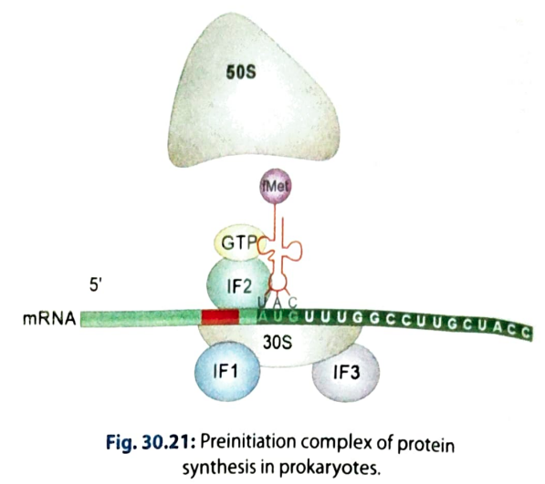
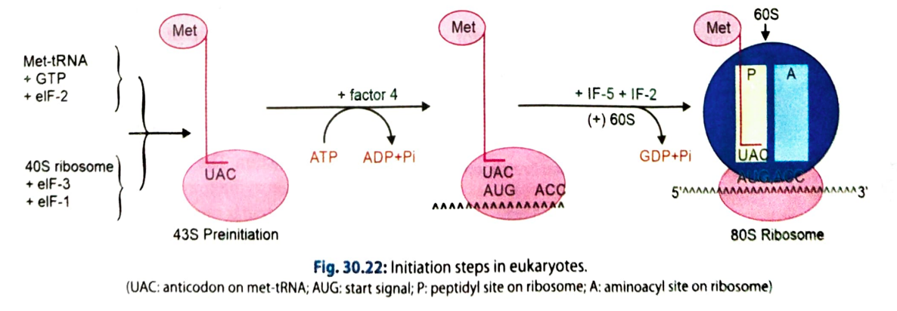
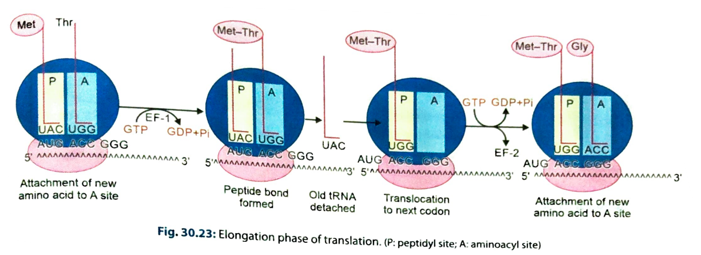
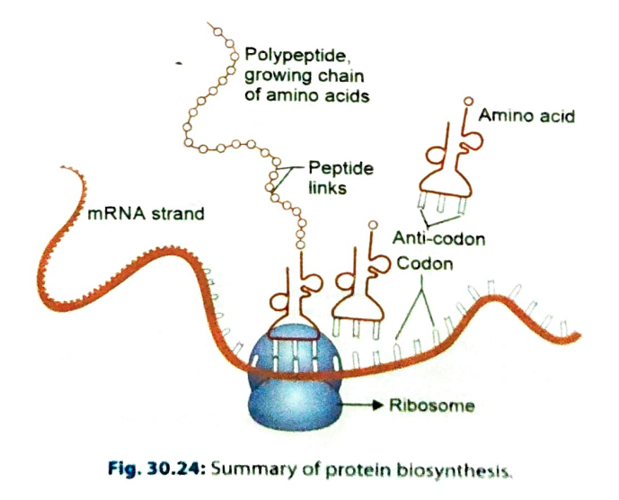

# TRANSLATION / PROTEIN SYNTHESIS

### Definition

* Translation is the **cytoplasmic process of synthesis of a polypeptide chain using mRNA as template**.
* mRNA is read in **5′ → 3′ direction**.
* Polypeptide grows from **N-terminal → C-terminal**.

### Phases of Translation

1. **Activation of amino acids**
2. **Initiation**
3. **Elongation**
4. **Termination**
5. **Post-translational processing**

---

# 1. ACTIVATION OF AMINO ACID

### Charging of tRNA

* Enzyme: **Aminoacyl-tRNA synthetase**
* Each amino acid has a specific synthetase.
* Amino acid attaches to the **3′ CCA end of tRNA**.

### Reaction

**Amino acid + tRNA + ATP → Aminoacyl-tRNA + AMP**

### Two steps

**Step 1: Activation**

* Amino acid + ATP → **aminoacyl-AMP-enzyme complex**

**Step 2: Transfer**

* Activated amino acid is transferred to the **3′-OH of tRNA**.
* AMP + enzyme are released.

⭐ **Important:** ATP is hydrolysed to **AMP**, therefore **2 high-energy phosphate bonds** are consumed.

---

# 2. INITIATION

### Important components

* mRNA
* Ribosomal subunits
* Initiator **Met-tRNA**
* **eukaryotic initiation factors (eIFs)**
* GTP

### A. Recognition

* Start codon = **AUG**
* In eukaryotes → codes for **methionine (Met)**
* In prokaryotes → **N-formyl methionine (fMet)**

⭐ Marker sequences:

* **Eukaryotes → Kozak sequence**
* **Prokaryotes → Shine-Dalgarno sequence**

### B. Formation of Pre-initiation Complex

In eukaryotes:

**40S + eIFs + eIF-2–GTP + Met-tRNA → PIC**

### C. Binding of mRNA

* 5′ **methylated cap** of mRNA facilitates attachment.
* **eIF-4E** recognises the 5′ cap.
* ATP is required.
* Forms the **43S initiation complex**.

⭐ **eIF-4E cap recognition is the rate-limiting step of translation.**

### D. Formation of 80S Ribosome

* 60S subunit joins the 43S complex.
* Requires **GTP hydrolysis**.
* Forms the complete **80S initiation complex**.

### Position of initiator tRNA

**Met-tRNA occupies P site.**

---

# 3. RIBOSOMAL SITES

The ribosome has two important tRNA-binding sites:

### P site — Peptidyl site

* Holds **peptidyl-tRNA**
* Contains the growing peptide chain.

### A site — Aminoacyl site

* Receives the **incoming aminoacyl-tRNA**.

⭐ At initiation:

> **Met-tRNA is present in the P site.**

---

# 4. ELONGATION

Elongation occurs by **3 steps**:

### A. Binding of aminoacyl-tRNA

* Incoming aminoacyl-tRNA enters **A site**.
* Requires **EF-1 + GTP**.
* Anticodon pairs with complementary mRNA codon.
* GTP → GDP.

### B. Peptide bond formation

* Peptide bond forms between:

  * amino group of amino acid in **A site**
  * carboxyl group of peptide in **P site**
* Enzyme: **Peptidyl transferase**
* Component of **28S rRNA of 60S subunit**.

⭐ **Peptidyl transferase is a ribozyme** → RNA acts as the enzyme.

* No additional energy is required for peptide bond formation because the amino acid was already activated.

### C. Translocation

* Empty tRNA leaves the ribosome.
* Ribosome moves **one codon (3 bases)** along mRNA.
* Peptidyl-tRNA moves:

**A site → P site**

* A site becomes free for the next aminoacyl-tRNA.
* Requires **EF-2 + GTP**.

### 🔁 Elongation cycle

**Aminoacyl-tRNA enters A site**
↓
**Peptide bond formation**
↓
**Translocation**
↓
**Empty tRNA leaves**
↓
**Next aminoacyl-tRNA enters A site**

Repeated until a stop codon is reached.

---

# 5. TERMINATION

### Stop codons

**UAA, UAG, UGA**

* No tRNA has an anticodon complementary to these codons.
* Therefore, **A site remains empty**.
* **Release factors** bind to the A site.
* Peptide chain is released from tRNA.
* Ribosome dissociates into:

**60S + 40S**

### Result

→ Completed **polypeptide chain** is released.

---

# 6. POLYSOMES / POLYRIBOSOMES

* Several ribosomes can simultaneously translate the **same mRNA**.
* This aggregate is called a **polysome/polyribosome**.
* Allows rapid synthesis of multiple copies of the same protein.

### Ribosomes may be:

* **Free in cytoplasm** → synthesis of cytoplasmic proteins.
* **Attached to rough ER** → synthesis of proteins destined for secretion/membranes/endomembrane system.

---

# 7. POST-TRANSLATIONAL PROCESSING

Newly synthesized polypeptide may undergo:

* **Folding**
* **Proteolytic cleavage**
* **Modification of amino acids**
* Addition of carbohydrate/lipid groups
* Formation of disulfide bonds

→ Produces the **functional protein**.

---

# ⭐ ENERGY REQUIREMENT — HIGH-YIELD

For addition of **each amino acid**:

### Activation

ATP → AMP
= **2 high-energy phosphate bonds**

### Aminoacyl-tRNA entry

GTP → GDP
= **1 GTP**

### Translocation

GTP → GDP
= **1 GTP**

Therefore:

> **4 high-energy phosphate bonds are consumed per amino acid added.**

---

# 🔥 ONE-PAGE FLOWCHART TO MEMORISE

**Amino acid**
↓ *(Aminoacyl-tRNA synthetase + ATP)*
**Aminoacyl-tRNA**
↓

### INITIATION

**40S + Met-tRNA + eIF-2-GTP**
↓
**43S complex + mRNA**
↓
**60S joins**
↓
**80S ribosome**
↓

### ELONGATION

**Aminoacyl-tRNA → A site**
↓
**Peptide bond formation**
↓
**Translocation**
↓
**A site free**
↓
Repeat 🔁
↓

### TERMINATION

**UAA / UAG / UGA**
↓
**Release factor**
↓
**Polypeptide released**
↓
**80S → 60S + 40S**

### 🎯 Absolute must-remember points

* **Direction:** mRNA 5′ → 3′
* **Protein growth:** N → C terminal
* **Start codon:** AUG
* **Stop codons:** UAA, UAG, UGA
* **Eukaryotic ribosome:** 80S = 60S + 40S
* **Initiator tRNA:** starts in **P site**
* **Incoming tRNA:** enters **A site**
* **Peptidyl transferase:** **28S rRNA**
* **Kozak:** eukaryotes
* **Shine-Dalgarno:** prokaryotes
* **eIF-4E:** recognises 5′ cap
* **Polysome:** multiple ribosomes on one mRNA
* **Energy:** 4 high-energy phosphate bonds/amino acid added.
