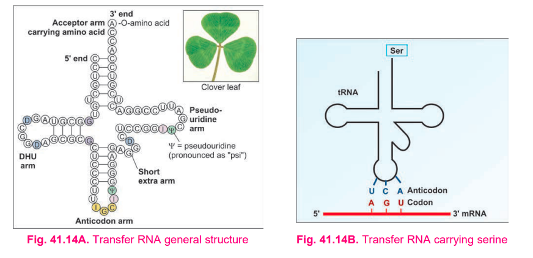

# tRNA (Transfer RNA)

### Headings

- Definition / Functions
- General features
- Structure
  - Acceptor arm
  - Anticodon arm
  - D arm / DHU arm
  - Pseudouridine arm
  - Extra arm
- Processing of tRNA

---

## 1. Definition / Functions

- tRNA = **transfer RNA**, also called **soluble RNA (sRNA)**.
- Transfers amino acids from cytoplasm to the **ribosome** for protein synthesis.
- Acts as an **adapter molecule between mRNA codons and amino acids**.
- It recognizes:
  - Specific **mRNA codon**
  - Corresponding **amino acid**

---

## 2. General Features

- Small RNA molecule present in the cytoplasm.
- Contains about **73–93 nucleotides**.
- Much smaller than mRNA.
- Shows extensive **internal base pairing**.
- Forms a characteristic **cloverleaf structure**.
- Contains unusual bases such as:
  - **Dihydrouracil (DHU)**
  - **Pseudouridine (ψ)**
  - **Hypoxanthine**
- Many bases are **methylated**.

---

## 3. Structure of tRNA

### A. Acceptor Arm

- Present at the **3′ end**.
- Carries the specific amino acid.
- Contains **7 base pairs**.
- Terminal sequence = **CCA-3′**.
- Amino acid attaches to the **3′-OH group** by an ester bond.

> **Remember: 3′ CCA = amino acid attachment site**

---

### B. Anticodon Arm

- Lies opposite the acceptor arm.
- Contains the **anticodon**.
- Anticodon recognizes and base-pairs with the complementary **codon on mRNA**.
- Determines the specificity of tRNA.

**Example:**

mRNA codon → **UUU**  
tRNA anticodon → **AAA**  
Amino acid → **Phenylalanine**

---

### C. D Arm / DHU Arm

- Contains **dihydrouridine (DHU)**.
- Acts as a **recognition site for the enzyme that adds the amino acid**.

---

### D. Pseudouridine Arm / TψC Arm

- Contains **pseudouridine (ψ)**.
- Helps in **binding tRNA to the ribosome**.

---

### E. Extra Arm

- Present in many tRNAs.
- **Class I:** short extra arm → 3–5 base pairs.
- **Class II:** long extra arm → 13–21 base pairs.

---

## 4. Processing of tRNA

- tRNA is initially synthesized as a **long precursor**.
- It undergoes post-transcriptional processing.
- Precursor is trimmed by **RNase P**, which is a **ribozyme**.
- **CCA sequence is added at the 3′ end**.
- Bases undergo **modification**.

---

## ⭐ Last-minute recall

### tRNA = "ADAPT-er"

**A** → Acceptor arm → **3′ CCA → amino acid**

**D** → D arm → **DHU → enzyme recognition**

**A** → Anticodon arm → **mRNA codon recognition**

**P** → Pseudouridine arm → **ribosome binding**

**E** → Extra arm → Class I / II

---

### ⭐ Must-write points in a 5-mark answer

1. **Definition + adapter function**
2. **73–93 nucleotides + cloverleaf structure**
3. **3′ CCA acceptor arm**
4. **Anticodon arm**
5. **D/DHU arm + TψC arm**
6. **RNase P + processing**