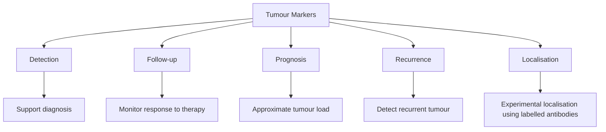

# TUMOUR MARKERS 

## 1. Definition

* Tumour markers are also called **tumour index substances**.
* They are **substances produced/released by tumour cells** that can be detected in **blood or tissues**.
* Their presence or increased level may indicate the presence or activity of a tumour.

> ⚠️ **Important:** Tumour markers are generally **not diagnostic by themselves** because they may also increase in non-malignant conditions.

---

# 2. Uses of Tumour Markers ⭐⭐⭐

### **A. Detection**

* Facilitate **detection of cancer**.
* Positive marker supports the diagnosis but requires confirmation by other methods.

### **B. Follow-up**

* Monitor **response to treatment**.
* Falling levels → may indicate response to therapy.

### **C. Detection of recurrence**

* Rising marker levels after treatment may suggest **recurrence**.

### **D. Prognosis**

* Serum level may roughly reflect **tumour load**.
* Helps assess prognosis.

### **E. Localisation**

* Experimentally, **radiolabelled antibodies** against tumour markers can localise tissues producing the marker.

### ⚠️ Precaution

$$
\boxed{\text{Tumour marker} \neq \text{definitive diagnosis}}
$$

* May be elevated in **non-malignant conditions**.
* Some tumours may **not produce elevated markers**, especially in early stages.
* Positive results require confirmation by **imaging, biopsy and other investigations**.

---

# 3. Important Tumour Markers ⭐⭐⭐

## A. Oncofetal Products

| Marker  | Important association                                                                              |
| ------- | -------------------------------------------------------------------------------------------------- |
| **AFP** | **Hepatocellular carcinoma**, germ-cell tumours, teratocarcinoma of ovary                          |
| **CEA** | **Colorectal carcinoma**; may also increase in breast, lung, gastric, ovarian & pancreatic cancers |

### 1. Alpha-fetoprotein — **AFP**

* **Oncofetal protein**
* Increased in:

  * **Hepatocellular carcinoma** ⭐
  * Germ-cell tumours
  * Ovarian teratocarcinoma
  * Pregnancy with fetal neural-tube malformations
* Normal adult male/non-pregnant female: **<15 ng/L**.

### 2. Carcinoembryonic Antigen — **CEA**

* Markedly increased in **colorectal carcinoma** ⭐
* May also be elevated in:

  * Breast
  * Lung
  * Gastric
  * Ovarian
  * Pancreatic cancers
* May also increase in **IBD, pancreatitis and liver disease**.

---

# B. Hormones and Hormone Metabolites

| Marker         | Tumour association                                    |
| -------------- | ----------------------------------------------------- |
| **β-hCG**      | Choriocarcinoma, hydatidiform mole, germ-cell tumours |
| **Calcitonin** | **Medullary thyroid carcinoma**                       |

### 3. β-hCG

* β-subunit is **specific for hCG**.
* Increased in:

  * **Hydatidiform mole**
  * **Choriocarcinoma**
  * Germ-cell tumours
* About **60% of testicular cancers** secrete hCG.

### 4. Calcitonin

* Produced by **parafollicular C cells** of thyroid.
* Increased in **medullary thyroid carcinoma**.
* Useful in detecting MTC, particularly in **high-risk families**.

---

# C. Carbohydrate Antigen

### 5. CA-125 ⭐

* Tumour marker for **ovarian carcinoma**.
* Approximately **75%** of ovarian cancer patients may show elevated levels.
* Levels correlate with **tumour mass**.
* Useful for monitoring **recurrence after chemotherapy**.
* Normal: **<35 U/mL**.

---

# D. Enzyme

### 6. Prostate-Specific Antigen — **PSA** ⭐

* Produced by secretory epithelium of **prostate gland**.
* A **protease**.
* Increased particularly in **prostate carcinoma**.
* Total PSA normally **<4 ng/L**.
* **4–10 ng/L** = borderline range; low free PSA increases suspicion of malignancy.

---

# E. Serum Protein

### 7. Bence Jones Protein

* An important **serum/urinary protein marker** associated with **multiple myeloma**.

---

# F. Receptor Tumour Markers

| Marker       | Major use                                                 |
| ------------ | --------------------------------------------------------- |
| **ER**       | Breast carcinoma → predicts response to endocrine therapy |
| **PR**       | Breast carcinoma → prognostic & therapeutic value         |
| **HER2/neu** | Breast carcinoma → predicts response to anti-HER2 therapy |

### 8. Estrogen Receptor — **ER**

* Nuclear receptor found in breast and uterine tissues.
* **ER-positive breast cancers** are more likely to respond to **tamoxifen/endocrine therapy**.

### 9. Progesterone Receptor — **PR**

* Nuclear receptor in breast and uterine tissues.
* Has **prognostic and therapeutic value** similar to ER.
* ER/PR status helps predict response to hormonal therapy.

### 10. HER2/neu

* Receptor protein promoting growth of breast cancer cells.
* Positive in approximately **1 in 5 breast cancers**.
* HER2-positive tumours tend to be **more aggressive**.
* Predicts response to **anti-HER2 therapy** such as trastuzumab.

---

# 🧠 FINAL EXAM TABLE

| **Class**                | **Tumour marker**       | **Major association**              |
| ------------------------ | ----------------------- | ---------------------------------- |
| **Oncofetal**            | **AFP**                 | Hepatocellular carcinoma           |
|                          | **CEA**                 | Colorectal carcinoma               |
| **Hormone**              | **β-hCG**               | Choriocarcinoma / germ-cell tumour |
|                          | **Calcitonin**          | Medullary thyroid carcinoma        |
| **Carbohydrate antigen** | **CA-125**              | Ovarian carcinoma                  |
| **Enzyme**               | **PSA**                 | Prostate carcinoma                 |
| **Serum protein**        | **Bence Jones protein** | Multiple myeloma                   |
| **Receptor**             | **ER**                  | Breast carcinoma                   |
|                          | **PR**                  | Breast carcinoma                   |
|                          | **HER2/neu**            | Breast carcinoma                   |

### Absolute associations to lock in:

$$
\boxed{
\begin{matrix}
AFP &\rightarrow& Hepatocellular\ carcinoma\\\\
CEA &\rightarrow& Colorectal\ carcinoma\\\\
\beta\text{-}hCG &\rightarrow& Choriocarcinoma\\\\
Calcitonin &\rightarrow& Medullary\ thyroid\ carcinoma\\\\
CA\text{-}125 &\rightarrow& Ovarian\ carcinoma\\\\
PSA &\rightarrow& Prostate\ carcinoma\\\\
Bence\ Jones &\rightarrow& Multiple\ myeloma\\\\
ER/PR/HER2 &\rightarrow& Breast\ carcinoma
\end{matrix}
}
$$
