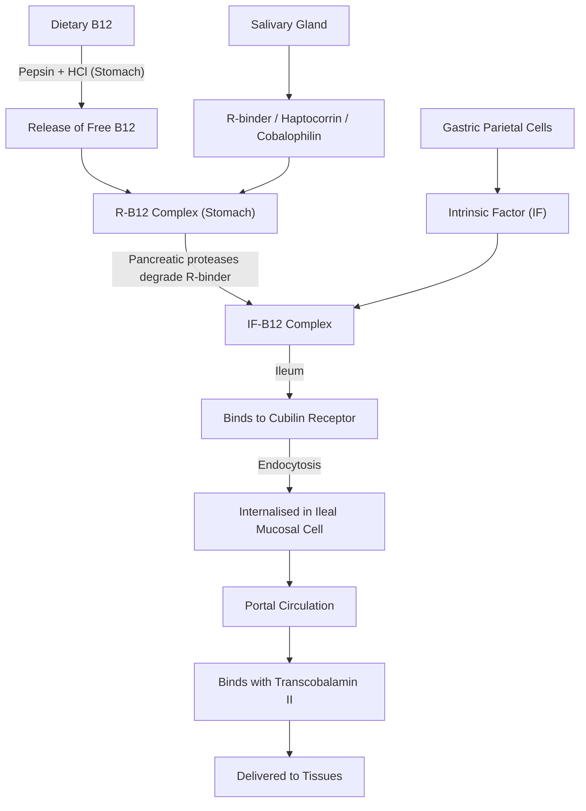
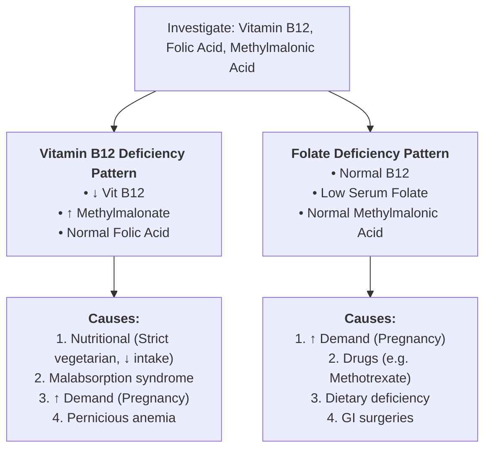

# B12 - COBALAMIN

### MNEMONIC: CoBalAMINES MMS SCaM

* **Part 1 : CoBAMINE**
  * **Co $\longrightarrow$** **Co**balt (central metal ion in corrin ring)
  * **B $\longrightarrow$** Vitamin **B**₁₂
  * **A $\longrightarrow$** **A**denosyl B₁₂ (active coenzyme form)
  * **M $\longrightarrow$** **M**ethyl B₁₂ (active coenzyme form)
  * **I $\longrightarrow$** **I**ntrinsic factor (required for ileal absorption)
  * **N $\longrightarrow$** **N**eurological manifestations (demyelination)
  * **E $\longrightarrow$** **E**xtrinsic factor of Castle

---

* **Part 2 : MMS (Enzymes & Reactions)**
  * **M $\longrightarrow$** **M**ethylmalonyl-CoA mutase
  * **M $\longrightarrow$** **M**ethionine synthase
  * **S $\longrightarrow$** **S**uccinyl-CoA (product of methylmalonyl-CoA mutase reaction)

---

* **Part 3 : SCaM (Deficiency Features)**
  * **S $\longrightarrow$** **S**ubacute combined degeneration of spinal cord
  * **C $\longrightarrow$** **C**ord involvement (posterior and lateral columns)
  * **a $\longrightarrow$** **a**nemia (megaloblastic anemia / pernicious anemia)
  * **M $\longrightarrow$** **M**ethylmalonate excretion in urine (methylmalonic aciduria)

---

## DIGESTION, ABSORPTION AND TRANSPORT

---

### SOURCES & RDA

* **Sources :—**
* Produced by microorganisms in the intestine.
* Present in food of animal origin *(meat, fish, etc.)*.

* **RDA :—** $1\ \mu\text{g/day}$.

---

## BIOCHEMICAL FUNCTIONS

* a. **Conversion of Homocysteine to Methionine :—**

$$\text{Homocysteine} + \text{Methyl THF} \xrightarrow[\text{B}_{12}]{\text{Methionine Synthase}} \text{Methionine} + \text{THF}$$

* b. **Methylmalonyl-CoA Mutase :—**

$$\text{Propionyl-CoA} \longrightarrow \text{Methylmalonyl-CoA} \xrightarrow[\text{B}_{12}]{\text{Methylmalonyl-CoA Mutase}} \text{Succinyl-CoA}$$

$$\downarrow$$

$$\text{Enters TCA Cycle } \& \text{ Heme Synthesis}$$

---

## DEFICIENCY MANIFESTATIONS

### Causes of Deficiency:

* a. **Nutritional deficiency $\longrightarrow$** Decreased intake, strict vegetarian diet.
* b. **Malabsorption syndrome.**
* c. **Increased demand $\longrightarrow$** Pregnancy.
* d. **Pernicious anemia $\longrightarrow$** Autoantibodies against gastric parietal cells $\longrightarrow$ Deficiency of Intrinsic Factor $\longrightarrow \downarrow \text{B}_{12}$ absorption.

---

### Manifestations:

* a. **Megaloblastic Anemia :—**

$$\text{B}_{12} \text{ or } \text{B}_9 \text{ deficiency} \longrightarrow \downarrow \text{DNA} \ \& \ \downarrow \text{RNA} \longrightarrow \text{Cell cycle arrest in S-phase}$$

$$\downarrow$$

$$\text{Cell grows continuously without cell division}$$

$$\downarrow$$

$$\uparrow\uparrow \text{Cytoplasm}, \quad \downarrow\downarrow \text{Nucleus}$$

$$\downarrow$$

$$\text{Macrocytic RBCs}$$

* b. **Sub-Acute Combined Degeneration of Spinal Cord :—**
*(Due to defective myelination)*
* **Mechanism 1:** Methylmalonyl-CoA competes with Malonyl-CoA $\longrightarrow \downarrow$ Fatty acid synthesis $\longrightarrow \downarrow$ Myelin synthesis.
* **Mechanism 2:** Methylmalonyl-CoA incorporated into sphingolipids / glycolipids $\longrightarrow$ Defective myelin synthesis $\longrightarrow$ Degeneration.

* c. **Excretion of Methyl Malonate in Urine.**

---

### LAB DIAGNOSIS OF B12 DEFICIENCY

* a. Serum Cobalamin level
* b. Serum Methylmalonic acid level
* c. Serum Homocysteine level
* d. Megaloblasts in Peripheral Blood Smear
* e. Bone Marrow Aspiration

---

## DIFFERENTIAL DIAGNOSIS: MEGALOBLASTIC ANEMIA

> **Findings:** Anemia ($\downarrow\text{Hb}$), Macrocytosis ($\text{MCV} > 100\text{ fL}$), Hypersegmented neutrophils.

