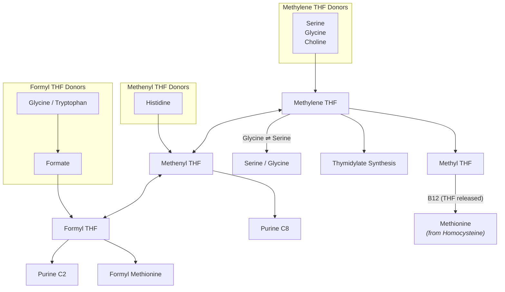
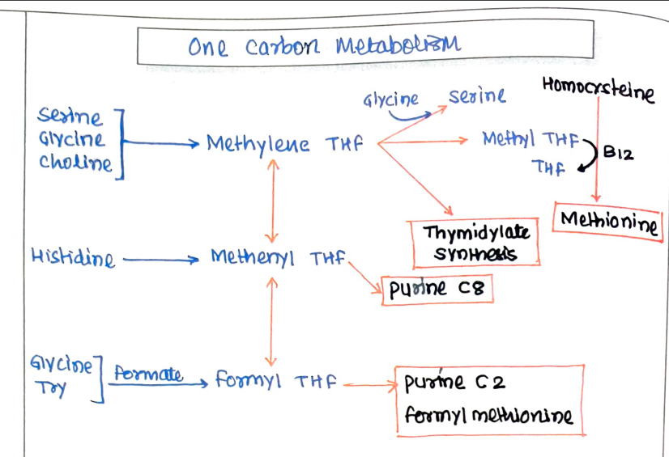

# B9 - FOLIC ACID

* **Water-soluble, hematopoietic vitamin.**

---

### CHEMISTRY

$$\text{Pteridine} + \text{PABA} \longrightarrow \text{Pteroic acid}$$
$$\text{Pteroic acid} + \text{Glutamate} \longrightarrow \text{Folic Acid}$$

> **Note on Name :—**  
> *Folium* = leaf of green vegetables (important source).

---

### ACTIVE FORM

$$\text{Folic Acid} \xrightarrow{\text{Dihydrofolate Reductase}} \text{Dihydrofolate} \xrightarrow{\text{Dihydrofolate Reductase}} \text{Tetrahydrofolate (THF)}$$

* **Tetrahydrofolate (THF) :—** Active coenzyme.

---

## BIOCHEMICAL FUNCTIONS

### One Carbon Metabolism
* **Definition :—** The organic compounds which contain one transferable carbon are called one-carbon compounds.

* **One-Carbon Moieties :—**
  * $-\text{CH}_3$ : Methyl
  * $-\text{CH}_2-$ : Methylene
  * $=\text{CH}-$ : Methenyl
  * $-\text{CHO}$ : Formyl
  * $-\text{CH}_2\text{OH}$ : Hydroxymethyl
  * $-\text{CH}=\text{NH}$ : Formimino

* **Reactions of One-Carbon Metabolism :—**
  * a. $\text{Homocysteine} \xrightarrow{\text{Methyl THF}} \text{Methionine}$
  * b. $\text{dUMP} \xrightarrow[\text{Thymidylate synthase}]{\text{Methylene THF}} \text{dTMP}$
  * c. $\text{Glycinamide Ribosyl 5-P} \xrightarrow{\text{Methenyl THF}} \text{Formylglycinamide Ribosyl 5-P [C-8 Purine]}$
  * d. $\text{Aminoimidazole Carboxamide Ribosyl 5-P} \xrightarrow{\text{Formyl THF}} \text{Formamidoimidazole Carboxamide Ribosyl 5-P [C-2 Purine]}$
  * e. $\text{Glycine} \xrightarrow{\text{Methylene THF}} \text{Serine}$
  * f. $\text{Histidine} \longrightarrow \text{FIGLU} \longrightarrow \text{L-Glutamate}$

---

### ONE CARBON METABOLISM PATHWAY

---

### 5 IMPORTANT REACTIONS (FOLIC ACID)

* a. Conversion of serine to glycine
* b. Synthesis of thymidylate
* c. Catabolism of histidine
* d. Synthesis of purine
* e. Synthesis of methionine

---

## DEFICIENCY MANIFESTATIONS

### Causes:

* Increased demand
* Drugs
* Dietary deficiency
* GI surgeries

### Manifestations:

* a. **Megaloblastic Anemia :—**

$$\begin{matrix} \text{TMP} \\ \text{C2} \\ \text{C8} \end{matrix} \Bigg\} \text{Purine} \longrightarrow \downarrow \text{DNA}, \downarrow \text{RNA} \longrightarrow \text{Cell cycle arrested at S-phase} \longrightarrow \text{Cell grows without cell division}$$

$$\downarrow$$

$$\uparrow\uparrow \text{Cytoplasm}, \quad \downarrow\downarrow \text{Nucleus}$$

$$\downarrow$$

$$\text{Macrocytic RBCs}$$

* b. **Homocysteinemia :—**
$\uparrow$ Homocysteine $\longrightarrow$ CVS manifestations.
* c. **Neural Tube Defect :—**
Spina bifida / Anencephaly due to lack of folate in pregnancy.

---

### RDA & DIETARY SOURCES

* **RDA :—**
* Adult = $200\ \mu\text{g/day}$
* Pregnancy = $400\ \mu\text{g/day}$

* **Dietary Sources :—**
* Vegetables *(spinach, beans)*
* Orange, Papaya, Beet

---

## ANTAGONISTS

* a. **Sulphonamide :—**
* Antibacterial.
* Structurally similar to PABA $\longrightarrow$ Competitive inhibition of folic acid synthesis $\longrightarrow$ Inhibits growth of bacteria.

* b. **Aminopterin & Amethopterin (Methotrexate) :—**
* Competitive inhibitor of **Dihydrofolate Reductase** $\longrightarrow$ $\downarrow \text{THF} \longrightarrow \downarrow\downarrow \text{Cell division} \longrightarrow \text{Death of cancer cells}$.

---

## LAB DIAGNOSIS OF MEGALOBLASTIC ANEMIA

* **Peripheral Smear :—** Macrocytosis, Reticulocytosis.
* **Histidine Load Test :—** Excretion of FIGLU in urine.
* **Serum folate level and RBC folate level.**

### FIGLU Excretion Pathway:

$$\text{Histidine} \longrightarrow \text{Formiminoglutamate [FIGLU]} \xrightarrow[\text{THF} \longrightarrow \text{N}^5\text{-Formimino THF}]{\text{\textbf{❌ Block in folate deficiency}}} \text{L-Glutamate}$$

> **In Folate Deficiency :—**
> FIGLU is **excreted in urine**.

---

> **Note on Pregnancy Supplementation :—**
> In pregnancy, **Folic acid ($500\ \mu\text{g}$)** + **Elemental iron ($100\text{ mg}$)** is given.

