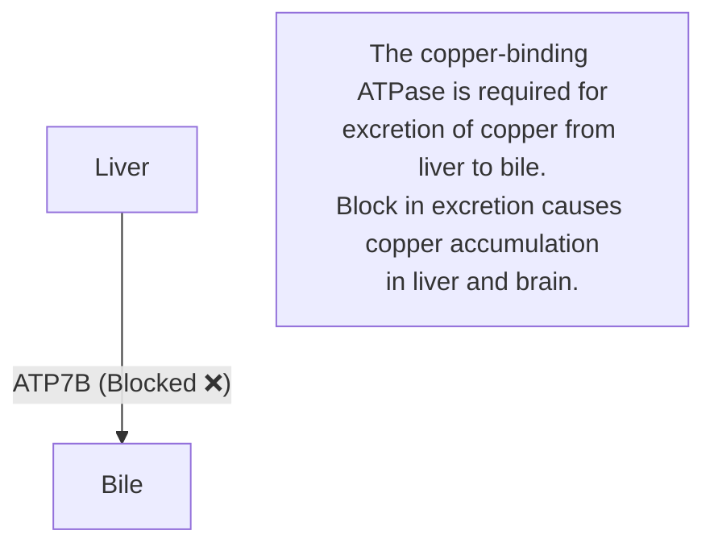
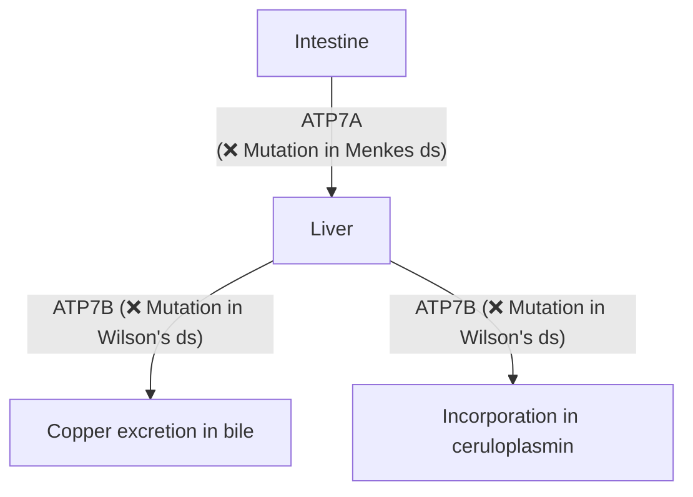
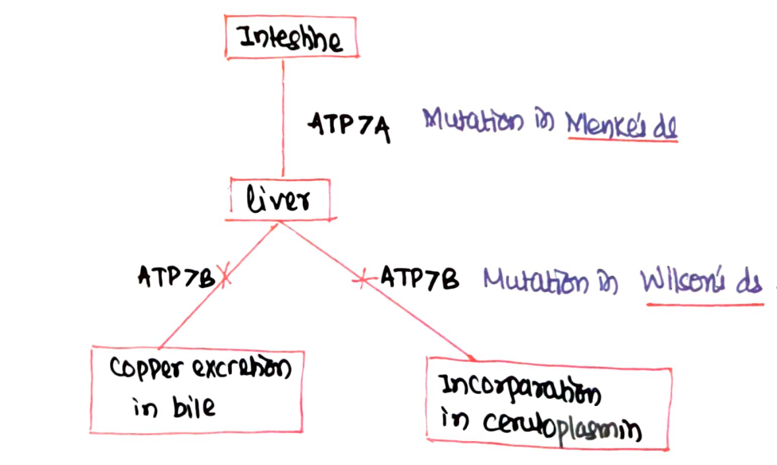

# COPPER

* **Trace element**
* **Total body content :—** 100 mg
* Widely distributed in various organs.

---

### SOURCES
* Organ meat
* Green leafy vegetables
* Fruits, Nuts
* Shellfish, etc.

---

### RECOMMENDED DIETARY ALLOWANCE (RDA)
* **Adult $\longrightarrow$** 2 – 3 mg/day
* **Infant / Children $\longrightarrow$** 0.5 – 2 mg/day

---

## BIOCHEMICAL FUNCTIONS

* a. **Cofactor for Enzymes :—**
  * Cytochrome oxidase
  * Catalase
  * Ceruloplasmin
  * ALA synthase
  * Superoxide dismutase
  * Tyrosinase
  * Lysyl oxidase

* b. **Electron Transport Chain :—** Cytochrome oxidase.

* c. **Incorporation of Iron in Transferrin :—**
  $$\text{Fe}^{2+} \longrightarrow \text{Fe}^{3+} \longrightarrow \text{Transferrin}$$

* d. **Heme Synthesis :—** ALA synthase.

* e. **Antioxidant :—** Superoxide dismutase.

* f. **Melanin Synthesis :—** Tyrosinase.

* g. **Formation of Vessel Walls :—** Lysyl oxidase *(High-Yield MCQ)*.

---

## DISEASES RELATED WITH COPPER

* a. **Wilson's disease**
* b. **Anemia :—** Normochromic microcytic
* c. **CVS Abnormalities :—** Aneurysm or rupture of aorta
* d. **Menkes disease :—** X-linked, affects males, kinky hair
* e. **Hypopigmentation :—** Defect in tyrosinase

---

## WILSON'S DISEASE
*(Hepatolenticular Degeneration)*

* **Mutation :—** Copper-binding ATPase (**ATP7B**).

### Clinical Presentation (C/P):

* Accumulation of copper in liver.
* Damages lenticular nucleus of brain.
* **Kayser–Fleischer Ring *(MCQ)* :—** Circular golden ring in the Descemet's membrane of cornea.
* **Blood Ceruloplasmin Level :—** Decreases *(Normal: 18 – 35 mg/dL)*.

### Symptoms:

* Jaundice
* Fatigue
* Muscle stiffness
* Tremors and behavioural changes

### Gold Standard Test:

* **Liver biopsy & quantitative copper estimation.**

---

### COPPER TRANSPORT & TRANSPORTER DEFECTS

> 

---

### TREATMENT

* **Penicillamine :—** Causes chelation & excretion of copper.
